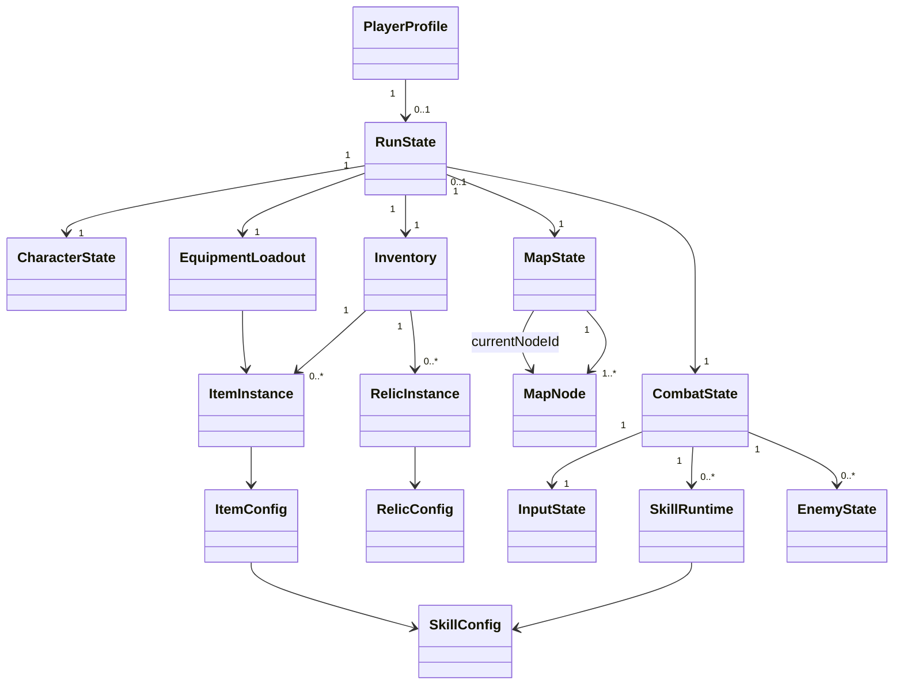
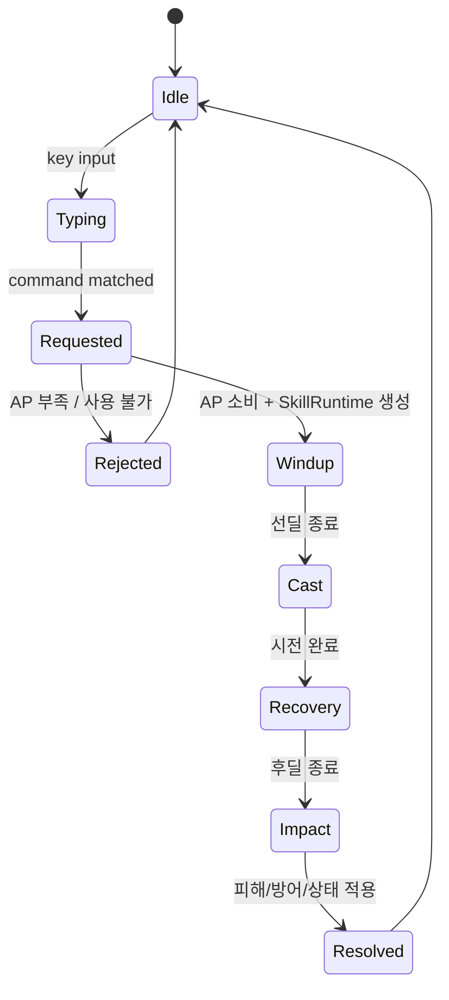

# 게임 데이터 모델 · 런타임 상태 스키마

<aside>
🧩

CEX 구현에서 사용하는 핵심 객체와 관계를 정의한다. **정적 콘텐츠 정의(Config)**, **플레이어가 보유한 인스턴스**, **한 런 동안 변하는 Runtime State**를 분리하는 것을 기본 원칙으로 한다.

</aside>

## 모델링 원칙

- `Player` 하나에 HP, 장비 ID, 맵 위치, 입력 상태를 모두 넣지 않는다.
- 장비·유물·스킬의 원본 정의는 **Config**, 획득한 개체는 **Instance**, 전투 중 수치와 진행 상태는 **Runtime State**로 분리한다.
- 엔티티 간 연결은 가능하면 ID 참조로 표현하고, 실제 효과 계산은 런타임 시스템이 담당한다.
- 저장해야 하는 장기 상태와 매 프레임/전투마다 변하는 일시 상태를 분리한다.
- 현재 확정되지 않은 슬롯 수, 세부 맵 생성 알고리즘, 패링/회피 세분화 등은 **미정**으로 남긴다.

## 전체 관계 개요



## 1. PlayerProfile — 영구 사용자 상태

`PlayerProfile`은 계정/세이브에 남는 값만 가진다. 한 런에서 잃거나 변하는 HP·장비·위치는 여기에 두지 않는다.

```tsx
interface PlayerProfile {
  playerId: string;
  money: number;
  unlockedContentIds: string[];
  settings: PlayerSettings;
  activeRunId?: string;
}
```

**책임**

- 영구 재화
- 해금 정보
- 사용자 입력 언어 등 설정
- 진행 중 런이 있다면 `activeRunId` 참조

## 2. RunState — 한 번의 탑 등반 세션

탑 입장부터 사망/클리어까지의 세션 루트 객체이다. 현재 Wiki에서 런은 전투·보상·장비/유물 획득을 거쳐 종료되는 단위로 정의되어 있다.

```tsx
interface RunState {
  runId: string;
  playerId: string;
  status: 'active' | 'dead' | 'cleared' | 'abandoned';
  character: CharacterState;
  inventory: Inventory;
  loadout: EquipmentLoadout;
  map: MapState;
  combat?: CombatState;
  runCurrency?: number;
  startedAt: number;
}
```

`money`처럼 영구 정산되는 재화와 런 중 임시로 쓰는 재화가 실제로 분리되는지는 **미정**이다. 분리될 경우 `runCurrency`를 사용한다.

## 3. CharacterState — 현재 캐릭터 전투 상태

```tsx
interface CharacterState {
  hp: number;
  maxHp: number;
  ap: number;
  maxAp: number;
  apRegenPerSec: number;
  baseDefense: number;
  combo: number;
  shield: number;
  statusEffects: StatusEffectInstance[];
}
```

현재 전투 기준값:

- 최대 HP 100
- 최대 AP 6
- AP 초당 1 재생
- 기본 방어력 0
- 기본 치명타 확률 없음

공격력은 독립적으로 저장하기보다 **장착 무기 + 버프/유물 Modifier를 합성해 계산하는 Derived Stat**으로 두는 것을 권장한다.

```tsx
interface DerivedStats {
  attack: number;
  defense: number;
  apCostMultiplier: number;
  apRegenPerSec: number;
  damageMultiplier: number;
}
```

## 4. Inventory — 획득한 개체 보관

초기 아이디어의 `weaponId`, `subweaponId`, `ring1Id`, `ring2Id`, `relic`를 Player에 직접 두지 않고, 보유 목록과 장착 상태를 분리한다.

RunState → Inventory → EquipmentLoadout  → WeaponeId

RunState → WeaponId

```tsx
interface Inventory {
  itemInstanceIds: string[];
  relicInstanceIds: string[];
  consumableInstanceIds: string[]; // 소모품 도입 여부는 미정
}
```

## 5. EquipmentLoadout — 현재 장착 상태

현재 확정 장비 슬롯은 무기 1, 보조무기 1, 반지 2이다.

```tsx
interface EquipmentLoadout {
  weaponId?: string;      // ItemInstance.id
  subweaponId?: string;   // ItemInstance.id
  ring1Id?: string;       // ItemInstance.id
  ring2Id?: string;       // ItemInstance.id
}
```

유물은 장비 슬롯과 별도 개념이므로 `EquipmentLoadout`에 넣지 않고 `Inventory`/`RunBuildState`에서 별도로 관리한다.

```tsx
interface RunBuildState {
  equippedRelicIds: string[];
}
```

유물의 최대 장착 개수 또는 소지 제한은 **미정**이다.

## 6. ItemConfig / ItemInstance

### ItemConfig — 정적 데이터

```tsx
interface ItemConfig {
  id: string;
  name: string;
  slot: 'weapon' | 'subweapon' | 'ring';
  weaponType?: string;
  rarity: Rarity;
  sellValue: number;
  baseSkillIds: string[];
  signatureSkillIds: string[];
  tags: string[];
  description: string;
  assetId: string;
}
```

### ItemInstance — 런에서 획득한 실제 개체

```tsx
interface ItemInstance {
  id: string;
  configId: string;
  acquiredAtNodeId?: string;
  modifiers?: ModifierInstance[];
}
```

같은 원본 장비라도 향후 강화·랜덤 옵션이 붙을 가능성을 위해 `configId`와 `instance id`를 분리한다.

## 7. RelicConfig / RelicInstance

```tsx
interface RelicConfig {
  id: string;
  name: string;
  rarity: Rarity;
  tags: string[];
  triggerDefinitions: TriggerDefinition[];
  modifiers: ModifierDefinition[];
  description: string;
  assetId: string;
}

interface RelicInstance {
  id: string;
  configId: string;
  acquiredAtNodeId?: string;
  runtimeStacks?: number;
}
```

유물은 개별 스킬을 제공하기보다 스킬/전투 규칙을 변경하는 방향이므로 `trigger + modifier` 구조가 적합하다.

## 8. MapState / MapNode — 탑 지도와 플레이어 위치

현재 탑은 **10층, 분기 3개의 경로 선택형 지도**를 기준으로 하며 일반 전투·엘리트·보스·상점·휴식 등의 노드가 필요하다.

```tsx
interface MapState {
  mapId: string;
  nodes: Record<string, MapNode>;
  currentNodeId: string;
  visitedNodeIds: string[];
  availableNodeIds: string[];
}

interface MapNode {
  id: string;
  floor: number;
  lane?: number;
  type: 'combat' | 'elite' | 'boss' | 'shop' | 'rest' | 'reward' | 'event';
  nextNodeIds: string[];
  encounterId?: string;
  rewardTableId?: string;
  status: 'locked' | 'available' | 'current' | 'cleared';
}
```

**캐릭터 위치 = 별도 좌표보다 `RunState.map.currentNodeId`가 authoritative state**가 된다. 화면 내 전투 캐릭터의 픽셀 좌표/애니메이션 위치는 렌더링 상태이며 세이브 데이터와 분리한다.

## 9. CombatState — 현재 전투 세션

```tsx
interface CombatState {
  combatId: string;
  phase: 'running' | 'reward' | 'won' | 'lost' | 'paused';
  elapsedMs: number;
  input: InputState;
  activeSkills: SkillRuntime[];
  enemies: EnemyState[];
  eventQueue: CombatEvent[];
}
```

전투 상태는 `RunState` 아래에 존재하지만 전투 종료 후에는 제거하거나 결과만 기록한다.

## 10. InputState — 사용자 타자 입력

```tsx
interface InputState {
  buffer: string;
  focusedCommandId?: string;
  startedAt?: number;
  lastKeyAt?: number;
  typoCount: number;
  inputStatus: 'idle' | 'typing' | 'matched' | 'failed';
}
```

입력 문자열 그 자체와 스킬 실행을 분리한다. 정확히 명령어가 일치하면 `SkillRequested` 이벤트를 생성한다.

## 11. SkillConfig — 스킬 정의

```tsx
interface SkillConfig {
  id: string;
  name: string;
  command: string;
  apCost: number;
  windupMs: number;
  recoveryMs: number;
  coefficient?: number;
  tags: string[];
  effects: EffectDefinition[];
}
```

현재 용어에서 `windupMs = 선딜`, `recoveryMs = 시전 완료 후 타격까지의 후딜`로 대응한다. 이름은 구현팀에서 `travelMs`, `impactDelayMs` 등으로 더 명확히 바꿔도 된다.

## 12. SkillRuntime — 스킬 생명주기 인스턴스

하나의 스킬 Config와 실제로 실행 중인 스킬 인스턴스를 구분한다.

```tsx
interface SkillRuntime {
  id: string;
  skillId: string;
  casterId: string;
  targetIds: string[];
  phase: 'windup' | 'cast' | 'recovery' | 'impact' | 'resolved' | 'cancelled';
  startedAt: number;
  castAt?: number;
  impactAt?: number;
  snapshot?: SkillSnapshot;
}
```

### 생명주기



중요한 규칙:

- AP는 **입력 성공 후 스킬 시작 시점**에 소비한다.
- 입력 성공과 실제 타격은 같은 이벤트가 아니다.
- 적은 기존 공격의 타격을 기다리지 않고 **시전 완료 후 다음 공격 준비**를 시작할 수 있다.

## 13. SkillSnapshot — 발동 시점 값 고정

장비를 교체하거나 버프가 중간에 변하더라도 이미 발사된 공격의 결과가 흔들리지 않게 하려면 시전 시점에 필요한 값을 snapshot한다.

```tsx
interface SkillSnapshot {
  attack: number;
  damageMultiplier: number;
  critMultiplier?: number;
  sourceItemInstanceId?: string;
  appliedModifierIds: string[];
}
```

**미정:** 모든 수치를 시전 시점에 고정할지, 타격 시점의 방어력/대상 상태를 다시 읽을지는 스킬 규칙별로 명시해야 한다. 기본 권장안은 공격자 수치는 snapshot, 대상 방어/상태는 impact 시점 조회이다.

## 14. EnemyState

```tsx
interface EnemyState {
  id: string;
  enemyConfigId: string;
  hp: number;
  maxHp: number;
  statusEffects: StatusEffectInstance[];
  currentAction?: SkillRuntime;
  nextActionId?: string;
}
```

적 역시 플레이어와 동일한 `SkillRuntime` 생명주기를 사용하면 선딜 게이지, 시전 완료, 후딜, 타격 UI를 하나의 규칙으로 처리할 수 있다.

## 15. Event 중심 연결

직접 객체를 서로 호출하게 만들기보다 핵심 전투 변화는 이벤트로 연결하는 것을 권장한다.

```tsx
type CombatEvent =
  | { type: 'COMMAND_MATCHED'; commandId: string }
  | { type: 'SKILL_REQUESTED'; skillId: string; casterId: string }
  | { type: 'SKILL_STARTED'; skillRuntimeId: string }
  | { type: 'SKILL_CAST'; skillRuntimeId: string }
  | { type: 'SKILL_IMPACT'; skillRuntimeId: string }
  | { type: 'DAMAGE_APPLIED'; sourceId: string; targetId: string; amount: number }
  | { type: 'STATUS_APPLIED'; targetId: string; statusId: string }
  | { type: 'ENTITY_DIED'; entityId: string }
  | { type: 'COMBAT_ENDED'; result: 'win' | 'loss' };
```

이 구조는 유물의 `입력 성공 시`, `피격 시`, `스킬 시전 시`, `적 처치 시` 같은 트리거를 붙이기 쉽다.

## 16. Modifier / Trigger 모델

```tsx
interface ModifierDefinition {
  stat?: string;
  operation: 'add' | 'multiply' | 'override';
  value: number;
  condition?: ConditionDefinition;
}

interface TriggerDefinition {
  event: string;
  condition?: ConditionDefinition;
  effects: EffectDefinition[];
}
```

장비·유물·상태이상에서 동일한 효과 시스템을 재사용하는 것이 목표다.

## 권장 Source of Truth 분리

| 영역 | Source of Truth | 예시 |
| --- | --- | --- |
| 콘텐츠 원본 | Config Repository / JSON | ItemConfig, SkillConfig, RelicConfig, EnemyConfig |
| 영구 저장 | PlayerProfile | money, unlock, settings |
| 런 저장 | RunState | HP, inventory, loadout, map position |
| 전투 일시 상태 | CombatState | input buffer, active skill, enemy action, event queue |
| 화면 표현 | UI/View State | animation frame, tooltip, selected panel |

## 최소 MVP 스키마

해커톤 구현에서 먼저 필요한 최소 객체는 다음이다.

```tsx
interface RunState {
  runId: string;
  character: CharacterState;
  inventory: Inventory;
  loadout: EquipmentLoadout;
  map: MapState;
  combat?: CombatState;
}
```

그리고 최소 Config는 `ItemConfig`, `SkillConfig`, `EnemyConfig`, `RelicConfig`, `EncounterConfig`, `RewardTableConfig`로 시작한다.

## 구현 순서 권장

1. `SkillConfig + SkillRuntime + CombatEvent`를 먼저 고정한다.
2. `CharacterState + EnemyState`를 같은 전투 파이프라인에 연결한다.
3. `ItemConfig → EquipmentLoadout → DerivedStats`를 연결한다.
4. `RelicConfig → Trigger/Modifier`를 연결한다.
5. `RunState + Inventory`로 전투 간 상태를 유지한다.
6. `MapState + MapNode`로 현재 노드 및 분기를 연결한다.
7. 마지막으로 영구 `PlayerProfile`과 런 종료 정산을 붙인다.

## 아직 결정해야 하는 사항

- 런 중 장비를 몇 개까지 들고 갈 수 있는가
- 획득 즉시 장착인지, 인벤토리 보관 후 자유 교체인지
- 유물 최대 보유/장착 수
- 맵 10층 × 3분기의 정확한 그래프 생성 규칙
- 상점/휴식/이벤트 노드의 초기 MVP 포함 범위
- 방어를 방패/보호막 외에 패링·회피 등으로 세분화할지
- 스킬 중 장비 교체 허용 여부
- 공격자/대상 스탯 snapshot 시점
- `money`와 런 내부 재화의 분리 여부

## 관련 Wiki

- [전투 시스템](%EC%A0%84%ED%88%AC%20%EC%8B%9C%EC%8A%A4%ED%85%9C%203c612168d52181679b5cede8cc1d5187.md)
- [스킬과 커맨드](%EC%8A%A4%ED%82%AC%EA%B3%BC%20%EC%BB%A4%EB%A7%A8%EB%93%9C%203c612168d5218125a530d0f6d87b1a21.md)
- [장비](%EC%9E%A5%EB%B9%84%203c612168d52181f2bbe8ca75ff69fd38.md)
- [유물](%EC%9C%A0%EB%AC%BC%203c612168d5218107b90ccf7efca1ea28.md)
- [탑과 런](%ED%83%91%EA%B3%BC%20%EB%9F%B0%203c612168d5218199a030d9acdd6e99a1.md)