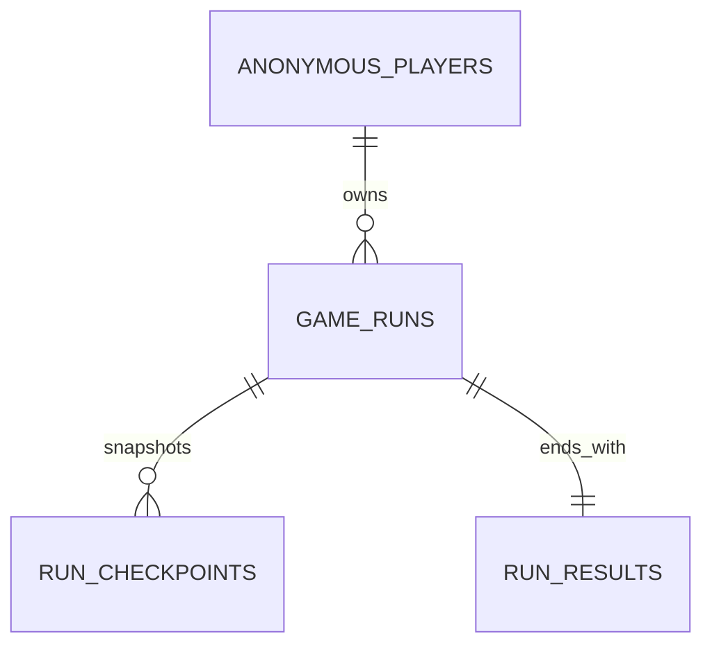

# 🗄️ 백엔드 DB · 런 중간 저장 스키마

<aside>
🗄️

노드 진입 시점의 중간 저장과 런 종료 후 점수 저장을 위한 PostgreSQL 스키마다. 장비·스킬·적의 Config 원본은 DB에 복제하지 않고, 스냅샷 안에서 ID로 참조한다.

</aside>

## 익명 사용자 식별

- 로그인은 사용하지 않는다. 백엔드는 최초 요청에 UUID를 생성하고 anonymous_player_id 쿠키를 발급한다.
- 쿠키는 HttpOnly, Secure, SameSite=Lax, Path=/로 설정하며, 권장 보존 기간은 30일이다.
- 프론트는 쿠키 값을 읽지 않는다. 브라우저가 API 요청에 자동으로 포함한다.
- 쿠키 삭제·시크릿 모드 종료·다른 기기에서는 이어하기가 불가능하다.
- 프론트와 API는 같은 사이트로 배포한다. 예: [game.example.com](http://game.example.com)과 [api.game.example.com](http://api.game.example.com).

## 저장 원칙

- 체크포인트는 **노드 진입 직후** 저장한다. CombatState, 입력 버퍼, 애니메이션, 이벤트 큐는 저장하지 않는다.
- game_runs에는 최신 복구 상태를, run_checkpoints에는 불변 이력을 둔다.
- run_results는 종료 결과를 런당 한 번만 저장한다.
- MVP에서는 프론트가 계산한 점수·통계를 저장한다. 공개 랭킹이나 영구 재화 보상 도입 시에는 서버 계산 또는 전투 로그 검증으로 확장한다.

## 테이블 관계



## SQLite 마이그레이션

로그인 없이 익명 사용자 ID를 HttpOnly 쿠키로 발급한다. 쿠키 값은 서버에서 생성한 UUID이며, game_runs는 이 UUID에 연결한다.

```sql
database.exec(`
  PRAGMA foreign_keys = ON;
  PRAGMA journal_mode = WAL;

  CREATE TABLE IF NOT EXISTS anonymous_players (
    id TEXT PRIMARY KEY,
    created_at TEXT NOT NULL,
    last_seen_at TEXT NOT NULL
  );

  CREATE TABLE IF NOT EXISTS game_runs (
    id TEXT PRIMARY KEY,
    anonymous_player_id TEXT NOT NULL REFERENCES anonymous_players(id) ON DELETE CASCADE,
    status TEXT NOT NULL CHECK (status IN ('active', 'dead', 'cleared', 'abandoned')) DEFAULT 'active',
    current_node_id TEXT NOT NULL,
    current_floor INTEGER NOT NULL CHECK (current_floor >= 0),
    map_seed INTEGER NOT NULL,
    state_snapshot TEXT NOT NULL,
    state_version INTEGER NOT NULL CHECK (state_version > 0),
    state_hash TEXT,
    started_at TEXT NOT NULL,
    last_saved_at TEXT NOT NULL,
    ended_at TEXT,
    CHECK ((status = 'active' AND ended_at IS NULL) OR (status <> 'active' AND ended_at IS NOT NULL))
  );

  CREATE UNIQUE INDEX IF NOT EXISTS game_runs_one_active_run_per_player
    ON game_runs (anonymous_player_id) WHERE status = 'active';
  CREATE INDEX IF NOT EXISTS game_runs_player_history_idx
    ON game_runs (anonymous_player_id, started_at DESC);

  CREATE TABLE IF NOT EXISTS run_checkpoints (
    id TEXT PRIMARY KEY,
    run_id TEXT NOT NULL REFERENCES game_runs(id) ON DELETE CASCADE,
    sequence_no INTEGER NOT NULL CHECK (sequence_no > 0),
    reason TEXT NOT NULL CHECK (reason IN ('run_started', 'node_entered')),
    node_id TEXT NOT NULL,
    floor INTEGER NOT NULL CHECK (floor >= 0),
    state_snapshot TEXT NOT NULL,
    state_hash TEXT,
    created_at TEXT NOT NULL,
    UNIQUE (run_id, sequence_no)
  );
  CREATE INDEX IF NOT EXISTS run_checkpoints_latest_idx
    ON run_checkpoints (run_id, sequence_no DESC);

  CREATE TABLE IF NOT EXISTS run_results (
    run_id TEXT PRIMARY KEY REFERENCES game_runs(id) ON DELETE CASCADE,
    end_reason TEXT NOT NULL CHECK (end_reason IN ('dead', 'cleared', 'abandoned')),
    score INTEGER NOT NULL CHECK (score >= 0),
    cleared_floor INTEGER NOT NULL CHECK (cleared_floor >= 0),
    play_time_ms INTEGER NOT NULL CHECK (play_time_ms >= 0),
    accuracy REAL CHECK (accuracy IS NULL OR (accuracy >= 0 AND accuracy <= 100)),
    max_combo INTEGER NOT NULL DEFAULT 0 CHECK (max_combo >= 0),
    defeated_enemy_count INTEGER NOT NULL DEFAULT 0 CHECK (defeated_enemy_count >= 0),
    earned_money INTEGER NOT NULL DEFAULT 0 CHECK (earned_money >= 0),
    result_snapshot TEXT NOT NULL DEFAULT '{}',
    finalized_at TEXT NOT NULL
  );
  CREATE INDEX IF NOT EXISTS run_results_score_ranking_idx
    ON run_results (score DESC, finalized_at ASC);
`);
```

## 출처

- [게임 데이터 모델 · 런타임 상태 스키마](%EA%B2%8C%EC%9E%84%20%EB%8D%B0%EC%9D%B4%ED%84%B0%20%EB%AA%A8%EB%8D%B8%20%C2%B7%20%EB%9F%B0%ED%83%80%EC%9E%84%20%EC%83%81%ED%83%9C%20%EC%8A%A4%ED%82%A4%EB%A7%88%203c712168d5218162a22af1888591dd71.md)
- [탑과 런](%ED%83%91%EA%B3%BC%20%EB%9F%B0%203c612168d5218199a030d9acdd6e99a1.md)
- [재화와 정산](%EC%9E%AC%ED%99%94%EC%99%80%20%EC%A0%95%EC%82%B0%203c612168d5218179935bf3d31bebe6ad.md)

---