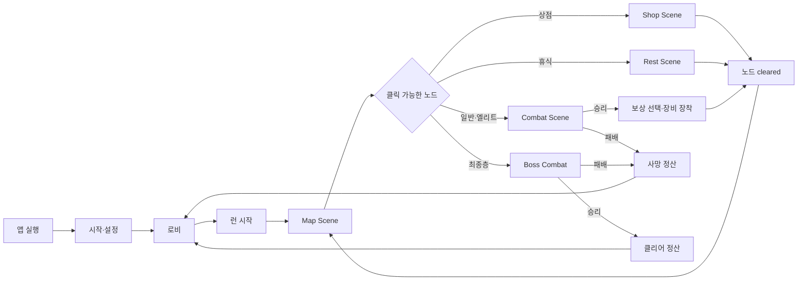
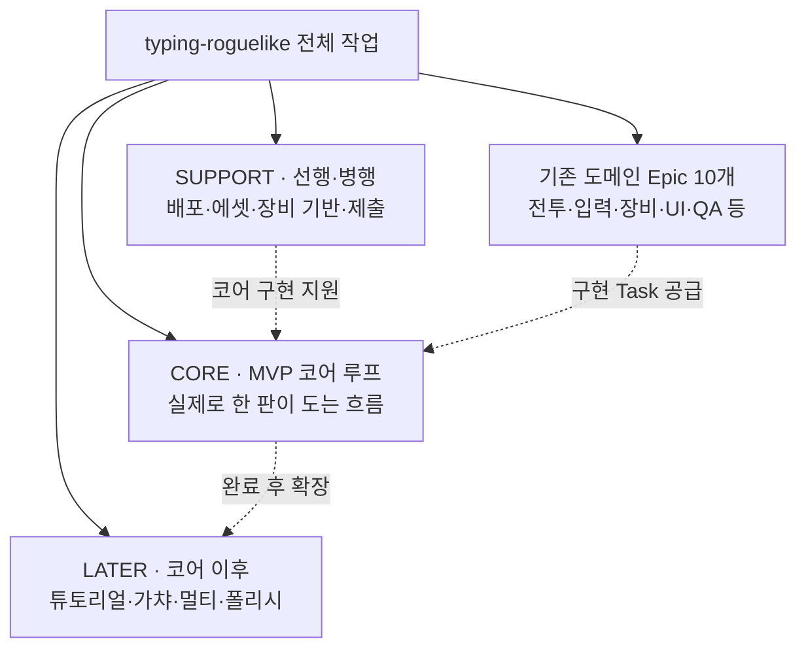

# 전체 Task 구조 및 구현 흐름

<aside>
🧭

**기준 시점: 2026-08-26** · [CEX Project Kanban](CEX%20Project%20Kanban%20c6bf6543290c4e7aa72e70740017bafd.md)의 전체 165개 카드 관계를 시각화한 문서입니다.

동일 Task가 기존 도메인 Feature와 새 CORE/SUPPORT/LATER Feature에 함께 연결된 경우 여러 트리에 표시될 수 있지만, 맨 아래 전체 색인에서는 한 번만 표시합니다.

</aside>

## 현황 요약

| 구분 | 전체 | 완료 | 진행 중 | 검토 | 준비 | 차단 | 백로그 |
| --- | --- | --- | --- | --- | --- | --- | --- |
| Epic | 13 | 제품·도메인·확장 목표 단위 |  |  |  |  |  |
| Feature | 51 | 독립적으로 완성 가능한 기능 단위 |  |  |  |  |  |
| Task | 101 | 17 | 1 | 1 | 62 | 1 | 19 |

> 상태 표기: ✅ Done · 🚧 In Progress · 👀 Review · ▶️ Ready · ⛔ Blocked · 💤 Backlog
> 

## 게임 코어 루프

<aside>
⚔️

**장비 정산 규칙**: 런 동안 장비를 획득·장착하고, 사망 시에는 장비 환전 가치만 지급합니다. 클리어 시에는 보유한 런 장비를 전부 재화로 환전한 뒤 클리어 보너스를 별도로 더하고, 정산된 런 장비와 RunState를 제거합니다. [탑과 런](typing-roguelike%20%EC%9C%84%ED%82%A4/%ED%83%91%EA%B3%BC%20%EB%9F%B0%203c612168d5218199a030d9acdd6e99a1.md) · [장비](typing-roguelike%20%EC%9C%84%ED%82%A4/%EC%9E%A5%EB%B9%84%203c612168d52181f2bbe8ca75ff69fd38.md)

</aside>

## Epic 전체 구조

## CORE · MVP 코어 루프

앱 실행부터 런 정산과 로비 복귀까지의 구현 순서입니다. 맵은 전투·상점·휴식 Scene과 분리되고, 완료된 노드만 **cleared**가 되어 다음 연결 노드를 엽니다. [탑과 런](typing-roguelike%20%EC%9C%84%ED%82%A4/%ED%83%91%EA%B3%BC%20%EB%9F%B0%203c612168d5218199a030d9acdd6e99a1.md)

- [CORE-01 · 앱 실행·시작·설정](CEX%20Project%20Kanban/CORE-01%20%C2%B7%20%EC%95%B1%20%EC%8B%A4%ED%96%89%C2%B7%EC%8B%9C%EC%9E%91%C2%B7%EC%84%A4%EC%A0%95%203c812168d5218153b303db38c4a8ae81.md) · Task 3개
    - ▶️ **P0** [CORE-01-01 · 시작·설정→로비 Scene 흐름 구현](CEX%20Project%20Kanban/CORE-01-01%20%C2%B7%20%EC%8B%9C%EC%9E%91%C2%B7%EC%84%A4%EC%A0%95%E2%86%92%EB%A1%9C%EB%B9%84%20Scene%20%ED%9D%90%EB%A6%84%20%EA%B5%AC%ED%98%84%203c812168d5218120a00fe714ec78c634.md) · Ready · @지원 정
    - ▶️ **P0** [CORE-01-02 · Scene 등록·전환 데이터 계약 구현](CEX%20Project%20Kanban/CORE-01-02%20%C2%B7%20Scene%20%EB%93%B1%EB%A1%9D%C2%B7%EC%A0%84%ED%99%98%20%EB%8D%B0%EC%9D%B4%ED%84%B0%20%EA%B3%84%EC%95%BD%20%EA%B5%AC%ED%98%84%203c812168d5218163ae60c793184ff10c.md) · Ready · 미배정
    - ▶️ **P1** [CORE-01-03 · 설정 상태 저장·시스템 적용 구현](CEX%20Project%20Kanban/CORE-01-03%20%C2%B7%20%EC%84%A4%EC%A0%95%20%EC%83%81%ED%83%9C%20%EC%A0%80%EC%9E%A5%C2%B7%EC%8B%9C%EC%8A%A4%ED%85%9C%20%EC%A0%81%EC%9A%A9%20%EA%B5%AC%ED%98%84%203c812168d5218134909fe6ec987de279.md) · Ready · 미배정
- [CORE-02 · 로비](CEX%20Project%20Kanban/CORE-02%20%C2%B7%20%EB%A1%9C%EB%B9%84%203c812168d5218140b016d680ca894319.md) · Task 1개
    - ▶️ **P0** [CORE-02-01 · 로비→런 시작 연결 구현](CEX%20Project%20Kanban/CORE-02-01%20%C2%B7%20%EB%A1%9C%EB%B9%84%E2%86%92%EB%9F%B0%20%EC%8B%9C%EC%9E%91%20%EC%97%B0%EA%B2%B0%20%EA%B5%AC%ED%98%84%203c812168d52181c2a96cde5ac3ee31f4.md) · Ready · @지원 정
- [CORE-03 · 런 시작](CEX%20Project%20Kanban/CORE-03%20%C2%B7%20%EB%9F%B0%20%EC%8B%9C%EC%9E%91%203c812168d52181258ceecd47e02828b1.md) · Task 5개
    - **연결 Feature**: [런 상태·전환](CEX%20Project%20Kanban/%EB%9F%B0%20%EC%83%81%ED%83%9C%C2%B7%EC%A0%84%ED%99%98%203c712168d52181c389cecf938a9909bc.md)
    - ✅ **P0** [RunState 데이터 모델 구현](CEX%20Project%20Kanban/RunState%20%EB%8D%B0%EC%9D%B4%ED%84%B0%20%EB%AA%A8%EB%8D%B8%20%EA%B5%AC%ED%98%84%203c712168d5218188ba86d1b16e591b86.md) · Done · @지원 정
    - ▶️ **P0** [CORE-03-01 · 런 시작→맵 진입 구현](CEX%20Project%20Kanban/CORE-03-01%20%C2%B7%20%EB%9F%B0%20%EC%8B%9C%EC%9E%91%E2%86%92%EB%A7%B5%20%EC%A7%84%EC%9E%85%20%EA%B5%AC%ED%98%84%203c712168d5218140b952f9bb557b5c96.md) · Ready · @지원 정
    - ▶️ **P0** [CORE-03-02 · 클라이언트 RunSession 관리자 구현](CEX%20Project%20Kanban/CORE-03-02%20%C2%B7%20%ED%81%B4%EB%9D%BC%EC%9D%B4%EC%96%B8%ED%8A%B8%20RunSession%20%EA%B4%80%EB%A6%AC%EC%9E%90%20%EA%B5%AC%ED%98%84%203c812168d52181aca771c7932cd43291.md) · Ready · 미배정
    - ▶️ **P0** [CORE-05-01 · 전투 종료→맵·정산 분기 구현](CEX%20Project%20Kanban/CORE-05-01%20%C2%B7%20%EC%A0%84%ED%88%AC%20%EC%A2%85%EB%A3%8C%E2%86%92%EB%A7%B5%C2%B7%EC%A0%95%EC%82%B0%20%EB%B6%84%EA%B8%B0%20%EA%B5%AC%ED%98%84%203c712168d521810395b4fc92a9ad8e39.md) · Ready · @지원 정
    - ▶️ **P1** [CORE-03-03 · 런 저장·새로고침 복구 구현](CEX%20Project%20Kanban/CORE-03-03%20%C2%B7%20%EB%9F%B0%20%EC%A0%80%EC%9E%A5%C2%B7%EC%83%88%EB%A1%9C%EA%B3%A0%EC%B9%A8%20%EB%B3%B5%EA%B5%AC%20%EA%B5%AC%ED%98%84%203c812168d52181d29c7ad23f7a5be6d8.md) · Ready · 미배정
- [CORE-04 · 맵·노드 진행](CEX%20Project%20Kanban/CORE-04%20%C2%B7%20%EB%A7%B5%C2%B7%EB%85%B8%EB%93%9C%20%EC%A7%84%ED%96%89%203c812168d5218184af69e24fcc74d9a3.md) · Task 8개
    - **연결 Feature**: [전투 보상·다음 전투](CEX%20Project%20Kanban/%EC%A0%84%ED%88%AC%20%EB%B3%B4%EC%83%81%C2%B7%EB%8B%A4%EC%9D%8C%20%EC%A0%84%ED%88%AC%203c712168d52181b4a3ebf742f981b058.md) · [탑 지도·노드 선택](CEX%20Project%20Kanban/%ED%83%91%20%EC%A7%80%EB%8F%84%C2%B7%EB%85%B8%EB%93%9C%20%EC%84%A0%ED%83%9D%203c712168d5218165a801f725a7f2e217.md)
    - ✅ **P0** [FE-05 · 보상 선택 화면 구현](CEX%20Project%20Kanban/FE-05%20%C2%B7%20%EB%B3%B4%EC%83%81%20%EC%84%A0%ED%83%9D%20%ED%99%94%EB%A9%B4%20%EA%B5%AC%ED%98%84%203c712168d521811f86fef8b67953c0c1.md) · Done · @김예찬
    - ▶️ **P0** [보상 완료→다음 노드 전환 구현](CEX%20Project%20Kanban/%EB%B3%B4%EC%83%81%20%EC%99%84%EB%A3%8C%E2%86%92%EB%8B%A4%EC%9D%8C%20%EB%85%B8%EB%93%9C%20%EC%A0%84%ED%99%98%20%EA%B5%AC%ED%98%84%203c712168d52181aab0eef1472508651c.md) · Ready · 미배정
    - ▶️ **P0** [전투 보상 선택 상태 구현](CEX%20Project%20Kanban/%EC%A0%84%ED%88%AC%20%EB%B3%B4%EC%83%81%20%EC%84%A0%ED%83%9D%20%EC%83%81%ED%83%9C%20%EA%B5%AC%ED%98%84%203c712168d52181bea144f4ac27af324b.md) · Ready · 미배정
    - ▶️ **P0** [CORE-04-02 · Map Scene 렌더링·런 HUD 구현](CEX%20Project%20Kanban/CORE-04-02%20%C2%B7%20Map%20Scene%20%EB%A0%8C%EB%8D%94%EB%A7%81%C2%B7%EB%9F%B0%20HUD%20%EA%B5%AC%ED%98%84%203c812168d52181de9970ce2b90e114bf.md) · Ready · 미배정
    - ▶️ **P0** [CORE-04-03 · 노드 상태 전이·결과 멱등성 구현](CEX%20Project%20Kanban/CORE-04-03%20%C2%B7%20%EB%85%B8%EB%93%9C%20%EC%83%81%ED%83%9C%20%EC%A0%84%EC%9D%B4%C2%B7%EA%B2%B0%EA%B3%BC%20%EB%A9%B1%EB%93%B1%EC%84%B1%20%EA%B5%AC%ED%98%84%203c812168d52181a48e4ffeaa950b6594.md) · Ready · 미배정
    - ✅ **P1** [FE-06 · 장비 장착 화면 구현](CEX%20Project%20Kanban/FE-06%20%C2%B7%20%EC%9E%A5%EB%B9%84%20%EC%9E%A5%EC%B0%A9%20%ED%99%94%EB%A9%B4%20%EA%B5%AC%ED%98%84%203c712168d5218143b8ffeb2ae71ef151.md) · Done · @김예찬
    - ▶️ **P1** [CORE-04-01 · 지도 노드 선택·잠금 로직 구현](CEX%20Project%20Kanban/CORE-04-01%20%C2%B7%20%EC%A7%80%EB%8F%84%20%EB%85%B8%EB%93%9C%20%EC%84%A0%ED%83%9D%C2%B7%EC%9E%A0%EA%B8%88%20%EB%A1%9C%EC%A7%81%20%EA%B5%AC%ED%98%84%203c712168d52181088285c332af7e628e.md) · Ready · @지원 정
    - 👀 **P1** [10층 3분기 지도 데이터 구조 구현](CEX%20Project%20Kanban/10%EC%B8%B5%203%EB%B6%84%EA%B8%B0%20%EC%A7%80%EB%8F%84%20%EB%8D%B0%EC%9D%B4%ED%84%B0%20%EA%B5%AC%EC%A1%B0%20%EA%B5%AC%ED%98%84%203c712168d5218134a454d3974994ae52.md) · Review · @김예찬
- [CORE-05 · 전투 노드](CEX%20Project%20Kanban/CORE-05%20%C2%B7%20%EC%A0%84%ED%88%AC%20%EB%85%B8%EB%93%9C%203c812168d5218139bac8e6f86512a209.md) · Task 40개
    - **연결 Feature**: [승패·전투 종료 처리](CEX%20Project%20Kanban/%EC%8A%B9%ED%8C%A8%C2%B7%EC%A0%84%ED%88%AC%20%EC%A2%85%EB%A3%8C%20%EC%B2%98%EB%A6%AC%203c712168d521811e9130ff3a2f1f7284.md) · [적 공격 예고·타임라인](CEX%20Project%20Kanban/%EC%A0%81%20%EA%B3%B5%EA%B2%A9%20%EC%98%88%EA%B3%A0%C2%B7%ED%83%80%EC%9E%84%EB%9D%BC%EC%9D%B8%203c712168d521816587e8df8b350f0b52.md) · [전투 상태·타이밍 엔진](CEX%20Project%20Kanban/%EC%A0%84%ED%88%AC%20%EC%83%81%ED%83%9C%C2%B7%ED%83%80%EC%9D%B4%EB%B0%8D%20%EC%97%94%EC%A7%84%203c712168d521812aa27bfd336331b660.md) · [전투 HUD](CEX%20Project%20Kanban/%EC%A0%84%ED%88%AC%20HUD%203c712168d521818fb208c1a7aafbeb42.md) · [커맨드 입력 판정](CEX%20Project%20Kanban/%EC%BB%A4%EB%A7%A8%EB%93%9C%20%EC%9E%85%EB%A0%A5%20%ED%8C%90%EC%A0%95%203c712168d521814d811ad86f3ec65c3f.md) · [플레이어 스킬 실행](CEX%20Project%20Kanban/%ED%94%8C%EB%A0%88%EC%9D%B4%EC%96%B4%20%EC%8A%A4%ED%82%AC%20%EC%8B%A4%ED%96%89%203c712168d5218135a4c7f0faffdc68bd.md) · [피해·HP·AP 처리](CEX%20Project%20Kanban/%ED%94%BC%ED%95%B4%C2%B7HP%C2%B7AP%20%EC%B2%98%EB%A6%AC%203c712168d52181f4acc7fcb2f7a68245.md) · [방어 대응 입력](CEX%20Project%20Kanban/%EB%B0%A9%EC%96%B4%20%EB%8C%80%EC%9D%91%20%EC%9E%85%EB%A0%A5%203c712168d52181748fcefcebcea7939e.md) · [적 데이터·행동 시스템](CEX%20Project%20Kanban/%EC%A0%81%20%EB%8D%B0%EC%9D%B4%ED%84%B0%C2%B7%ED%96%89%EB%8F%99%20%EC%8B%9C%EC%8A%A4%ED%85%9C%203c712168d5218188bafbd7ffb93b7ace.md)
    - ✅ **P0** [스킬 데이터 계약 구현](CEX%20Project%20Kanban/%EC%8A%A4%ED%82%AC%20%EB%8D%B0%EC%9D%B4%ED%84%B0%20%EA%B3%84%EC%95%BD%20%EA%B5%AC%ED%98%84%203c712168d521818f8d91fec34a7f6cdf.md) · Done · @지원 정
    - ✅ **P0** [커맨드 성공→스킬 시작 연결](CEX%20Project%20Kanban/%EC%BB%A4%EB%A7%A8%EB%93%9C%20%EC%84%B1%EA%B3%B5%E2%86%92%EC%8A%A4%ED%82%AC%20%EC%8B%9C%EC%9E%91%20%EC%97%B0%EA%B2%B0%203c712168d5218161a5adcc19484329d9.md) · Done · @지원 정
    - ✅ **P0** [키 입력 버퍼·문자열 매칭 구현](CEX%20Project%20Kanban/%ED%82%A4%20%EC%9E%85%EB%A0%A5%20%EB%B2%84%ED%8D%BC%C2%B7%EB%AC%B8%EC%9E%90%EC%97%B4%20%EB%A7%A4%EC%B9%AD%20%EA%B5%AC%ED%98%84%203c712168d5218178b6d5def22db79bfb.md) · Done · @지원 정
    - ✅ **P0** [피해 계산 공식 구현](CEX%20Project%20Kanban/%ED%94%BC%ED%95%B4%20%EA%B3%84%EC%82%B0%20%EA%B3%B5%EC%8B%9D%20%EA%B5%AC%ED%98%84%203c712168d52181d68570da05088a81fc.md) · Done · @지원 정
    - ✅ **P0** [AP 소비·재생 로직 구현](CEX%20Project%20Kanban/AP%20%EC%86%8C%EB%B9%84%C2%B7%EC%9E%AC%EC%83%9D%20%EB%A1%9C%EC%A7%81%20%EA%B5%AC%ED%98%84%203c712168d521817c8d80c35c44a877d2.md) · Done · @지원 정
    - ✅ **P0** [CombatState 데이터 모델 구현](CEX%20Project%20Kanban/CombatState%20%EB%8D%B0%EC%9D%B4%ED%84%B0%20%EB%AA%A8%EB%8D%B8%20%EA%B5%AC%ED%98%84%203c712168d5218123bd49c33321c0fbd4.md) · Done · @지원 정
    - ✅ **P0** [EnemyAttackTimeline 데이터 모델 구현](CEX%20Project%20Kanban/EnemyAttackTimeline%20%EB%8D%B0%EC%9D%B4%ED%84%B0%20%EB%AA%A8%EB%8D%B8%20%EA%B5%AC%ED%98%84%203c712168d52181689fa4c643d296de68.md) · Done · @지원 정
    - ✅ **P0** [FE-00 · Phaser 화면 및 에셋 기반 구축](CEX%20Project%20Kanban/FE-00%20%C2%B7%20Phaser%20%ED%99%94%EB%A9%B4%20%EB%B0%8F%20%EC%97%90%EC%85%8B%20%EA%B8%B0%EB%B0%98%20%EA%B5%AC%EC%B6%95%203c712168d52181dc84b6f2f9b27f6e1d.md) · Done · @김예찬
    - ✅ **P0** [FE-01 · HP·AP HUD 구현](CEX%20Project%20Kanban/FE-01%20%C2%B7%20HP%C2%B7AP%20HUD%20%EA%B5%AC%ED%98%84%203c712168d52181889154c61bed9d1a7e.md) · Done · @김예찬
    - ✅ **P0** [FE-02 · 커맨드 입력 HUD 구현](CEX%20Project%20Kanban/FE-02%20%C2%B7%20%EC%BB%A4%EB%A7%A8%EB%93%9C%20%EC%9E%85%EB%A0%A5%20HUD%20%EA%B5%AC%ED%98%84%203c712168d52181b8a759e766b62f4333.md) · Done · @김예찬
    - ✅ **P0** [FE-03 · 적 공격 게이지 UI 구현](CEX%20Project%20Kanban/FE-03%20%C2%B7%20%EC%A0%81%20%EA%B3%B5%EA%B2%A9%20%EA%B2%8C%EC%9D%B4%EC%A7%80%20UI%20%EA%B5%AC%ED%98%84%203c712168d52181188048d7c6c88dc970.md) · Done · @김예찬
    - ✅ **P0** [FE-05 · 보상 선택 화면 구현](CEX%20Project%20Kanban/FE-05%20%C2%B7%20%EB%B3%B4%EC%83%81%20%EC%84%A0%ED%83%9D%20%ED%99%94%EB%A9%B4%20%EA%B5%AC%ED%98%84%203c712168d521811f86fef8b67953c0c1.md) · Done · @김예찬
    - ✅ **P0** [HP 상태 및 사망 판정 구현](CEX%20Project%20Kanban/HP%20%EC%83%81%ED%83%9C%20%EB%B0%8F%20%EC%82%AC%EB%A7%9D%20%ED%8C%90%EC%A0%95%20%EA%B5%AC%ED%98%84%203c712168d5218165bd10c2372b8e79d2.md) · Done · @지원 정
    - ▶️ **P0** [보상 완료→다음 노드 전환 구현](CEX%20Project%20Kanban/%EB%B3%B4%EC%83%81%20%EC%99%84%EB%A3%8C%E2%86%92%EB%8B%A4%EC%9D%8C%20%EB%85%B8%EB%93%9C%20%EC%A0%84%ED%99%98%20%EA%B5%AC%ED%98%84%203c712168d52181aab0eef1472508651c.md) · Ready · 미배정
    - ▶️ **P0** [스킬 생명주기 타이머 구현](CEX%20Project%20Kanban/%EC%8A%A4%ED%82%AC%20%EC%83%9D%EB%AA%85%EC%A3%BC%EA%B8%B0%20%ED%83%80%EC%9D%B4%EB%A8%B8%20%EA%B5%AC%ED%98%84%203c712168d52181c1a6b0d9bfe6c1dcad.md) · Ready · 미배정
    - ▶️ **P0** [스킬 타격 효과 적용 구현](CEX%20Project%20Kanban/%EC%8A%A4%ED%82%AC%20%ED%83%80%EA%B2%A9%20%ED%9A%A8%EA%B3%BC%20%EC%A0%81%EC%9A%A9%20%EA%B5%AC%ED%98%84%203c712168d52181028c0ee031e9d9e84e.md) · Ready · 미배정
    - ▶️ **P0** [장비 등급 드롭 테이블 구현](CEX%20Project%20Kanban/%EC%9E%A5%EB%B9%84%20%EB%93%B1%EA%B8%89%20%EB%93%9C%EB%A1%AD%20%ED%85%8C%EC%9D%B4%EB%B8%94%20%EA%B5%AC%ED%98%84%203c712168d52181c283c0ef81a6158a99.md) · Ready · @지원 정
    - ▶️ **P0** [적 공격 게이지 진행 로직 구현](CEX%20Project%20Kanban/%EC%A0%81%20%EA%B3%B5%EA%B2%A9%20%EA%B2%8C%EC%9D%B4%EC%A7%80%20%EC%A7%84%ED%96%89%20%EB%A1%9C%EC%A7%81%20%EA%B5%AC%ED%98%84%203c712168d52181debb4ce8730e2d2a2d.md) · Ready · 미배정
    - ▶️ **P0** [적 공격 타격 시점 처리](CEX%20Project%20Kanban/%EC%A0%81%20%EA%B3%B5%EA%B2%A9%20%ED%83%80%EA%B2%A9%20%EC%8B%9C%EC%A0%90%20%EC%B2%98%EB%A6%AC%203c712168d521814cbcf8db9bc7710f94.md) · Ready · 미배정
    - ▶️ **P0** [전투 보상 선택 상태 구현](CEX%20Project%20Kanban/%EC%A0%84%ED%88%AC%20%EB%B3%B4%EC%83%81%20%EC%84%A0%ED%83%9D%20%EC%83%81%ED%83%9C%20%EA%B5%AC%ED%98%84%203c712168d52181bea144f4ac27af324b.md) · Ready · 미배정
    - ▶️ **P0** [전투 승리 판정 구현](CEX%20Project%20Kanban/%EC%A0%84%ED%88%AC%20%EC%8A%B9%EB%A6%AC%20%ED%8C%90%EC%A0%95%20%EA%B5%AC%ED%98%84%203c712168d5218171ab1dd81f6696c215.md) · Ready · 미배정
    - ▶️ **P0** [전투 패배 판정 구현](CEX%20Project%20Kanban/%EC%A0%84%ED%88%AC%20%ED%8C%A8%EB%B0%B0%20%ED%8C%90%EC%A0%95%20%EA%B5%AC%ED%98%84%203c712168d5218173a778c22e0e5f991b.md) · Ready · 미배정
    - ▶️ **P0** [CORE-05-01 · 전투 종료→맵·정산 분기 구현](CEX%20Project%20Kanban/CORE-05-01%20%C2%B7%20%EC%A0%84%ED%88%AC%20%EC%A2%85%EB%A3%8C%E2%86%92%EB%A7%B5%C2%B7%EC%A0%95%EC%82%B0%20%EB%B6%84%EA%B8%B0%20%EA%B5%AC%ED%98%84%203c712168d521810395b4fc92a9ad8e39.md) · Ready · @지원 정
    - ▶️ **P0** [CORE-05-02 · 맵 노드→전투 Encounter 초기화 구현](CEX%20Project%20Kanban/CORE-05-02%20%C2%B7%20%EB%A7%B5%20%EB%85%B8%EB%93%9C%E2%86%92%EC%A0%84%ED%88%AC%20Encounter%20%EC%B4%88%EA%B8%B0%ED%99%94%20%EA%B5%AC%ED%98%84%203c812168d521813eb3d9d68413643d72.md) · Ready · 미배정
    - ▶️ **P0** [CORE-05-03 · 보상 선택→장비 장착·RunState 반영 구현](CEX%20Project%20Kanban/CORE-05-03%20%C2%B7%20%EB%B3%B4%EC%83%81%20%EC%84%A0%ED%83%9D%E2%86%92%EC%9E%A5%EB%B9%84%20%EC%9E%A5%EC%B0%A9%C2%B7RunState%20%EB%B0%98%EC%98%81%20%EA%B5%AC%ED%98%84%203c812168d5218156a5b6d7a907d5f4ba.md) · Ready · 미배정
    - 💤 **P1** [커맨드 언어 방식 결정](CEX%20Project%20Kanban/%EC%BB%A4%EB%A7%A8%EB%93%9C%20%EC%96%B8%EC%96%B4%20%EB%B0%A9%EC%8B%9D%20%EA%B2%B0%EC%A0%95%203c712168d52181a995f4f8d76b75682a.md) · Backlog · 미배정
    - ✅ **P1** [FE-04 · 후딜·투사체 상태 UI 구현](CEX%20Project%20Kanban/FE-04%20%C2%B7%20%ED%9B%84%EB%94%9C%C2%B7%ED%88%AC%EC%82%AC%EC%B2%B4%20%EC%83%81%ED%83%9C%20UI%20%EA%B5%AC%ED%98%84%203c712168d52181a29e7ee30b1d71653d.md) · Done · @김예찬
    - ✅ **P1** [FE-06 · 장비 장착 화면 구현](CEX%20Project%20Kanban/FE-06%20%C2%B7%20%EC%9E%A5%EB%B9%84%20%EC%9E%A5%EC%B0%A9%20%ED%99%94%EB%A9%B4%20%EA%B5%AC%ED%98%84%203c712168d5218143b8ffeb2ae71ef151.md) · Done · @김예찬
    - ▶️ **P1** [방어 유효 구간 판정 구현](CEX%20Project%20Kanban/%EB%B0%A9%EC%96%B4%20%EC%9C%A0%ED%9A%A8%20%EA%B5%AC%EA%B0%84%20%ED%8C%90%EC%A0%95%20%EA%B5%AC%ED%98%84%203c712168d5218123b5e0dc70bbb5bd9b.md) · Ready · 미배정
    - ▶️ **P1** [보유 장비 중복 등장 방지 구현](CEX%20Project%20Kanban/%EB%B3%B4%EC%9C%A0%20%EC%9E%A5%EB%B9%84%20%EC%A4%91%EB%B3%B5%20%EB%93%B1%EC%9E%A5%20%EB%B0%A9%EC%A7%80%20%EA%B5%AC%ED%98%84%203c712168d52181a2a6c5e0cc060f1f73.md) · Ready · @지원 정
    - ▶️ **P1** [오입력·초기화 규칙 구현](CEX%20Project%20Kanban/%EC%98%A4%EC%9E%85%EB%A0%A5%C2%B7%EC%B4%88%EA%B8%B0%ED%99%94%20%EA%B7%9C%EC%B9%99%20%EA%B5%AC%ED%98%84%203c712168d52181bdbdf8f38190ea6d6b.md) · Ready · 미배정
    - ▶️ **P1** [장비 4슬롯 상태 구현](CEX%20Project%20Kanban/%EC%9E%A5%EB%B9%84%204%EC%8A%AC%EB%A1%AF%20%EC%83%81%ED%83%9C%20%EA%B5%AC%ED%98%84%203c712168d521818a83f0e036ae008331.md) · Ready · @지원 정
    - ▶️ **P1** [장비 교체 전후 스킬 diff 계산](CEX%20Project%20Kanban/%EC%9E%A5%EB%B9%84%20%EA%B5%90%EC%B2%B4%20%EC%A0%84%ED%9B%84%20%EC%8A%A4%ED%82%AC%20diff%20%EA%B3%84%EC%82%B0%203c712168d521811fb2f7cf0197c227f0.md) · Ready · @지원 정
    - ▶️ **P1** [장비→사용 가능 스킬 구성 구현](CEX%20Project%20Kanban/%EC%9E%A5%EB%B9%84%E2%86%92%EC%82%AC%EC%9A%A9%20%EA%B0%80%EB%8A%A5%20%EC%8A%A4%ED%82%AC%20%EA%B5%AC%EC%84%B1%20%EA%B5%AC%ED%98%84%203c712168d52181b69a50d5afc3968367.md) · Ready · @지원 정
    - ▶️ **P1** [적 공격 선택 루프 구현](CEX%20Project%20Kanban/%EC%A0%81%20%EA%B3%B5%EA%B2%A9%20%EC%84%A0%ED%83%9D%20%EB%A3%A8%ED%94%84%20%EA%B5%AC%ED%98%84%203c712168d52181a89fa6ee07ab7cf352.md) · Ready · 미배정
    - ▶️ **P1** [중첩 공격 타임라인 처리](CEX%20Project%20Kanban/%EC%A4%91%EC%B2%A9%20%EA%B3%B5%EA%B2%A9%20%ED%83%80%EC%9E%84%EB%9D%BC%EC%9D%B8%20%EC%B2%98%EB%A6%AC%203c712168d521816cacffecd2bc605b12.md) · Ready · 미배정
    - ▶️ **P1** [CORE-05-04 · 포커스 이탈·일시정지 처리](CEX%20Project%20Kanban/CORE-05-04%20%C2%B7%20%ED%8F%AC%EC%BB%A4%EC%8A%A4%20%EC%9D%B4%ED%83%88%C2%B7%EC%9D%BC%EC%8B%9C%EC%A0%95%EC%A7%80%20%EC%B2%98%EB%A6%AC%203c812168d5218144a72fe00ca9e07665.md) · Ready · 미배정
    - ▶️ **P1** [Enemy 데이터 모델 구현](CEX%20Project%20Kanban/Enemy%20%EB%8D%B0%EC%9D%B4%ED%84%B0%20%EB%AA%A8%EB%8D%B8%20%EA%B5%AC%ED%98%84%203c712168d521819c99dbf5ff8936b2ca.md) · Ready · 미배정
    - ▶️ **P1** [Equipment 데이터 모델 구현](CEX%20Project%20Kanban/Equipment%20%EB%8D%B0%EC%9D%B4%ED%84%B0%20%EB%AA%A8%EB%8D%B8%20%EA%B5%AC%ED%98%84%203c712168d521819aa8c1cf24fea87cf0.md) · Ready · @지원 정
    - 💤 **P2** [방어 유형 세분화 범위 결정](CEX%20Project%20Kanban/%EB%B0%A9%EC%96%B4%20%EC%9C%A0%ED%98%95%20%EC%84%B8%EB%B6%84%ED%99%94%20%EB%B2%94%EC%9C%84%20%EA%B2%B0%EC%A0%95%203c712168d52181499cd5c9beee3996e5.md) · Backlog · 미배정
- [CORE-06 · 상점 노드](CEX%20Project%20Kanban/CORE-06%20%C2%B7%20%EC%83%81%EC%A0%90%20%EB%85%B8%EB%93%9C%203c812168d521811680c4f05227be39ee.md) · Task 2개
    - ▶️ **P0** [CORE-06-01 · 상점 Scene 및 맵 복귀 구현](CEX%20Project%20Kanban/CORE-06-01%20%C2%B7%20%EC%83%81%EC%A0%90%20Scene%20%EB%B0%8F%20%EB%A7%B5%20%EB%B3%B5%EA%B7%80%20%EA%B5%AC%ED%98%84%203c812168d521812f8bd7d744d5d46479.md) · Ready · @지원 정
    - ▶️ **P0** [CORE-06-02 · 상점 상품·가격·구매 규칙 구현](CEX%20Project%20Kanban/CORE-06-02%20%C2%B7%20%EC%83%81%EC%A0%90%20%EC%83%81%ED%92%88%C2%B7%EA%B0%80%EA%B2%A9%C2%B7%EA%B5%AC%EB%A7%A4%20%EA%B7%9C%EC%B9%99%20%EA%B5%AC%ED%98%84%203c812168d521819f96d6ddba89361fd6.md) · Ready · 미배정
- [CORE-07 · 휴식 노드](CEX%20Project%20Kanban/CORE-07%20%C2%B7%20%ED%9C%B4%EC%8B%9D%20%EB%85%B8%EB%93%9C%203c812168d52181f2a3b6e8df87c6c6dd.md) · Task 2개
    - ▶️ **P0** [CORE-07-01 · 휴식 Scene 및 맵 복귀 구현](CEX%20Project%20Kanban/CORE-07-01%20%C2%B7%20%ED%9C%B4%EC%8B%9D%20Scene%20%EB%B0%8F%20%EB%A7%B5%20%EB%B3%B5%EA%B7%80%20%EA%B5%AC%ED%98%84%203c812168d5218198b77ddd6e803f3daa.md) · Ready · @지원 정
    - ▶️ **P0** [CORE-07-02 · 휴식 회복 규칙 구현](CEX%20Project%20Kanban/CORE-07-02%20%C2%B7%20%ED%9C%B4%EC%8B%9D%20%ED%9A%8C%EB%B3%B5%20%EA%B7%9C%EC%B9%99%20%EA%B5%AC%ED%98%84%203c812168d52181d89564f7cc5da23d36.md) · Ready · 미배정
- [CORE-08 · 보스·클리어](CEX%20Project%20Kanban/CORE-08%20%C2%B7%20%EB%B3%B4%EC%8A%A4%C2%B7%ED%81%B4%EB%A6%AC%EC%96%B4%203c812168d5218157a131f479afae37dd.md) · Task 5개
    - **연결 Feature**: [최소 적·엘리트·보스 콘텐츠](CEX%20Project%20Kanban/%EC%B5%9C%EC%86%8C%20%EC%A0%81%C2%B7%EC%97%98%EB%A6%AC%ED%8A%B8%C2%B7%EB%B3%B4%EC%8A%A4%20%EC%BD%98%ED%85%90%EC%B8%A0%203c712168d521813a8e14fac240b378e4.md)
    - ▶️ **P0** [CORE-08-01 · 보스 노드→클리어 정산 연결 구현](CEX%20Project%20Kanban/CORE-08-01%20%C2%B7%20%EB%B3%B4%EC%8A%A4%20%EB%85%B8%EB%93%9C%E2%86%92%ED%81%B4%EB%A6%AC%EC%96%B4%20%EC%A0%95%EC%82%B0%20%EC%97%B0%EA%B2%B0%20%EA%B5%AC%ED%98%84%203c812168d52181f48800d6e367aeaff5.md) · Ready · @지원 정
    - ▶️ **P0** [CORE-08-02 · 최종층 보스 강제 진입 규칙 구현](CEX%20Project%20Kanban/CORE-08-02%20%C2%B7%20%EC%B5%9C%EC%A2%85%EC%B8%B5%20%EB%B3%B4%EC%8A%A4%20%EA%B0%95%EC%A0%9C%20%EC%A7%84%EC%9E%85%20%EA%B7%9C%EC%B9%99%20%EA%B5%AC%ED%98%84%203c812168d5218141b26edbc360a34c70.md) · Ready · 미배정
    - ▶️ **P1** [MVP 보스 1종 선정·명세](CEX%20Project%20Kanban/MVP%20%EB%B3%B4%EC%8A%A4%201%EC%A2%85%20%EC%84%A0%EC%A0%95%C2%B7%EB%AA%85%EC%84%B8%203c712168d521812ba4ebc52d0c4229d7.md) · Ready · 미배정
    - ▶️ **P1** [MVP 엘리트 1종 선정·명세](CEX%20Project%20Kanban/MVP%20%EC%97%98%EB%A6%AC%ED%8A%B8%201%EC%A2%85%20%EC%84%A0%EC%A0%95%C2%B7%EB%AA%85%EC%84%B8%203c712168d5218128ac31ee7e9dcf5c87.md) · Ready · 미배정
    - ▶️ **P1** [MVP 일반 적 2종 선정·명세](CEX%20Project%20Kanban/MVP%20%EC%9D%BC%EB%B0%98%20%EC%A0%81%202%EC%A2%85%20%EC%84%A0%EC%A0%95%C2%B7%EB%AA%85%EC%84%B8%203c712168d52181fb8a92c5946e4b9680.md) · Ready · 미배정
- [CORE-09 · 정산·로비 복귀](CEX%20Project%20Kanban/CORE-09%20%C2%B7%20%EC%A0%95%EC%82%B0%C2%B7%EB%A1%9C%EB%B9%84%20%EB%B3%B5%EA%B7%80%203c812168d52181a2a682f25ae320558e.md) · Task 6개
    - **연결 Feature**: [런 종료·정산](CEX%20Project%20Kanban/%EB%9F%B0%20%EC%A2%85%EB%A3%8C%C2%B7%EC%A0%95%EC%82%B0%203c712168d521810c8191cc8dad9a8b65.md) · [보상·장비·결과 화면](CEX%20Project%20Kanban/%EB%B3%B4%EC%83%81%C2%B7%EC%9E%A5%EB%B9%84%C2%B7%EA%B2%B0%EA%B3%BC%20%ED%99%94%EB%A9%B4%203c712168d521815fb136fb964c656d97.md)
    - ✅ **P0** [FE-07 · 런 결과·정산 화면 구현](CEX%20Project%20Kanban/FE-07%20%C2%B7%20%EB%9F%B0%20%EA%B2%B0%EA%B3%BC%C2%B7%EC%A0%95%EC%82%B0%20%ED%99%94%EB%A9%B4%20%EA%B5%AC%ED%98%84%203c712168d521811abf76f601b2b45a47.md) · Done · @김예찬
    - ▶️ **P0** [사망 정산 로직 구현](CEX%20Project%20Kanban/%EC%82%AC%EB%A7%9D%20%EC%A0%95%EC%82%B0%20%EB%A1%9C%EC%A7%81%20%EA%B5%AC%ED%98%84%203c712168d5218160bc84e1997880fcab.md) · Ready · 미배정
    - ▶️ **P0** [클리어 정산 로직 구현](CEX%20Project%20Kanban/%ED%81%B4%EB%A6%AC%EC%96%B4%20%EC%A0%95%EC%82%B0%20%EB%A1%9C%EC%A7%81%20%EA%B5%AC%ED%98%84%203c712168d521814fa02ce184a675a722.md) · Ready · 미배정
    - ▶️ **P0** [CORE-09-01 · 정산 완료→로비 복귀 구현](CEX%20Project%20Kanban/CORE-09-01%20%C2%B7%20%EC%A0%95%EC%82%B0%20%EC%99%84%EB%A3%8C%E2%86%92%EB%A1%9C%EB%B9%84%20%EB%B3%B5%EA%B7%80%20%EA%B5%AC%ED%98%84%203c812168d5218137909ad45d1be45e4b.md) · Ready · @지원 정
    - ▶️ **P0** [CORE-09-02 · 정산 재화 저장·로비 반영 구현](CEX%20Project%20Kanban/CORE-09-02%20%C2%B7%20%EC%A0%95%EC%82%B0%20%EC%9E%AC%ED%99%94%20%EC%A0%80%EC%9E%A5%C2%B7%EB%A1%9C%EB%B9%84%20%EB%B0%98%EC%98%81%20%EA%B5%AC%ED%98%84%203c812168d521817f8294cfa58872567c.md) · Ready · 미배정
    - 💤 **P3** [재화 명칭·사용처 MVP 범위 결정](CEX%20Project%20Kanban/%EC%9E%AC%ED%99%94%20%EB%AA%85%EC%B9%AD%C2%B7%EC%82%AC%EC%9A%A9%EC%B2%98%20MVP%20%EB%B2%94%EC%9C%84%20%EA%B2%B0%EC%A0%95%203c712168d5218148b4c9fc455674b4f6.md) · Backlog · 미배정
- [CORE-10 · 전체 흐름 검증](CEX%20Project%20Kanban/CORE-10%20%C2%B7%20%EC%A0%84%EC%B2%B4%20%ED%9D%90%EB%A6%84%20%EA%B2%80%EC%A6%9D%203c812168d52181248e64df1d93827b26.md) · Task 6개
    - **연결 Feature**: [핵심 루프 통합 QA](CEX%20Project%20Kanban/%ED%95%B5%EC%8B%AC%20%EB%A3%A8%ED%94%84%20%ED%86%B5%ED%95%A9%20QA%203c712168d521818b9f3ac9f3140fc178.md)
    - ▶️ **P0** [런 보상·정산 통합 테스트 작성](CEX%20Project%20Kanban/%EB%9F%B0%20%EB%B3%B4%EC%83%81%C2%B7%EC%A0%95%EC%82%B0%20%ED%86%B5%ED%95%A9%20%ED%85%8C%EC%8A%A4%ED%8A%B8%20%EC%9E%91%EC%84%B1%203c712168d52181119c70f16ccd1b3534.md) · Ready · 미배정
    - ▶️ **P0** [적 공격·방어 통합 테스트 작성](CEX%20Project%20Kanban/%EC%A0%81%20%EA%B3%B5%EA%B2%A9%C2%B7%EB%B0%A9%EC%96%B4%20%ED%86%B5%ED%95%A9%20%ED%85%8C%EC%8A%A4%ED%8A%B8%20%EC%9E%91%EC%84%B1%203c712168d52181bbbaafe407bc8c22ba.md) · Ready · 미배정
    - ▶️ **P0** [전투 입력·스킬 통합 테스트 작성](CEX%20Project%20Kanban/%EC%A0%84%ED%88%AC%20%EC%9E%85%EB%A0%A5%C2%B7%EC%8A%A4%ED%82%AC%20%ED%86%B5%ED%95%A9%20%ED%85%8C%EC%8A%A4%ED%8A%B8%20%EC%9E%91%EC%84%B1%203c712168d521811c9eb4e5a33b98734c.md) · Ready · 미배정
    - ▶️ **P0** [CORE-10-01 · 핵심 루프 E2E 시나리오 작성](CEX%20Project%20Kanban/CORE-10-01%20%C2%B7%20%ED%95%B5%EC%8B%AC%20%EB%A3%A8%ED%94%84%20E2E%20%EC%8B%9C%EB%82%98%EB%A6%AC%EC%98%A4%20%EC%9E%91%EC%84%B1%203c712168d5218170becddcbf47b53004.md) · Ready · @지원 정
    - ▶️ **P0** [CORE-10-02 · Scene 전환·RunState 연속성 통합 테스트](CEX%20Project%20Kanban/CORE-10-02%20%C2%B7%20Scene%20%EC%A0%84%ED%99%98%C2%B7RunState%20%EC%97%B0%EC%86%8D%EC%84%B1%20%ED%86%B5%ED%95%A9%20%ED%85%8C%EC%8A%A4%ED%8A%B8%203c812168d5218165a712d1cf32acb485.md) · Ready · 미배정
    - ▶️ **P1** [CORE-10-03 · 맵·상점·휴식 규칙 테스트](CEX%20Project%20Kanban/CORE-10-03%20%C2%B7%20%EB%A7%B5%C2%B7%EC%83%81%EC%A0%90%C2%B7%ED%9C%B4%EC%8B%9D%20%EA%B7%9C%EC%B9%99%20%ED%85%8C%EC%8A%A4%ED%8A%B8%203c812168d52181e6a1adefd0879b3cef.md) · Ready · 미배정

## SUPPORT · 코어 선행·병행 작업

코어 루프를 막지 않도록 실행·배포·필수 콘텐츠·장비 기반·제출 작업을 병행하는 묶음입니다.

- [SUPPORT-01 · 실행·배포·브라우저 검증](CEX%20Project%20Kanban/SUPPORT-01%20%C2%B7%20%EC%8B%A4%ED%96%89%C2%B7%EB%B0%B0%ED%8F%AC%C2%B7%EB%B8%8C%EB%9D%BC%EC%9A%B0%EC%A0%80%20%EA%B2%80%EC%A6%9D%203c812168d521810fba48ffbbd1f927a4.md) · Task 5개
    - 🚧 **P0** [프로덕션 웹 빌드 구성](CEX%20Project%20Kanban/%ED%94%84%EB%A1%9C%EB%8D%95%EC%85%98%20%EC%9B%B9%20%EB%B9%8C%EB%93%9C%20%EA%B5%AC%EC%84%B1%203c712168d5218153a4d4e6b7d425ff9a.md) · In Progress · @지원 정
    - ▶️ **P0** [배포 URL 시크릿 브라우저 테스트](CEX%20Project%20Kanban/%EB%B0%B0%ED%8F%AC%20URL%20%EC%8B%9C%ED%81%AC%EB%A6%BF%20%EB%B8%8C%EB%9D%BC%EC%9A%B0%EC%A0%80%20%ED%85%8C%EC%8A%A4%ED%8A%B8%203c712168d521819db930c9e35585c627.md) · Ready · @지원 정
    - ▶️ **P0** [외부 호스팅 배포 구성](CEX%20Project%20Kanban/%EC%99%B8%EB%B6%80%20%ED%98%B8%EC%8A%A4%ED%8C%85%20%EB%B0%B0%ED%8F%AC%20%EA%B5%AC%EC%84%B1%203c712168d52181f680bde694ede50f34.md) · Ready · @지원 정
    - ▶️ **P0** [제출 직전 회귀 테스트 실행](CEX%20Project%20Kanban/%EC%A0%9C%EC%B6%9C%20%EC%A7%81%EC%A0%84%20%ED%9A%8C%EA%B7%80%20%ED%85%8C%EC%8A%A4%ED%8A%B8%20%EC%8B%A4%ED%96%89%203c712168d5218113a58ee2b810ffc0c7.md) · Ready · @지원 정
    - ▶️ **P1** [1280×720 최소 해상도 테스트](CEX%20Project%20Kanban/1280%C3%97720%20%EC%B5%9C%EC%86%8C%20%ED%95%B4%EC%83%81%EB%8F%84%20%ED%85%8C%EC%8A%A4%ED%8A%B8%203c712168d52181938e0ee49e5558493e.md) · Ready · @지원 정
- [SUPPORT-02 · 코어 콘텐츠·필수 에셋](CEX%20Project%20Kanban/SUPPORT-02%20%C2%B7%20%EC%BD%94%EC%96%B4%20%EC%BD%98%ED%85%90%EC%B8%A0%C2%B7%ED%95%84%EC%88%98%20%EC%97%90%EC%85%8B%203c812168d52181c69f55c942424faf19.md) · Task 4개
    - 💤 **P1** [MVP 보스 1종 스프라이트·준비 모션 제작](CEX%20Project%20Kanban/MVP%20%EB%B3%B4%EC%8A%A4%201%EC%A2%85%20%EC%8A%A4%ED%94%84%EB%9D%BC%EC%9D%B4%ED%8A%B8%C2%B7%EC%A4%80%EB%B9%84%20%EB%AA%A8%EC%85%98%20%EC%A0%9C%EC%9E%91%203c712168d5218197bdcefef7e4a079b2.md) · Backlog · @지원 정
    - 💤 **P2** [플레이어 전투 스프라이트 최소 세트 제작](CEX%20Project%20Kanban/%ED%94%8C%EB%A0%88%EC%9D%B4%EC%96%B4%20%EC%A0%84%ED%88%AC%20%EC%8A%A4%ED%94%84%EB%9D%BC%EC%9D%B4%ED%8A%B8%20%EC%B5%9C%EC%86%8C%20%EC%84%B8%ED%8A%B8%20%EC%A0%9C%EC%9E%91%203c712168d521818da289c3461d8f875a.md) · Backlog · @지원 정
    - 💤 **P2** [MVP 엘리트 1종 스프라이트 제작](CEX%20Project%20Kanban/MVP%20%EC%97%98%EB%A6%AC%ED%8A%B8%201%EC%A2%85%20%EC%8A%A4%ED%94%84%EB%9D%BC%EC%9D%B4%ED%8A%B8%20%EC%A0%9C%EC%9E%91%203c712168d521810a9e27c960b2bde85c.md) · Backlog · @지원 정
    - 💤 **P2** [MVP 일반 적 2종 스프라이트 제작](CEX%20Project%20Kanban/MVP%20%EC%9D%BC%EB%B0%98%20%EC%A0%81%202%EC%A2%85%20%EC%8A%A4%ED%94%84%EB%9D%BC%EC%9D%B4%ED%8A%B8%20%EC%A0%9C%EC%9E%91%203c712168d521815d9535de92e6babce1.md) · Backlog · @지원 정
- [SUPPORT-03 · 장비 기반](CEX%20Project%20Kanban/SUPPORT-03%20%C2%B7%20%EC%9E%A5%EB%B9%84%20%EA%B8%B0%EB%B0%98%203c812168d52181e49ef9d4d482b6ac4f.md) · Task 3개
    - ▶️ **P1** [장비 4슬롯 상태 구현](CEX%20Project%20Kanban/%EC%9E%A5%EB%B9%84%204%EC%8A%AC%EB%A1%AF%20%EC%83%81%ED%83%9C%20%EA%B5%AC%ED%98%84%203c712168d521818a83f0e036ae008331.md) · Ready · @지원 정
    - ▶️ **P1** [장비→사용 가능 스킬 구성 구현](CEX%20Project%20Kanban/%EC%9E%A5%EB%B9%84%E2%86%92%EC%82%AC%EC%9A%A9%20%EA%B0%80%EB%8A%A5%20%EC%8A%A4%ED%82%AC%20%EA%B5%AC%EC%84%B1%20%EA%B5%AC%ED%98%84%203c712168d52181b69a50d5afc3968367.md) · Ready · @지원 정
    - ▶️ **P1** [Equipment 데이터 모델 구현](CEX%20Project%20Kanban/Equipment%20%EB%8D%B0%EC%9D%B4%ED%84%B0%20%EB%AA%A8%EB%8D%B8%20%EA%B5%AC%ED%98%84%203c712168d521819aa8c1cf24fea87cf0.md) · Ready · @지원 정
- [SUPPORT-04 · 필수 제출 병행](CEX%20Project%20Kanban/SUPPORT-04%20%C2%B7%20%ED%95%84%EC%88%98%20%EC%A0%9C%EC%B6%9C%20%EB%B3%91%ED%96%89%203c812168d521810cb799d72b0ffe9d96.md) · Task 6개
    - ⛔ **P0** [Track 1 제출 폼 최종 검증·제출](CEX%20Project%20Kanban/Track%201%20%EC%A0%9C%EC%B6%9C%20%ED%8F%BC%20%EC%B5%9C%EC%A2%85%20%EA%B2%80%EC%A6%9D%C2%B7%EC%A0%9C%EC%B6%9C%203c712168d52181a89257caa67843a8de.md) · Blocked · @지원 정
    - ▶️ **P0** [게임 소개 200자 이내 작성](CEX%20Project%20Kanban/%EA%B2%8C%EC%9E%84%20%EC%86%8C%EA%B0%9C%20200%EC%9E%90%20%EC%9D%B4%EB%82%B4%20%EC%9E%91%EC%84%B1%203c712168d52181f5b44fe423e3e5c93c.md) · Ready · @지원 정
    - ▶️ **P0** [게임 썸네일 16:9 제작](CEX%20Project%20Kanban/%EA%B2%8C%EC%9E%84%20%EC%8D%B8%EB%84%A4%EC%9D%BC%2016%209%20%EC%A0%9C%EC%9E%91%203c712168d5218162a49bdb7077c91ba1.md) · Ready · @지원 정
    - ▶️ **P0** [플레이 링크·조작법 제출 정보 정리](CEX%20Project%20Kanban/%ED%94%8C%EB%A0%88%EC%9D%B4%20%EB%A7%81%ED%81%AC%C2%B7%EC%A1%B0%EC%9E%91%EB%B2%95%20%EC%A0%9C%EC%B6%9C%20%EC%A0%95%EB%B3%B4%20%EC%A0%95%EB%A6%AC%203c712168d521817ea285fc9b24569401.md) · Ready · @지원 정
    - ▶️ **P1** [해커톤 기간 신규 개발 범위 기록](CEX%20Project%20Kanban/%ED%95%B4%EC%BB%A4%ED%86%A4%20%EA%B8%B0%EA%B0%84%20%EC%8B%A0%EA%B7%9C%20%EA%B0%9C%EB%B0%9C%20%EB%B2%94%EC%9C%84%20%EA%B8%B0%EB%A1%9D%203c712168d521816ea7b1f682152789f1.md) · Ready · @지원 정
    - ▶️ **P1** [Codex 활용 사례 로그 정리](CEX%20Project%20Kanban/Codex%20%ED%99%9C%EC%9A%A9%20%EC%82%AC%EB%A1%80%20%EB%A1%9C%EA%B7%B8%20%EC%A0%95%EB%A6%AC%203c712168d521811ca807f41fe5316280.md) · Ready · @지원 정
- [SUPPORT-05 · 코어 UI 결정](CEX%20Project%20Kanban/SUPPORT-05%20%C2%B7%20%EC%BD%94%EC%96%B4%20UI%20%EA%B2%B0%EC%A0%95%203c812168d521815cb5ebf82344cada57.md) · Task 2개
    - 💤 **P1** [공격 게이지·후딜 시각 규칙 결정](CEX%20Project%20Kanban/%EA%B3%B5%EA%B2%A9%20%EA%B2%8C%EC%9D%B4%EC%A7%80%C2%B7%ED%9B%84%EB%94%9C%20%EC%8B%9C%EA%B0%81%20%EA%B7%9C%EC%B9%99%20%EA%B2%B0%EC%A0%95%203c712168d521814fa099c428fd98e156.md) · Backlog · @지원 정
    - 💤 **P1** [커맨드 입력창 위치 결정](CEX%20Project%20Kanban/%EC%BB%A4%EB%A7%A8%EB%93%9C%20%EC%9E%85%EB%A0%A5%EC%B0%BD%20%EC%9C%84%EC%B9%98%20%EA%B2%B0%EC%A0%95%203c712168d52181af965acee8d91ceea2.md) · Backlog · @지원 정

## LATER · 코어 이후 확장

튜토리얼·가챠·멀티플레이·유물 확장·접근성·선택 제출은 코어 한 판이 완성된 뒤 진행합니다.

- [LATER-01 · 튜토리얼](CEX%20Project%20Kanban/LATER-01%20%C2%B7%20%ED%8A%9C%ED%86%A0%EB%A6%AC%EC%96%BC%203c812168d521814eb057d74f6f45eb76.md) · Task 1개
    - 💤 **P2** [LATER-01-01 · 튜토리얼 진입·완료 흐름 구현](CEX%20Project%20Kanban/LATER-01-01%20%C2%B7%20%ED%8A%9C%ED%86%A0%EB%A6%AC%EC%96%BC%20%EC%A7%84%EC%9E%85%C2%B7%EC%99%84%EB%A3%8C%20%ED%9D%90%EB%A6%84%20%EA%B5%AC%ED%98%84%203c812168d521810084b6e11ce4f6e55f.md) · Backlog · @지원 정
- [LATER-02 · 가챠](CEX%20Project%20Kanban/LATER-02%20%C2%B7%20%EA%B0%80%EC%B1%A0%203c812168d521816f893ee469de3845ab.md) · Task 1개
    - 💤 **P2** [LATER-02-01 · 무료 가챠→장비 장착 흐름 구현](CEX%20Project%20Kanban/LATER-02-01%20%C2%B7%20%EB%AC%B4%EB%A3%8C%20%EA%B0%80%EC%B1%A0%E2%86%92%EC%9E%A5%EB%B9%84%20%EC%9E%A5%EC%B0%A9%20%ED%9D%90%EB%A6%84%20%EA%B5%AC%ED%98%84%203c812168d5218149bdd3d67476521702.md) · Backlog · @지원 정
- [LATER-03 · 멀티플레이](CEX%20Project%20Kanban/LATER-03%20%C2%B7%20%EB%A9%80%ED%8B%B0%ED%94%8C%EB%A0%88%EC%9D%B4%203c812168d52181eb9b34c58e28ec86db.md) · Task 1개
    - 💤 **P3** [LATER-03-01 · 멀티플레이 범위·권위 모델 결정](CEX%20Project%20Kanban/LATER-03-01%20%C2%B7%20%EB%A9%80%ED%8B%B0%ED%94%8C%EB%A0%88%EC%9D%B4%20%EB%B2%94%EC%9C%84%C2%B7%EA%B6%8C%EC%9C%84%20%EB%AA%A8%EB%8D%B8%20%EA%B2%B0%EC%A0%95%203c812168d5218189b9d0fc9aa70255fe.md) · Backlog · @지원 정
- [LATER-04 · 유물·보상·콤보 확장](CEX%20Project%20Kanban/LATER-04%20%C2%B7%20%EC%9C%A0%EB%AC%BC%C2%B7%EB%B3%B4%EC%83%81%C2%B7%EC%BD%A4%EB%B3%B4%20%ED%99%95%EC%9E%A5%203c812168d5218152a139f4f11879c978.md) · Task 6개
    - ▶️ **P0** [장비 등급 드롭 테이블 구현](CEX%20Project%20Kanban/%EC%9E%A5%EB%B9%84%20%EB%93%B1%EA%B8%89%20%EB%93%9C%EB%A1%AD%20%ED%85%8C%EC%9D%B4%EB%B8%94%20%EA%B5%AC%ED%98%84%203c712168d52181c283c0ef81a6158a99.md) · Ready · @지원 정
    - 💤 **P1** [유물 MVP 포함 범위 결정](CEX%20Project%20Kanban/%EC%9C%A0%EB%AC%BC%20MVP%20%ED%8F%AC%ED%95%A8%20%EB%B2%94%EC%9C%84%20%EA%B2%B0%EC%A0%95%203c712168d52181e18823da56ef2f45bd.md) · Backlog · @지원 정
    - ▶️ **P1** [보유 장비 중복 등장 방지 구현](CEX%20Project%20Kanban/%EB%B3%B4%EC%9C%A0%20%EC%9E%A5%EB%B9%84%20%EC%A4%91%EB%B3%B5%20%EB%93%B1%EC%9E%A5%20%EB%B0%A9%EC%A7%80%20%EA%B5%AC%ED%98%84%203c712168d52181a2a6c5e0cc060f1f73.md) · Ready · @지원 정
    - ▶️ **P1** [장비 교체 전후 스킬 diff 계산](CEX%20Project%20Kanban/%EC%9E%A5%EB%B9%84%20%EA%B5%90%EC%B2%B4%20%EC%A0%84%ED%9B%84%20%EC%8A%A4%ED%82%AC%20diff%20%EA%B3%84%EC%82%B0%203c712168d521811fb2f7cf0197c227f0.md) · Ready · @지원 정
    - 💤 **P2** [유물 효과 인터페이스 구현](CEX%20Project%20Kanban/%EC%9C%A0%EB%AC%BC%20%ED%9A%A8%EA%B3%BC%20%EC%9D%B8%ED%84%B0%ED%8E%98%EC%9D%B4%EC%8A%A4%20%EA%B5%AC%ED%98%84%203c712168d521812e8e4cd49cf1da466f.md) · Backlog · @지원 정
    - ▶️ **P2** [콤보 카운트·보너스 구현](CEX%20Project%20Kanban/%EC%BD%A4%EB%B3%B4%20%EC%B9%B4%EC%9A%B4%ED%8A%B8%C2%B7%EB%B3%B4%EB%84%88%EC%8A%A4%20%EA%B5%AC%ED%98%84%203c712168d52181378a91c02cad72c0b1.md) · Ready · @지원 정
- [LATER-05 · 접근성·연출 폴리시](CEX%20Project%20Kanban/LATER-05%20%C2%B7%20%EC%A0%91%EA%B7%BC%EC%84%B1%C2%B7%EC%97%B0%EC%B6%9C%20%ED%8F%B4%EB%A6%AC%EC%8B%9C%203c812168d521815c883df6b31fb2af9a.md) · Task 3개
    - 💤 **P2** [스킬 성공 VFX 구현](CEX%20Project%20Kanban/%EC%8A%A4%ED%82%AC%20%EC%84%B1%EA%B3%B5%20VFX%20%EA%B5%AC%ED%98%84%203c712168d52181aaae21e3d922c4c10c.md) · Backlog · @지원 정
    - 💤 **P2** [입력 성공·실패 SFX 제작·연결](CEX%20Project%20Kanban/%EC%9E%85%EB%A0%A5%20%EC%84%B1%EA%B3%B5%C2%B7%EC%8B%A4%ED%8C%A8%20SFX%20%EC%A0%9C%EC%9E%91%C2%B7%EC%97%B0%EA%B2%B0%203c712168d52181a9af49fccb5b61fc1a.md) · Backlog · @지원 정
    - 💤 **P3** [접근성 MVP 범위 결정](CEX%20Project%20Kanban/%EC%A0%91%EA%B7%BC%EC%84%B1%20MVP%20%EB%B2%94%EC%9C%84%20%EA%B2%B0%EC%A0%95%203c712168d52181bf98efff7395cd6260.md) · Backlog · @지원 정
- [LATER-06 · 선택 제출·발표](CEX%20Project%20Kanban/LATER-06%20%C2%B7%20%EC%84%A0%ED%83%9D%20%EC%A0%9C%EC%B6%9C%C2%B7%EB%B0%9C%ED%91%9C%203c812168d52181b6930ad98a0e55de75.md) · Task 2개
    - 💤 **P2** [3분 이내 데모 영상 제작](CEX%20Project%20Kanban/3%EB%B6%84%20%EC%9D%B4%EB%82%B4%20%EB%8D%B0%EB%AA%A8%20%EC%98%81%EC%83%81%20%EC%A0%9C%EC%9E%91%203c712168d52181fa8b56d4ab58239328.md) · Backlog · @지원 정
    - 💤 **P3** [본선 3분 피치 초안 준비](CEX%20Project%20Kanban/%EB%B3%B8%EC%84%A0%203%EB%B6%84%20%ED%94%BC%EC%B9%98%20%EC%B4%88%EC%95%88%20%EC%A4%80%EB%B9%84%203c712168d5218102b302ec9a58b948af.md) · Backlog · @지원 정

## 기존 도메인 Epic → Feature 지도

기존 Epic은 전문 영역별 구현 기준을 보존합니다. CORE/SUPPORT/LATER는 이 카드들을 실제 제품 순서에 맞게 다시 연결한 실행 관점입니다.

- [Art / Audio](CEX%20Project%20Kanban/Art%20Audio%203c712168d521819dac18cb1aedab18fd.md) · Feature 2개
    - [전투 VFX·SFX](CEX%20Project%20Kanban/%EC%A0%84%ED%88%AC%20VFX%C2%B7SFX%203c712168d5218194a8a8f5264c97a458.md) · 직접 연결 Task 2개
    - [핵심 전투 에셋](CEX%20Project%20Kanban/%ED%95%B5%EC%8B%AC%20%EC%A0%84%ED%88%AC%20%EC%97%90%EC%85%8B%203c712168d521818aadeed5f834f61eb4.md) · 직접 연결 Task 4개
- [Core Combat](CEX%20Project%20Kanban/Core%20Combat%203c712168d52181659896cde5eabb02c8.md) · Feature 3개
    - [승패·전투 종료 처리](CEX%20Project%20Kanban/%EC%8A%B9%ED%8C%A8%C2%B7%EC%A0%84%ED%88%AC%20%EC%A2%85%EB%A3%8C%20%EC%B2%98%EB%A6%AC%203c712168d521811e9130ff3a2f1f7284.md) · 직접 연결 Task 2개
    - [전투 상태·타이밍 엔진](CEX%20Project%20Kanban/%EC%A0%84%ED%88%AC%20%EC%83%81%ED%83%9C%C2%B7%ED%83%80%EC%9D%B4%EB%B0%8D%20%EC%97%94%EC%A7%84%203c712168d521812aa27bfd336331b660.md) · 직접 연결 Task 3개
    - [피해·HP·AP 처리](CEX%20Project%20Kanban/%ED%94%BC%ED%95%B4%C2%B7HP%C2%B7AP%20%EC%B2%98%EB%A6%AC%203c712168d52181f4acc7fcb2f7a68245.md) · 직접 연결 Task 3개
- [Enemy & Boss](CEX%20Project%20Kanban/Enemy%20&%20Boss%203c712168d52181caa176c40ec22c45c8.md) · Feature 3개
    - [적 공격 예고·타임라인](CEX%20Project%20Kanban/%EC%A0%81%20%EA%B3%B5%EA%B2%A9%20%EC%98%88%EA%B3%A0%C2%B7%ED%83%80%EC%9E%84%EB%9D%BC%EC%9D%B8%203c712168d521816587e8df8b350f0b52.md) · 직접 연결 Task 3개
    - [적 데이터·행동 시스템](CEX%20Project%20Kanban/%EC%A0%81%20%EB%8D%B0%EC%9D%B4%ED%84%B0%C2%B7%ED%96%89%EB%8F%99%20%EC%8B%9C%EC%8A%A4%ED%85%9C%203c712168d5218188bafbd7ffb93b7ace.md) · 직접 연결 Task 2개
    - [최소 적·엘리트·보스 콘텐츠](CEX%20Project%20Kanban/%EC%B5%9C%EC%86%8C%20%EC%A0%81%C2%B7%EC%97%98%EB%A6%AC%ED%8A%B8%C2%B7%EB%B3%B4%EC%8A%A4%20%EC%BD%98%ED%85%90%EC%B8%A0%203c712168d521813a8e14fac240b378e4.md) · 직접 연결 Task 3개
- [Equipment System](CEX%20Project%20Kanban/Equipment%20System%203c712168d52181ccb77ecbce2c8455f7.md) · Feature 3개
    - [장비 데이터·스킬 제공](CEX%20Project%20Kanban/%EC%9E%A5%EB%B9%84%20%EB%8D%B0%EC%9D%B4%ED%84%B0%C2%B7%EC%8A%A4%ED%82%AC%20%EC%A0%9C%EA%B3%B5%203c712168d52181e79c6bd52a0386d79f.md) · 직접 연결 Task 2개
    - [장비 보상·드롭](CEX%20Project%20Kanban/%EC%9E%A5%EB%B9%84%20%EB%B3%B4%EC%83%81%C2%B7%EB%93%9C%EB%A1%AD%203c712168d52181e798dde426ef936bde.md) · 직접 연결 Task 2개
    - [장비 슬롯·교체](CEX%20Project%20Kanban/%EC%9E%A5%EB%B9%84%20%EC%8A%AC%EB%A1%AF%C2%B7%EA%B5%90%EC%B2%B4%203c712168d52181a78ad9fc8bc6f73b7d.md) · 직접 연결 Task 2개
- [Hackathon Submission](CEX%20Project%20Kanban/Hackathon%20Submission%203c712168d5218190be80c6b1415406cc.md) · Feature 3개
    - [선택 제출·발표 자료](CEX%20Project%20Kanban/%EC%84%A0%ED%83%9D%20%EC%A0%9C%EC%B6%9C%C2%B7%EB%B0%9C%ED%91%9C%20%EC%9E%90%EB%A3%8C%203c712168d52181708a4af5e17262ce78.md) · 직접 연결 Task 2개
    - [필수 제출물 준비](CEX%20Project%20Kanban/%ED%95%84%EC%88%98%20%EC%A0%9C%EC%B6%9C%EB%AC%BC%20%EC%A4%80%EB%B9%84%203c712168d52181c9b347eefd3c872ac8.md) · 직접 연결 Task 4개
    - [Codex 활용·신규 개발 로그](CEX%20Project%20Kanban/Codex%20%ED%99%9C%EC%9A%A9%C2%B7%EC%8B%A0%EA%B7%9C%20%EA%B0%9C%EB%B0%9C%20%EB%A1%9C%EA%B7%B8%203c712168d521810298a7c31ff1594665.md) · 직접 연결 Task 2개
- [QA / Release](CEX%20Project%20Kanban/QA%20Release%203c712168d5218138900eff69ef029db4.md) · Feature 3개
    - [외부 브라우저 검증](CEX%20Project%20Kanban/%EC%99%B8%EB%B6%80%20%EB%B8%8C%EB%9D%BC%EC%9A%B0%EC%A0%80%20%EA%B2%80%EC%A6%9D%203c712168d52181a0b0c9cce6ab352ee0.md) · 직접 연결 Task 3개
    - [웹 빌드·호스팅](CEX%20Project%20Kanban/%EC%9B%B9%20%EB%B9%8C%EB%93%9C%C2%B7%ED%98%B8%EC%8A%A4%ED%8C%85%203c712168d52181d4b1bdf38d1bb38d3a.md) · 직접 연결 Task 2개
    - [핵심 루프 통합 QA](CEX%20Project%20Kanban/%ED%95%B5%EC%8B%AC%20%EB%A3%A8%ED%94%84%20%ED%86%B5%ED%95%A9%20QA%203c712168d521818b9f3ac9f3140fc178.md) · 직접 연결 Task 4개
- [Relic System](CEX%20Project%20Kanban/Relic%20System%203c712168d521813b8ecadb8b4500e3cd.md) · Feature 2개
    - [유물 범위·밸런스 결정](CEX%20Project%20Kanban/%EC%9C%A0%EB%AC%BC%20%EB%B2%94%EC%9C%84%C2%B7%EB%B0%B8%EB%9F%B0%EC%8A%A4%20%EA%B2%B0%EC%A0%95%203c712168d52181788d5cdd5febc63028.md) · 직접 연결 Task 1개
    - [유물 최소 규칙 구조](CEX%20Project%20Kanban/%EC%9C%A0%EB%AC%BC%20%EC%B5%9C%EC%86%8C%20%EA%B7%9C%EC%B9%99%20%EA%B5%AC%EC%A1%B0%203c712168d521819d9e60d943ec12fb13.md) · 직접 연결 Task 1개
- [Tower Run](CEX%20Project%20Kanban/Tower%20Run%203c712168d521819e9695c8c9d02174b8.md) · Feature 4개
    - [런 상태·전환](CEX%20Project%20Kanban/%EB%9F%B0%20%EC%83%81%ED%83%9C%C2%B7%EC%A0%84%ED%99%98%203c712168d52181c389cecf938a9909bc.md) · 직접 연결 Task 3개
    - [런 종료·정산](CEX%20Project%20Kanban/%EB%9F%B0%20%EC%A2%85%EB%A3%8C%C2%B7%EC%A0%95%EC%82%B0%203c712168d521810c8191cc8dad9a8b65.md) · 직접 연결 Task 3개
    - [전투 보상·다음 전투](CEX%20Project%20Kanban/%EC%A0%84%ED%88%AC%20%EB%B3%B4%EC%83%81%C2%B7%EB%8B%A4%EC%9D%8C%20%EC%A0%84%ED%88%AC%203c712168d52181b4a3ebf742f981b058.md) · 직접 연결 Task 4개
    - [탑 지도·노드 선택](CEX%20Project%20Kanban/%ED%83%91%20%EC%A7%80%EB%8F%84%C2%B7%EB%85%B8%EB%93%9C%20%EC%84%A0%ED%83%9D%203c712168d5218165a801f725a7f2e217.md) · 직접 연결 Task 2개
- [Typing & Skills](CEX%20Project%20Kanban/Typing%20&%20Skills%203c712168d52181ddb00adaaf6024a1ba.md) · Feature 4개
    - [방어 대응 입력](CEX%20Project%20Kanban/%EB%B0%A9%EC%96%B4%20%EB%8C%80%EC%9D%91%20%EC%9E%85%EB%A0%A5%203c712168d52181748fcefcebcea7939e.md) · 직접 연결 Task 2개
    - [커맨드 입력 판정](CEX%20Project%20Kanban/%EC%BB%A4%EB%A7%A8%EB%93%9C%20%EC%9E%85%EB%A0%A5%20%ED%8C%90%EC%A0%95%203c712168d521814d811ad86f3ec65c3f.md) · 직접 연결 Task 3개
    - [콤보·입력 피드백](CEX%20Project%20Kanban/%EC%BD%A4%EB%B3%B4%C2%B7%EC%9E%85%EB%A0%A5%20%ED%94%BC%EB%93%9C%EB%B0%B1%203c712168d52181b98934c0412796757b.md) · 직접 연결 Task 1개
    - [플레이어 스킬 실행](CEX%20Project%20Kanban/%ED%94%8C%EB%A0%88%EC%9D%B4%EC%96%B4%20%EC%8A%A4%ED%82%AC%20%EC%8B%A4%ED%96%89%203c712168d5218135a4c7f0faffdc68bd.md) · 직접 연결 Task 3개
- [UI / UX](CEX%20Project%20Kanban/UI%20UX%203c712168d521814291cae97887d1c7e5.md) · Feature 3개
    - [보상·장비·결과 화면](CEX%20Project%20Kanban/%EB%B3%B4%EC%83%81%C2%B7%EC%9E%A5%EB%B9%84%C2%B7%EA%B2%B0%EA%B3%BC%20%ED%99%94%EB%A9%B4%203c712168d521815fb136fb964c656d97.md) · 직접 연결 Task 1개
    - [전투 HUD](CEX%20Project%20Kanban/%EC%A0%84%ED%88%AC%20HUD%203c712168d521818fb208c1a7aafbeb42.md) · 직접 연결 Task 5개
    - [UI 미정 사항 결정](CEX%20Project%20Kanban/UI%20%EB%AF%B8%EC%A0%95%20%EC%82%AC%ED%95%AD%20%EA%B2%B0%EC%A0%95%203c712168d521810eb3a9f1f2e29687a5.md) · 직접 연결 Task 3개

## 전체 Task 색인 · 101개

이 색인은 각 Task를 정확히 한 번만 표시합니다. 직접 연결된 모든 Feature를 함께 적어 중복 소속을 확인할 수 있습니다.

- 🚧 In Progress · 1개
    - **P0** [프로덕션 웹 빌드 구성](CEX%20Project%20Kanban/%ED%94%84%EB%A1%9C%EB%8D%95%EC%85%98%20%EC%9B%B9%20%EB%B9%8C%EB%93%9C%20%EA%B5%AC%EC%84%B1%203c712168d5218153a4d4e6b7d425ff9a.md) · @지원 정
        - Parent: [웹 빌드·호스팅](CEX%20Project%20Kanban/%EC%9B%B9%20%EB%B9%8C%EB%93%9C%C2%B7%ED%98%B8%EC%8A%A4%ED%8C%85%203c712168d52181d4b1bdf38d1bb38d3a.md) · [SUPPORT-01 · 실행·배포·브라우저 검증](CEX%20Project%20Kanban/SUPPORT-01%20%C2%B7%20%EC%8B%A4%ED%96%89%C2%B7%EB%B0%B0%ED%8F%AC%C2%B7%EB%B8%8C%EB%9D%BC%EC%9A%B0%EC%A0%80%20%EA%B2%80%EC%A6%9D%203c812168d521810fba48ffbbd1f927a4.md)
- 👀 Review · 1개
    - **P1** [10층 3분기 지도 데이터 구조 구현](CEX%20Project%20Kanban/10%EC%B8%B5%203%EB%B6%84%EA%B8%B0%20%EC%A7%80%EB%8F%84%20%EB%8D%B0%EC%9D%B4%ED%84%B0%20%EA%B5%AC%EC%A1%B0%20%EA%B5%AC%ED%98%84%203c712168d5218134a454d3974994ae52.md) · @김예찬
        - Parent: [탑 지도·노드 선택](CEX%20Project%20Kanban/%ED%83%91%20%EC%A7%80%EB%8F%84%C2%B7%EB%85%B8%EB%93%9C%20%EC%84%A0%ED%83%9D%203c712168d5218165a801f725a7f2e217.md)
- ⛔ Blocked · 1개
    - **P0** [Track 1 제출 폼 최종 검증·제출](CEX%20Project%20Kanban/Track%201%20%EC%A0%9C%EC%B6%9C%20%ED%8F%BC%20%EC%B5%9C%EC%A2%85%20%EA%B2%80%EC%A6%9D%C2%B7%EC%A0%9C%EC%B6%9C%203c712168d52181a89257caa67843a8de.md) · @지원 정
        - Parent: [필수 제출물 준비](CEX%20Project%20Kanban/%ED%95%84%EC%88%98%20%EC%A0%9C%EC%B6%9C%EB%AC%BC%20%EC%A4%80%EB%B9%84%203c712168d52181c9b347eefd3c872ac8.md) · [SUPPORT-04 · 필수 제출 병행](CEX%20Project%20Kanban/SUPPORT-04%20%C2%B7%20%ED%95%84%EC%88%98%20%EC%A0%9C%EC%B6%9C%20%EB%B3%91%ED%96%89%203c812168d521810cb799d72b0ffe9d96.md)
- ▶️ Ready · 62개
    - **P0** [게임 소개 200자 이내 작성](CEX%20Project%20Kanban/%EA%B2%8C%EC%9E%84%20%EC%86%8C%EA%B0%9C%20200%EC%9E%90%20%EC%9D%B4%EB%82%B4%20%EC%9E%91%EC%84%B1%203c712168d52181f5b44fe423e3e5c93c.md) · @지원 정
        - Parent: [필수 제출물 준비](CEX%20Project%20Kanban/%ED%95%84%EC%88%98%20%EC%A0%9C%EC%B6%9C%EB%AC%BC%20%EC%A4%80%EB%B9%84%203c712168d52181c9b347eefd3c872ac8.md) · [SUPPORT-04 · 필수 제출 병행](CEX%20Project%20Kanban/SUPPORT-04%20%C2%B7%20%ED%95%84%EC%88%98%20%EC%A0%9C%EC%B6%9C%20%EB%B3%91%ED%96%89%203c812168d521810cb799d72b0ffe9d96.md)
    - **P0** [게임 썸네일 16:9 제작](CEX%20Project%20Kanban/%EA%B2%8C%EC%9E%84%20%EC%8D%B8%EB%84%A4%EC%9D%BC%2016%209%20%EC%A0%9C%EC%9E%91%203c712168d5218162a49bdb7077c91ba1.md) · @지원 정
        - Parent: [필수 제출물 준비](CEX%20Project%20Kanban/%ED%95%84%EC%88%98%20%EC%A0%9C%EC%B6%9C%EB%AC%BC%20%EC%A4%80%EB%B9%84%203c712168d52181c9b347eefd3c872ac8.md) · [SUPPORT-04 · 필수 제출 병행](CEX%20Project%20Kanban/SUPPORT-04%20%C2%B7%20%ED%95%84%EC%88%98%20%EC%A0%9C%EC%B6%9C%20%EB%B3%91%ED%96%89%203c812168d521810cb799d72b0ffe9d96.md)
    - **P0** [런 보상·정산 통합 테스트 작성](CEX%20Project%20Kanban/%EB%9F%B0%20%EB%B3%B4%EC%83%81%C2%B7%EC%A0%95%EC%82%B0%20%ED%86%B5%ED%95%A9%20%ED%85%8C%EC%8A%A4%ED%8A%B8%20%EC%9E%91%EC%84%B1%203c712168d52181119c70f16ccd1b3534.md) · 미배정
        - Parent: [핵심 루프 통합 QA](CEX%20Project%20Kanban/%ED%95%B5%EC%8B%AC%20%EB%A3%A8%ED%94%84%20%ED%86%B5%ED%95%A9%20QA%203c712168d521818b9f3ac9f3140fc178.md) · [CORE-10 · 전체 흐름 검증](CEX%20Project%20Kanban/CORE-10%20%C2%B7%20%EC%A0%84%EC%B2%B4%20%ED%9D%90%EB%A6%84%20%EA%B2%80%EC%A6%9D%203c812168d52181248e64df1d93827b26.md)
    - **P0** [배포 URL 시크릿 브라우저 테스트](CEX%20Project%20Kanban/%EB%B0%B0%ED%8F%AC%20URL%20%EC%8B%9C%ED%81%AC%EB%A6%BF%20%EB%B8%8C%EB%9D%BC%EC%9A%B0%EC%A0%80%20%ED%85%8C%EC%8A%A4%ED%8A%B8%203c712168d521819db930c9e35585c627.md) · @지원 정
        - Parent: [외부 브라우저 검증](CEX%20Project%20Kanban/%EC%99%B8%EB%B6%80%20%EB%B8%8C%EB%9D%BC%EC%9A%B0%EC%A0%80%20%EA%B2%80%EC%A6%9D%203c712168d52181a0b0c9cce6ab352ee0.md) · [SUPPORT-01 · 실행·배포·브라우저 검증](CEX%20Project%20Kanban/SUPPORT-01%20%C2%B7%20%EC%8B%A4%ED%96%89%C2%B7%EB%B0%B0%ED%8F%AC%C2%B7%EB%B8%8C%EB%9D%BC%EC%9A%B0%EC%A0%80%20%EA%B2%80%EC%A6%9D%203c812168d521810fba48ffbbd1f927a4.md)
    - **P0** [보상 완료→다음 노드 전환 구현](CEX%20Project%20Kanban/%EB%B3%B4%EC%83%81%20%EC%99%84%EB%A3%8C%E2%86%92%EB%8B%A4%EC%9D%8C%20%EB%85%B8%EB%93%9C%20%EC%A0%84%ED%99%98%20%EA%B5%AC%ED%98%84%203c712168d52181aab0eef1472508651c.md) · 미배정
        - Parent: [전투 보상·다음 전투](CEX%20Project%20Kanban/%EC%A0%84%ED%88%AC%20%EB%B3%B4%EC%83%81%C2%B7%EB%8B%A4%EC%9D%8C%20%EC%A0%84%ED%88%AC%203c712168d52181b4a3ebf742f981b058.md) · [CORE-05 · 전투 노드](CEX%20Project%20Kanban/CORE-05%20%C2%B7%20%EC%A0%84%ED%88%AC%20%EB%85%B8%EB%93%9C%203c812168d5218139bac8e6f86512a209.md)
    - **P0** [사망 정산 로직 구현](CEX%20Project%20Kanban/%EC%82%AC%EB%A7%9D%20%EC%A0%95%EC%82%B0%20%EB%A1%9C%EC%A7%81%20%EA%B5%AC%ED%98%84%203c712168d5218160bc84e1997880fcab.md) · 미배정
        - Parent: [런 종료·정산](CEX%20Project%20Kanban/%EB%9F%B0%20%EC%A2%85%EB%A3%8C%C2%B7%EC%A0%95%EC%82%B0%203c712168d521810c8191cc8dad9a8b65.md) · [CORE-09 · 정산·로비 복귀](CEX%20Project%20Kanban/CORE-09%20%C2%B7%20%EC%A0%95%EC%82%B0%C2%B7%EB%A1%9C%EB%B9%84%20%EB%B3%B5%EA%B7%80%203c812168d52181a2a682f25ae320558e.md)
    - **P0** [스킬 생명주기 타이머 구현](CEX%20Project%20Kanban/%EC%8A%A4%ED%82%AC%20%EC%83%9D%EB%AA%85%EC%A3%BC%EA%B8%B0%20%ED%83%80%EC%9D%B4%EB%A8%B8%20%EA%B5%AC%ED%98%84%203c712168d52181c1a6b0d9bfe6c1dcad.md) · 미배정
        - Parent: [전투 상태·타이밍 엔진](CEX%20Project%20Kanban/%EC%A0%84%ED%88%AC%20%EC%83%81%ED%83%9C%C2%B7%ED%83%80%EC%9D%B4%EB%B0%8D%20%EC%97%94%EC%A7%84%203c712168d521812aa27bfd336331b660.md)
    - **P0** [스킬 타격 효과 적용 구현](CEX%20Project%20Kanban/%EC%8A%A4%ED%82%AC%20%ED%83%80%EA%B2%A9%20%ED%9A%A8%EA%B3%BC%20%EC%A0%81%EC%9A%A9%20%EA%B5%AC%ED%98%84%203c712168d52181028c0ee031e9d9e84e.md) · 미배정
        - Parent: [플레이어 스킬 실행](CEX%20Project%20Kanban/%ED%94%8C%EB%A0%88%EC%9D%B4%EC%96%B4%20%EC%8A%A4%ED%82%AC%20%EC%8B%A4%ED%96%89%203c712168d5218135a4c7f0faffdc68bd.md)
    - **P0** [외부 호스팅 배포 구성](CEX%20Project%20Kanban/%EC%99%B8%EB%B6%80%20%ED%98%B8%EC%8A%A4%ED%8C%85%20%EB%B0%B0%ED%8F%AC%20%EA%B5%AC%EC%84%B1%203c712168d52181f680bde694ede50f34.md) · @지원 정
        - Parent: [웹 빌드·호스팅](CEX%20Project%20Kanban/%EC%9B%B9%20%EB%B9%8C%EB%93%9C%C2%B7%ED%98%B8%EC%8A%A4%ED%8C%85%203c712168d52181d4b1bdf38d1bb38d3a.md) · [SUPPORT-01 · 실행·배포·브라우저 검증](CEX%20Project%20Kanban/SUPPORT-01%20%C2%B7%20%EC%8B%A4%ED%96%89%C2%B7%EB%B0%B0%ED%8F%AC%C2%B7%EB%B8%8C%EB%9D%BC%EC%9A%B0%EC%A0%80%20%EA%B2%80%EC%A6%9D%203c812168d521810fba48ffbbd1f927a4.md)
    - **P0** [장비 등급 드롭 테이블 구현](CEX%20Project%20Kanban/%EC%9E%A5%EB%B9%84%20%EB%93%B1%EA%B8%89%20%EB%93%9C%EB%A1%AD%20%ED%85%8C%EC%9D%B4%EB%B8%94%20%EA%B5%AC%ED%98%84%203c712168d52181c283c0ef81a6158a99.md) · @지원 정
        - Parent: [장비 보상·드롭](CEX%20Project%20Kanban/%EC%9E%A5%EB%B9%84%20%EB%B3%B4%EC%83%81%C2%B7%EB%93%9C%EB%A1%AD%203c712168d52181e798dde426ef936bde.md) · [LATER-04 · 유물·보상·콤보 확장](CEX%20Project%20Kanban/LATER-04%20%C2%B7%20%EC%9C%A0%EB%AC%BC%C2%B7%EB%B3%B4%EC%83%81%C2%B7%EC%BD%A4%EB%B3%B4%20%ED%99%95%EC%9E%A5%203c812168d5218152a139f4f11879c978.md) · [CORE-05 · 전투 노드](CEX%20Project%20Kanban/CORE-05%20%C2%B7%20%EC%A0%84%ED%88%AC%20%EB%85%B8%EB%93%9C%203c812168d5218139bac8e6f86512a209.md)
    - **P0** [적 공격 게이지 진행 로직 구현](CEX%20Project%20Kanban/%EC%A0%81%20%EA%B3%B5%EA%B2%A9%20%EA%B2%8C%EC%9D%B4%EC%A7%80%20%EC%A7%84%ED%96%89%20%EB%A1%9C%EC%A7%81%20%EA%B5%AC%ED%98%84%203c712168d52181debb4ce8730e2d2a2d.md) · 미배정
        - Parent: [적 공격 예고·타임라인](CEX%20Project%20Kanban/%EC%A0%81%20%EA%B3%B5%EA%B2%A9%20%EC%98%88%EA%B3%A0%C2%B7%ED%83%80%EC%9E%84%EB%9D%BC%EC%9D%B8%203c712168d521816587e8df8b350f0b52.md)
    - **P0** [적 공격 타격 시점 처리](CEX%20Project%20Kanban/%EC%A0%81%20%EA%B3%B5%EA%B2%A9%20%ED%83%80%EA%B2%A9%20%EC%8B%9C%EC%A0%90%20%EC%B2%98%EB%A6%AC%203c712168d521814cbcf8db9bc7710f94.md) · 미배정
        - Parent: [적 공격 예고·타임라인](CEX%20Project%20Kanban/%EC%A0%81%20%EA%B3%B5%EA%B2%A9%20%EC%98%88%EA%B3%A0%C2%B7%ED%83%80%EC%9E%84%EB%9D%BC%EC%9D%B8%203c712168d521816587e8df8b350f0b52.md)
    - **P0** [적 공격·방어 통합 테스트 작성](CEX%20Project%20Kanban/%EC%A0%81%20%EA%B3%B5%EA%B2%A9%C2%B7%EB%B0%A9%EC%96%B4%20%ED%86%B5%ED%95%A9%20%ED%85%8C%EC%8A%A4%ED%8A%B8%20%EC%9E%91%EC%84%B1%203c712168d52181bbbaafe407bc8c22ba.md) · 미배정
        - Parent: [핵심 루프 통합 QA](CEX%20Project%20Kanban/%ED%95%B5%EC%8B%AC%20%EB%A3%A8%ED%94%84%20%ED%86%B5%ED%95%A9%20QA%203c712168d521818b9f3ac9f3140fc178.md)
    - **P0** [전투 보상 선택 상태 구현](CEX%20Project%20Kanban/%EC%A0%84%ED%88%AC%20%EB%B3%B4%EC%83%81%20%EC%84%A0%ED%83%9D%20%EC%83%81%ED%83%9C%20%EA%B5%AC%ED%98%84%203c712168d52181bea144f4ac27af324b.md) · 미배정
        - Parent: [전투 보상·다음 전투](CEX%20Project%20Kanban/%EC%A0%84%ED%88%AC%20%EB%B3%B4%EC%83%81%C2%B7%EB%8B%A4%EC%9D%8C%20%EC%A0%84%ED%88%AC%203c712168d52181b4a3ebf742f981b058.md) · [CORE-05 · 전투 노드](CEX%20Project%20Kanban/CORE-05%20%C2%B7%20%EC%A0%84%ED%88%AC%20%EB%85%B8%EB%93%9C%203c812168d5218139bac8e6f86512a209.md)
    - **P0** [전투 승리 판정 구현](CEX%20Project%20Kanban/%EC%A0%84%ED%88%AC%20%EC%8A%B9%EB%A6%AC%20%ED%8C%90%EC%A0%95%20%EA%B5%AC%ED%98%84%203c712168d5218171ab1dd81f6696c215.md) · 미배정
        - Parent: [승패·전투 종료 처리](CEX%20Project%20Kanban/%EC%8A%B9%ED%8C%A8%C2%B7%EC%A0%84%ED%88%AC%20%EC%A2%85%EB%A3%8C%20%EC%B2%98%EB%A6%AC%203c712168d521811e9130ff3a2f1f7284.md)
    - **P0** [전투 입력·스킬 통합 테스트 작성](CEX%20Project%20Kanban/%EC%A0%84%ED%88%AC%20%EC%9E%85%EB%A0%A5%C2%B7%EC%8A%A4%ED%82%AC%20%ED%86%B5%ED%95%A9%20%ED%85%8C%EC%8A%A4%ED%8A%B8%20%EC%9E%91%EC%84%B1%203c712168d521811c9eb4e5a33b98734c.md) · 미배정
        - Parent: [핵심 루프 통합 QA](CEX%20Project%20Kanban/%ED%95%B5%EC%8B%AC%20%EB%A3%A8%ED%94%84%20%ED%86%B5%ED%95%A9%20QA%203c712168d521818b9f3ac9f3140fc178.md)
    - **P0** [전투 패배 판정 구현](CEX%20Project%20Kanban/%EC%A0%84%ED%88%AC%20%ED%8C%A8%EB%B0%B0%20%ED%8C%90%EC%A0%95%20%EA%B5%AC%ED%98%84%203c712168d5218173a778c22e0e5f991b.md) · 미배정
        - Parent: [승패·전투 종료 처리](CEX%20Project%20Kanban/%EC%8A%B9%ED%8C%A8%C2%B7%EC%A0%84%ED%88%AC%20%EC%A2%85%EB%A3%8C%20%EC%B2%98%EB%A6%AC%203c712168d521811e9130ff3a2f1f7284.md)
    - **P0** [제출 직전 회귀 테스트 실행](CEX%20Project%20Kanban/%EC%A0%9C%EC%B6%9C%20%EC%A7%81%EC%A0%84%20%ED%9A%8C%EA%B7%80%20%ED%85%8C%EC%8A%A4%ED%8A%B8%20%EC%8B%A4%ED%96%89%203c712168d5218113a58ee2b810ffc0c7.md) · @지원 정
        - Parent: [외부 브라우저 검증](CEX%20Project%20Kanban/%EC%99%B8%EB%B6%80%20%EB%B8%8C%EB%9D%BC%EC%9A%B0%EC%A0%80%20%EA%B2%80%EC%A6%9D%203c712168d52181a0b0c9cce6ab352ee0.md) · [SUPPORT-01 · 실행·배포·브라우저 검증](CEX%20Project%20Kanban/SUPPORT-01%20%C2%B7%20%EC%8B%A4%ED%96%89%C2%B7%EB%B0%B0%ED%8F%AC%C2%B7%EB%B8%8C%EB%9D%BC%EC%9A%B0%EC%A0%80%20%EA%B2%80%EC%A6%9D%203c812168d521810fba48ffbbd1f927a4.md)
    - **P0** [클리어 정산 로직 구현](CEX%20Project%20Kanban/%ED%81%B4%EB%A6%AC%EC%96%B4%20%EC%A0%95%EC%82%B0%20%EB%A1%9C%EC%A7%81%20%EA%B5%AC%ED%98%84%203c712168d521814fa02ce184a675a722.md) · 미배정
        - Parent: [런 종료·정산](CEX%20Project%20Kanban/%EB%9F%B0%20%EC%A2%85%EB%A3%8C%C2%B7%EC%A0%95%EC%82%B0%203c712168d521810c8191cc8dad9a8b65.md) · [CORE-09 · 정산·로비 복귀](CEX%20Project%20Kanban/CORE-09%20%C2%B7%20%EC%A0%95%EC%82%B0%C2%B7%EB%A1%9C%EB%B9%84%20%EB%B3%B5%EA%B7%80%203c812168d52181a2a682f25ae320558e.md)
    - **P0** [플레이 링크·조작법 제출 정보 정리](CEX%20Project%20Kanban/%ED%94%8C%EB%A0%88%EC%9D%B4%20%EB%A7%81%ED%81%AC%C2%B7%EC%A1%B0%EC%9E%91%EB%B2%95%20%EC%A0%9C%EC%B6%9C%20%EC%A0%95%EB%B3%B4%20%EC%A0%95%EB%A6%AC%203c712168d521817ea285fc9b24569401.md) · @지원 정
        - Parent: [필수 제출물 준비](CEX%20Project%20Kanban/%ED%95%84%EC%88%98%20%EC%A0%9C%EC%B6%9C%EB%AC%BC%20%EC%A4%80%EB%B9%84%203c712168d52181c9b347eefd3c872ac8.md) · [SUPPORT-04 · 필수 제출 병행](CEX%20Project%20Kanban/SUPPORT-04%20%C2%B7%20%ED%95%84%EC%88%98%20%EC%A0%9C%EC%B6%9C%20%EB%B3%91%ED%96%89%203c812168d521810cb799d72b0ffe9d96.md)
    - **P0** [CORE-01-01 · 시작·설정→로비 Scene 흐름 구현](CEX%20Project%20Kanban/CORE-01-01%20%C2%B7%20%EC%8B%9C%EC%9E%91%C2%B7%EC%84%A4%EC%A0%95%E2%86%92%EB%A1%9C%EB%B9%84%20Scene%20%ED%9D%90%EB%A6%84%20%EA%B5%AC%ED%98%84%203c812168d5218120a00fe714ec78c634.md) · @지원 정
        - Parent: [CORE-01 · 앱 실행·시작·설정](CEX%20Project%20Kanban/CORE-01%20%C2%B7%20%EC%95%B1%20%EC%8B%A4%ED%96%89%C2%B7%EC%8B%9C%EC%9E%91%C2%B7%EC%84%A4%EC%A0%95%203c812168d5218153b303db38c4a8ae81.md)
    - **P0** [CORE-01-02 · Scene 등록·전환 데이터 계약 구현](CEX%20Project%20Kanban/CORE-01-02%20%C2%B7%20Scene%20%EB%93%B1%EB%A1%9D%C2%B7%EC%A0%84%ED%99%98%20%EB%8D%B0%EC%9D%B4%ED%84%B0%20%EA%B3%84%EC%95%BD%20%EA%B5%AC%ED%98%84%203c812168d5218163ae60c793184ff10c.md) · 미배정
        - Parent: [CORE-01 · 앱 실행·시작·설정](CEX%20Project%20Kanban/CORE-01%20%C2%B7%20%EC%95%B1%20%EC%8B%A4%ED%96%89%C2%B7%EC%8B%9C%EC%9E%91%C2%B7%EC%84%A4%EC%A0%95%203c812168d5218153b303db38c4a8ae81.md)
    - **P0** [CORE-02-01 · 로비→런 시작 연결 구현](CEX%20Project%20Kanban/CORE-02-01%20%C2%B7%20%EB%A1%9C%EB%B9%84%E2%86%92%EB%9F%B0%20%EC%8B%9C%EC%9E%91%20%EC%97%B0%EA%B2%B0%20%EA%B5%AC%ED%98%84%203c812168d52181c2a96cde5ac3ee31f4.md) · @지원 정
        - Parent: [CORE-02 · 로비](CEX%20Project%20Kanban/CORE-02%20%C2%B7%20%EB%A1%9C%EB%B9%84%203c812168d5218140b016d680ca894319.md)
    - **P0** [CORE-03-01 · 런 시작→맵 진입 구현](CEX%20Project%20Kanban/CORE-03-01%20%C2%B7%20%EB%9F%B0%20%EC%8B%9C%EC%9E%91%E2%86%92%EB%A7%B5%20%EC%A7%84%EC%9E%85%20%EA%B5%AC%ED%98%84%203c712168d5218140b952f9bb557b5c96.md) · @지원 정
        - Parent: [런 상태·전환](CEX%20Project%20Kanban/%EB%9F%B0%20%EC%83%81%ED%83%9C%C2%B7%EC%A0%84%ED%99%98%203c712168d52181c389cecf938a9909bc.md)
    - **P0** [CORE-03-02 · 클라이언트 RunSession 관리자 구현](CEX%20Project%20Kanban/CORE-03-02%20%C2%B7%20%ED%81%B4%EB%9D%BC%EC%9D%B4%EC%96%B8%ED%8A%B8%20RunSession%20%EA%B4%80%EB%A6%AC%EC%9E%90%20%EA%B5%AC%ED%98%84%203c812168d52181aca771c7932cd43291.md) · 미배정
        - Parent: [CORE-03 · 런 시작](CEX%20Project%20Kanban/CORE-03%20%C2%B7%20%EB%9F%B0%20%EC%8B%9C%EC%9E%91%203c812168d52181258ceecd47e02828b1.md)
    - **P0** [CORE-04-02 · Map Scene 렌더링·런 HUD 구현](CEX%20Project%20Kanban/CORE-04-02%20%C2%B7%20Map%20Scene%20%EB%A0%8C%EB%8D%94%EB%A7%81%C2%B7%EB%9F%B0%20HUD%20%EA%B5%AC%ED%98%84%203c812168d52181de9970ce2b90e114bf.md) · 미배정
        - Parent: [CORE-04 · 맵·노드 진행](CEX%20Project%20Kanban/CORE-04%20%C2%B7%20%EB%A7%B5%C2%B7%EB%85%B8%EB%93%9C%20%EC%A7%84%ED%96%89%203c812168d5218184af69e24fcc74d9a3.md)
    - **P0** [CORE-04-03 · 노드 상태 전이·결과 멱등성 구현](CEX%20Project%20Kanban/CORE-04-03%20%C2%B7%20%EB%85%B8%EB%93%9C%20%EC%83%81%ED%83%9C%20%EC%A0%84%EC%9D%B4%C2%B7%EA%B2%B0%EA%B3%BC%20%EB%A9%B1%EB%93%B1%EC%84%B1%20%EA%B5%AC%ED%98%84%203c812168d52181a48e4ffeaa950b6594.md) · 미배정
        - Parent: [CORE-04 · 맵·노드 진행](CEX%20Project%20Kanban/CORE-04%20%C2%B7%20%EB%A7%B5%C2%B7%EB%85%B8%EB%93%9C%20%EC%A7%84%ED%96%89%203c812168d5218184af69e24fcc74d9a3.md)
    - **P0** [CORE-05-01 · 전투 종료→맵·정산 분기 구현](CEX%20Project%20Kanban/CORE-05-01%20%C2%B7%20%EC%A0%84%ED%88%AC%20%EC%A2%85%EB%A3%8C%E2%86%92%EB%A7%B5%C2%B7%EC%A0%95%EC%82%B0%20%EB%B6%84%EA%B8%B0%20%EA%B5%AC%ED%98%84%203c712168d521810395b4fc92a9ad8e39.md) · @지원 정
        - Parent: [런 상태·전환](CEX%20Project%20Kanban/%EB%9F%B0%20%EC%83%81%ED%83%9C%C2%B7%EC%A0%84%ED%99%98%203c712168d52181c389cecf938a9909bc.md) · [CORE-05 · 전투 노드](CEX%20Project%20Kanban/CORE-05%20%C2%B7%20%EC%A0%84%ED%88%AC%20%EB%85%B8%EB%93%9C%203c812168d5218139bac8e6f86512a209.md)
    - **P0** [CORE-05-02 · 맵 노드→전투 Encounter 초기화 구현](CEX%20Project%20Kanban/CORE-05-02%20%C2%B7%20%EB%A7%B5%20%EB%85%B8%EB%93%9C%E2%86%92%EC%A0%84%ED%88%AC%20Encounter%20%EC%B4%88%EA%B8%B0%ED%99%94%20%EA%B5%AC%ED%98%84%203c812168d521813eb3d9d68413643d72.md) · 미배정
        - Parent: [CORE-05 · 전투 노드](CEX%20Project%20Kanban/CORE-05%20%C2%B7%20%EC%A0%84%ED%88%AC%20%EB%85%B8%EB%93%9C%203c812168d5218139bac8e6f86512a209.md)
    - **P0** [CORE-05-03 · 보상 선택→장비 장착·RunState 반영 구현](CEX%20Project%20Kanban/CORE-05-03%20%C2%B7%20%EB%B3%B4%EC%83%81%20%EC%84%A0%ED%83%9D%E2%86%92%EC%9E%A5%EB%B9%84%20%EC%9E%A5%EC%B0%A9%C2%B7RunState%20%EB%B0%98%EC%98%81%20%EA%B5%AC%ED%98%84%203c812168d5218156a5b6d7a907d5f4ba.md) · 미배정
        - Parent: [CORE-05 · 전투 노드](CEX%20Project%20Kanban/CORE-05%20%C2%B7%20%EC%A0%84%ED%88%AC%20%EB%85%B8%EB%93%9C%203c812168d5218139bac8e6f86512a209.md)
    - **P0** [CORE-06-01 · 상점 Scene 및 맵 복귀 구현](CEX%20Project%20Kanban/CORE-06-01%20%C2%B7%20%EC%83%81%EC%A0%90%20Scene%20%EB%B0%8F%20%EB%A7%B5%20%EB%B3%B5%EA%B7%80%20%EA%B5%AC%ED%98%84%203c812168d521812f8bd7d744d5d46479.md) · @지원 정
        - Parent: [CORE-06 · 상점 노드](CEX%20Project%20Kanban/CORE-06%20%C2%B7%20%EC%83%81%EC%A0%90%20%EB%85%B8%EB%93%9C%203c812168d521811680c4f05227be39ee.md)
    - **P0** [CORE-06-02 · 상점 상품·가격·구매 규칙 구현](CEX%20Project%20Kanban/CORE-06-02%20%C2%B7%20%EC%83%81%EC%A0%90%20%EC%83%81%ED%92%88%C2%B7%EA%B0%80%EA%B2%A9%C2%B7%EA%B5%AC%EB%A7%A4%20%EA%B7%9C%EC%B9%99%20%EA%B5%AC%ED%98%84%203c812168d521819f96d6ddba89361fd6.md) · 미배정
        - Parent: [CORE-06 · 상점 노드](CEX%20Project%20Kanban/CORE-06%20%C2%B7%20%EC%83%81%EC%A0%90%20%EB%85%B8%EB%93%9C%203c812168d521811680c4f05227be39ee.md)
    - **P0** [CORE-07-01 · 휴식 Scene 및 맵 복귀 구현](CEX%20Project%20Kanban/CORE-07-01%20%C2%B7%20%ED%9C%B4%EC%8B%9D%20Scene%20%EB%B0%8F%20%EB%A7%B5%20%EB%B3%B5%EA%B7%80%20%EA%B5%AC%ED%98%84%203c812168d5218198b77ddd6e803f3daa.md) · @지원 정
        - Parent: [CORE-07 · 휴식 노드](CEX%20Project%20Kanban/CORE-07%20%C2%B7%20%ED%9C%B4%EC%8B%9D%20%EB%85%B8%EB%93%9C%203c812168d52181f2a3b6e8df87c6c6dd.md)
    - **P0** [CORE-07-02 · 휴식 회복 규칙 구현](CEX%20Project%20Kanban/CORE-07-02%20%C2%B7%20%ED%9C%B4%EC%8B%9D%20%ED%9A%8C%EB%B3%B5%20%EA%B7%9C%EC%B9%99%20%EA%B5%AC%ED%98%84%203c812168d52181d89564f7cc5da23d36.md) · 미배정
        - Parent: [CORE-07 · 휴식 노드](CEX%20Project%20Kanban/CORE-07%20%C2%B7%20%ED%9C%B4%EC%8B%9D%20%EB%85%B8%EB%93%9C%203c812168d52181f2a3b6e8df87c6c6dd.md)
    - **P0** [CORE-08-01 · 보스 노드→클리어 정산 연결 구현](CEX%20Project%20Kanban/CORE-08-01%20%C2%B7%20%EB%B3%B4%EC%8A%A4%20%EB%85%B8%EB%93%9C%E2%86%92%ED%81%B4%EB%A6%AC%EC%96%B4%20%EC%A0%95%EC%82%B0%20%EC%97%B0%EA%B2%B0%20%EA%B5%AC%ED%98%84%203c812168d52181f48800d6e367aeaff5.md) · @지원 정
        - Parent: [CORE-08 · 보스·클리어](CEX%20Project%20Kanban/CORE-08%20%C2%B7%20%EB%B3%B4%EC%8A%A4%C2%B7%ED%81%B4%EB%A6%AC%EC%96%B4%203c812168d5218157a131f479afae37dd.md)
    - **P0** [CORE-08-02 · 최종층 보스 강제 진입 규칙 구현](CEX%20Project%20Kanban/CORE-08-02%20%C2%B7%20%EC%B5%9C%EC%A2%85%EC%B8%B5%20%EB%B3%B4%EC%8A%A4%20%EA%B0%95%EC%A0%9C%20%EC%A7%84%EC%9E%85%20%EA%B7%9C%EC%B9%99%20%EA%B5%AC%ED%98%84%203c812168d5218141b26edbc360a34c70.md) · 미배정
        - Parent: [CORE-08 · 보스·클리어](CEX%20Project%20Kanban/CORE-08%20%C2%B7%20%EB%B3%B4%EC%8A%A4%C2%B7%ED%81%B4%EB%A6%AC%EC%96%B4%203c812168d5218157a131f479afae37dd.md)
    - **P0** [CORE-09-01 · 정산 완료→로비 복귀 구현](CEX%20Project%20Kanban/CORE-09-01%20%C2%B7%20%EC%A0%95%EC%82%B0%20%EC%99%84%EB%A3%8C%E2%86%92%EB%A1%9C%EB%B9%84%20%EB%B3%B5%EA%B7%80%20%EA%B5%AC%ED%98%84%203c812168d5218137909ad45d1be45e4b.md) · @지원 정
        - Parent: [CORE-09 · 정산·로비 복귀](CEX%20Project%20Kanban/CORE-09%20%C2%B7%20%EC%A0%95%EC%82%B0%C2%B7%EB%A1%9C%EB%B9%84%20%EB%B3%B5%EA%B7%80%203c812168d52181a2a682f25ae320558e.md)
    - **P0** [CORE-09-02 · 정산 재화 저장·로비 반영 구현](CEX%20Project%20Kanban/CORE-09-02%20%C2%B7%20%EC%A0%95%EC%82%B0%20%EC%9E%AC%ED%99%94%20%EC%A0%80%EC%9E%A5%C2%B7%EB%A1%9C%EB%B9%84%20%EB%B0%98%EC%98%81%20%EA%B5%AC%ED%98%84%203c812168d521817f8294cfa58872567c.md) · 미배정
        - Parent: [CORE-09 · 정산·로비 복귀](CEX%20Project%20Kanban/CORE-09%20%C2%B7%20%EC%A0%95%EC%82%B0%C2%B7%EB%A1%9C%EB%B9%84%20%EB%B3%B5%EA%B7%80%203c812168d52181a2a682f25ae320558e.md)
    - **P0** [CORE-10-01 · 핵심 루프 E2E 시나리오 작성](CEX%20Project%20Kanban/CORE-10-01%20%C2%B7%20%ED%95%B5%EC%8B%AC%20%EB%A3%A8%ED%94%84%20E2E%20%EC%8B%9C%EB%82%98%EB%A6%AC%EC%98%A4%20%EC%9E%91%EC%84%B1%203c712168d5218170becddcbf47b53004.md) · @지원 정
        - Parent: [핵심 루프 통합 QA](CEX%20Project%20Kanban/%ED%95%B5%EC%8B%AC%20%EB%A3%A8%ED%94%84%20%ED%86%B5%ED%95%A9%20QA%203c712168d521818b9f3ac9f3140fc178.md)
    - **P0** [CORE-10-02 · Scene 전환·RunState 연속성 통합 테스트](CEX%20Project%20Kanban/CORE-10-02%20%C2%B7%20Scene%20%EC%A0%84%ED%99%98%C2%B7RunState%20%EC%97%B0%EC%86%8D%EC%84%B1%20%ED%86%B5%ED%95%A9%20%ED%85%8C%EC%8A%A4%ED%8A%B8%203c812168d5218165a712d1cf32acb485.md) · 미배정
        - Parent: [CORE-10 · 전체 흐름 검증](CEX%20Project%20Kanban/CORE-10%20%C2%B7%20%EC%A0%84%EC%B2%B4%20%ED%9D%90%EB%A6%84%20%EA%B2%80%EC%A6%9D%203c812168d52181248e64df1d93827b26.md)
    - **P1** [1280×720 최소 해상도 테스트](CEX%20Project%20Kanban/1280%C3%97720%20%EC%B5%9C%EC%86%8C%20%ED%95%B4%EC%83%81%EB%8F%84%20%ED%85%8C%EC%8A%A4%ED%8A%B8%203c712168d52181938e0ee49e5558493e.md) · @지원 정
        - Parent: [외부 브라우저 검증](CEX%20Project%20Kanban/%EC%99%B8%EB%B6%80%20%EB%B8%8C%EB%9D%BC%EC%9A%B0%EC%A0%80%20%EA%B2%80%EC%A6%9D%203c712168d52181a0b0c9cce6ab352ee0.md) · [SUPPORT-01 · 실행·배포·브라우저 검증](CEX%20Project%20Kanban/SUPPORT-01%20%C2%B7%20%EC%8B%A4%ED%96%89%C2%B7%EB%B0%B0%ED%8F%AC%C2%B7%EB%B8%8C%EB%9D%BC%EC%9A%B0%EC%A0%80%20%EA%B2%80%EC%A6%9D%203c812168d521810fba48ffbbd1f927a4.md)
    - **P1** [방어 유효 구간 판정 구현](CEX%20Project%20Kanban/%EB%B0%A9%EC%96%B4%20%EC%9C%A0%ED%9A%A8%20%EA%B5%AC%EA%B0%84%20%ED%8C%90%EC%A0%95%20%EA%B5%AC%ED%98%84%203c712168d5218123b5e0dc70bbb5bd9b.md) · 미배정
        - Parent: [방어 대응 입력](CEX%20Project%20Kanban/%EB%B0%A9%EC%96%B4%20%EB%8C%80%EC%9D%91%20%EC%9E%85%EB%A0%A5%203c712168d52181748fcefcebcea7939e.md)
    - **P1** [보유 장비 중복 등장 방지 구현](CEX%20Project%20Kanban/%EB%B3%B4%EC%9C%A0%20%EC%9E%A5%EB%B9%84%20%EC%A4%91%EB%B3%B5%20%EB%93%B1%EC%9E%A5%20%EB%B0%A9%EC%A7%80%20%EA%B5%AC%ED%98%84%203c712168d52181a2a6c5e0cc060f1f73.md) · @지원 정
        - Parent: [장비 보상·드롭](CEX%20Project%20Kanban/%EC%9E%A5%EB%B9%84%20%EB%B3%B4%EC%83%81%C2%B7%EB%93%9C%EB%A1%AD%203c712168d52181e798dde426ef936bde.md) · [LATER-04 · 유물·보상·콤보 확장](CEX%20Project%20Kanban/LATER-04%20%C2%B7%20%EC%9C%A0%EB%AC%BC%C2%B7%EB%B3%B4%EC%83%81%C2%B7%EC%BD%A4%EB%B3%B4%20%ED%99%95%EC%9E%A5%203c812168d5218152a139f4f11879c978.md) · [CORE-05 · 전투 노드](CEX%20Project%20Kanban/CORE-05%20%C2%B7%20%EC%A0%84%ED%88%AC%20%EB%85%B8%EB%93%9C%203c812168d5218139bac8e6f86512a209.md)
    - **P1** [오입력·초기화 규칙 구현](CEX%20Project%20Kanban/%EC%98%A4%EC%9E%85%EB%A0%A5%C2%B7%EC%B4%88%EA%B8%B0%ED%99%94%20%EA%B7%9C%EC%B9%99%20%EA%B5%AC%ED%98%84%203c712168d52181bdbdf8f38190ea6d6b.md) · 미배정
        - Parent: [커맨드 입력 판정](CEX%20Project%20Kanban/%EC%BB%A4%EB%A7%A8%EB%93%9C%20%EC%9E%85%EB%A0%A5%20%ED%8C%90%EC%A0%95%203c712168d521814d811ad86f3ec65c3f.md)
    - **P1** [장비 4슬롯 상태 구현](CEX%20Project%20Kanban/%EC%9E%A5%EB%B9%84%204%EC%8A%AC%EB%A1%AF%20%EC%83%81%ED%83%9C%20%EA%B5%AC%ED%98%84%203c712168d521818a83f0e036ae008331.md) · @지원 정
        - Parent: [장비 슬롯·교체](CEX%20Project%20Kanban/%EC%9E%A5%EB%B9%84%20%EC%8A%AC%EB%A1%AF%C2%B7%EA%B5%90%EC%B2%B4%203c712168d52181a78ad9fc8bc6f73b7d.md) · [SUPPORT-03 · 장비 기반](CEX%20Project%20Kanban/SUPPORT-03%20%C2%B7%20%EC%9E%A5%EB%B9%84%20%EA%B8%B0%EB%B0%98%203c812168d52181e49ef9d4d482b6ac4f.md) · [CORE-05 · 전투 노드](CEX%20Project%20Kanban/CORE-05%20%C2%B7%20%EC%A0%84%ED%88%AC%20%EB%85%B8%EB%93%9C%203c812168d5218139bac8e6f86512a209.md)
    - **P1** [장비 교체 전후 스킬 diff 계산](CEX%20Project%20Kanban/%EC%9E%A5%EB%B9%84%20%EA%B5%90%EC%B2%B4%20%EC%A0%84%ED%9B%84%20%EC%8A%A4%ED%82%AC%20diff%20%EA%B3%84%EC%82%B0%203c712168d521811fb2f7cf0197c227f0.md) · @지원 정
        - Parent: [장비 슬롯·교체](CEX%20Project%20Kanban/%EC%9E%A5%EB%B9%84%20%EC%8A%AC%EB%A1%AF%C2%B7%EA%B5%90%EC%B2%B4%203c712168d52181a78ad9fc8bc6f73b7d.md) · [LATER-04 · 유물·보상·콤보 확장](CEX%20Project%20Kanban/LATER-04%20%C2%B7%20%EC%9C%A0%EB%AC%BC%C2%B7%EB%B3%B4%EC%83%81%C2%B7%EC%BD%A4%EB%B3%B4%20%ED%99%95%EC%9E%A5%203c812168d5218152a139f4f11879c978.md) · [CORE-05 · 전투 노드](CEX%20Project%20Kanban/CORE-05%20%C2%B7%20%EC%A0%84%ED%88%AC%20%EB%85%B8%EB%93%9C%203c812168d5218139bac8e6f86512a209.md)
    - **P1** [장비→사용 가능 스킬 구성 구현](CEX%20Project%20Kanban/%EC%9E%A5%EB%B9%84%E2%86%92%EC%82%AC%EC%9A%A9%20%EA%B0%80%EB%8A%A5%20%EC%8A%A4%ED%82%AC%20%EA%B5%AC%EC%84%B1%20%EA%B5%AC%ED%98%84%203c712168d52181b69a50d5afc3968367.md) · @지원 정
        - Parent: [장비 데이터·스킬 제공](CEX%20Project%20Kanban/%EC%9E%A5%EB%B9%84%20%EB%8D%B0%EC%9D%B4%ED%84%B0%C2%B7%EC%8A%A4%ED%82%AC%20%EC%A0%9C%EA%B3%B5%203c712168d52181e79c6bd52a0386d79f.md) · [SUPPORT-03 · 장비 기반](CEX%20Project%20Kanban/SUPPORT-03%20%C2%B7%20%EC%9E%A5%EB%B9%84%20%EA%B8%B0%EB%B0%98%203c812168d52181e49ef9d4d482b6ac4f.md) · [CORE-05 · 전투 노드](CEX%20Project%20Kanban/CORE-05%20%C2%B7%20%EC%A0%84%ED%88%AC%20%EB%85%B8%EB%93%9C%203c812168d5218139bac8e6f86512a209.md)
    - **P1** [적 공격 선택 루프 구현](CEX%20Project%20Kanban/%EC%A0%81%20%EA%B3%B5%EA%B2%A9%20%EC%84%A0%ED%83%9D%20%EB%A3%A8%ED%94%84%20%EA%B5%AC%ED%98%84%203c712168d52181a89fa6ee07ab7cf352.md) · 미배정
        - Parent: [적 데이터·행동 시스템](CEX%20Project%20Kanban/%EC%A0%81%20%EB%8D%B0%EC%9D%B4%ED%84%B0%C2%B7%ED%96%89%EB%8F%99%20%EC%8B%9C%EC%8A%A4%ED%85%9C%203c712168d5218188bafbd7ffb93b7ace.md)
    - **P1** [중첩 공격 타임라인 처리](CEX%20Project%20Kanban/%EC%A4%91%EC%B2%A9%20%EA%B3%B5%EA%B2%A9%20%ED%83%80%EC%9E%84%EB%9D%BC%EC%9D%B8%20%EC%B2%98%EB%A6%AC%203c712168d521816cacffecd2bc605b12.md) · 미배정
        - Parent: [전투 상태·타이밍 엔진](CEX%20Project%20Kanban/%EC%A0%84%ED%88%AC%20%EC%83%81%ED%83%9C%C2%B7%ED%83%80%EC%9D%B4%EB%B0%8D%20%EC%97%94%EC%A7%84%203c712168d521812aa27bfd336331b660.md)
    - **P1** [해커톤 기간 신규 개발 범위 기록](CEX%20Project%20Kanban/%ED%95%B4%EC%BB%A4%ED%86%A4%20%EA%B8%B0%EA%B0%84%20%EC%8B%A0%EA%B7%9C%20%EA%B0%9C%EB%B0%9C%20%EB%B2%94%EC%9C%84%20%EA%B8%B0%EB%A1%9D%203c712168d521816ea7b1f682152789f1.md) · @지원 정
        - Parent: [Codex 활용·신규 개발 로그](CEX%20Project%20Kanban/Codex%20%ED%99%9C%EC%9A%A9%C2%B7%EC%8B%A0%EA%B7%9C%20%EA%B0%9C%EB%B0%9C%20%EB%A1%9C%EA%B7%B8%203c712168d521810298a7c31ff1594665.md) · [SUPPORT-04 · 필수 제출 병행](CEX%20Project%20Kanban/SUPPORT-04%20%C2%B7%20%ED%95%84%EC%88%98%20%EC%A0%9C%EC%B6%9C%20%EB%B3%91%ED%96%89%203c812168d521810cb799d72b0ffe9d96.md)
    - **P1** [Codex 활용 사례 로그 정리](CEX%20Project%20Kanban/Codex%20%ED%99%9C%EC%9A%A9%20%EC%82%AC%EB%A1%80%20%EB%A1%9C%EA%B7%B8%20%EC%A0%95%EB%A6%AC%203c712168d521811ca807f41fe5316280.md) · @지원 정
        - Parent: [Codex 활용·신규 개발 로그](CEX%20Project%20Kanban/Codex%20%ED%99%9C%EC%9A%A9%C2%B7%EC%8B%A0%EA%B7%9C%20%EA%B0%9C%EB%B0%9C%20%EB%A1%9C%EA%B7%B8%203c712168d521810298a7c31ff1594665.md) · [SUPPORT-04 · 필수 제출 병행](CEX%20Project%20Kanban/SUPPORT-04%20%C2%B7%20%ED%95%84%EC%88%98%20%EC%A0%9C%EC%B6%9C%20%EB%B3%91%ED%96%89%203c812168d521810cb799d72b0ffe9d96.md)
    - **P1** [CORE-01-03 · 설정 상태 저장·시스템 적용 구현](CEX%20Project%20Kanban/CORE-01-03%20%C2%B7%20%EC%84%A4%EC%A0%95%20%EC%83%81%ED%83%9C%20%EC%A0%80%EC%9E%A5%C2%B7%EC%8B%9C%EC%8A%A4%ED%85%9C%20%EC%A0%81%EC%9A%A9%20%EA%B5%AC%ED%98%84%203c812168d5218134909fe6ec987de279.md) · 미배정
        - Parent: [CORE-01 · 앱 실행·시작·설정](CEX%20Project%20Kanban/CORE-01%20%C2%B7%20%EC%95%B1%20%EC%8B%A4%ED%96%89%C2%B7%EC%8B%9C%EC%9E%91%C2%B7%EC%84%A4%EC%A0%95%203c812168d5218153b303db38c4a8ae81.md)
    - **P1** [CORE-03-03 · 런 저장·새로고침 복구 구현](CEX%20Project%20Kanban/CORE-03-03%20%C2%B7%20%EB%9F%B0%20%EC%A0%80%EC%9E%A5%C2%B7%EC%83%88%EB%A1%9C%EA%B3%A0%EC%B9%A8%20%EB%B3%B5%EA%B5%AC%20%EA%B5%AC%ED%98%84%203c812168d52181d29c7ad23f7a5be6d8.md) · 미배정
        - Parent: [CORE-03 · 런 시작](CEX%20Project%20Kanban/CORE-03%20%C2%B7%20%EB%9F%B0%20%EC%8B%9C%EC%9E%91%203c812168d52181258ceecd47e02828b1.md)
    - **P1** [CORE-04-01 · 지도 노드 선택·잠금 로직 구현](CEX%20Project%20Kanban/CORE-04-01%20%C2%B7%20%EC%A7%80%EB%8F%84%20%EB%85%B8%EB%93%9C%20%EC%84%A0%ED%83%9D%C2%B7%EC%9E%A0%EA%B8%88%20%EB%A1%9C%EC%A7%81%20%EA%B5%AC%ED%98%84%203c712168d52181088285c332af7e628e.md) · @지원 정
        - Parent: [탑 지도·노드 선택](CEX%20Project%20Kanban/%ED%83%91%20%EC%A7%80%EB%8F%84%C2%B7%EB%85%B8%EB%93%9C%20%EC%84%A0%ED%83%9D%203c712168d5218165a801f725a7f2e217.md)
    - **P1** [CORE-05-04 · 포커스 이탈·일시정지 처리](CEX%20Project%20Kanban/CORE-05-04%20%C2%B7%20%ED%8F%AC%EC%BB%A4%EC%8A%A4%20%EC%9D%B4%ED%83%88%C2%B7%EC%9D%BC%EC%8B%9C%EC%A0%95%EC%A7%80%20%EC%B2%98%EB%A6%AC%203c812168d5218144a72fe00ca9e07665.md) · 미배정
        - Parent: [CORE-05 · 전투 노드](CEX%20Project%20Kanban/CORE-05%20%C2%B7%20%EC%A0%84%ED%88%AC%20%EB%85%B8%EB%93%9C%203c812168d5218139bac8e6f86512a209.md)
    - **P1** [CORE-10-03 · 맵·상점·휴식 규칙 테스트](CEX%20Project%20Kanban/CORE-10-03%20%C2%B7%20%EB%A7%B5%C2%B7%EC%83%81%EC%A0%90%C2%B7%ED%9C%B4%EC%8B%9D%20%EA%B7%9C%EC%B9%99%20%ED%85%8C%EC%8A%A4%ED%8A%B8%203c812168d52181e6a1adefd0879b3cef.md) · 미배정
        - Parent: [CORE-10 · 전체 흐름 검증](CEX%20Project%20Kanban/CORE-10%20%C2%B7%20%EC%A0%84%EC%B2%B4%20%ED%9D%90%EB%A6%84%20%EA%B2%80%EC%A6%9D%203c812168d52181248e64df1d93827b26.md)
    - **P1** [Enemy 데이터 모델 구현](CEX%20Project%20Kanban/Enemy%20%EB%8D%B0%EC%9D%B4%ED%84%B0%20%EB%AA%A8%EB%8D%B8%20%EA%B5%AC%ED%98%84%203c712168d521819c99dbf5ff8936b2ca.md) · 미배정
        - Parent: [적 데이터·행동 시스템](CEX%20Project%20Kanban/%EC%A0%81%20%EB%8D%B0%EC%9D%B4%ED%84%B0%C2%B7%ED%96%89%EB%8F%99%20%EC%8B%9C%EC%8A%A4%ED%85%9C%203c712168d5218188bafbd7ffb93b7ace.md)
    - **P1** [Equipment 데이터 모델 구현](CEX%20Project%20Kanban/Equipment%20%EB%8D%B0%EC%9D%B4%ED%84%B0%20%EB%AA%A8%EB%8D%B8%20%EA%B5%AC%ED%98%84%203c712168d521819aa8c1cf24fea87cf0.md) · @지원 정
        - Parent: [장비 데이터·스킬 제공](CEX%20Project%20Kanban/%EC%9E%A5%EB%B9%84%20%EB%8D%B0%EC%9D%B4%ED%84%B0%C2%B7%EC%8A%A4%ED%82%AC%20%EC%A0%9C%EA%B3%B5%203c712168d52181e79c6bd52a0386d79f.md) · [SUPPORT-03 · 장비 기반](CEX%20Project%20Kanban/SUPPORT-03%20%C2%B7%20%EC%9E%A5%EB%B9%84%20%EA%B8%B0%EB%B0%98%203c812168d52181e49ef9d4d482b6ac4f.md) · [CORE-05 · 전투 노드](CEX%20Project%20Kanban/CORE-05%20%C2%B7%20%EC%A0%84%ED%88%AC%20%EB%85%B8%EB%93%9C%203c812168d5218139bac8e6f86512a209.md)
    - **P1** [MVP 보스 1종 선정·명세](CEX%20Project%20Kanban/MVP%20%EB%B3%B4%EC%8A%A4%201%EC%A2%85%20%EC%84%A0%EC%A0%95%C2%B7%EB%AA%85%EC%84%B8%203c712168d521812ba4ebc52d0c4229d7.md) · 미배정
        - Parent: [최소 적·엘리트·보스 콘텐츠](CEX%20Project%20Kanban/%EC%B5%9C%EC%86%8C%20%EC%A0%81%C2%B7%EC%97%98%EB%A6%AC%ED%8A%B8%C2%B7%EB%B3%B4%EC%8A%A4%20%EC%BD%98%ED%85%90%EC%B8%A0%203c712168d521813a8e14fac240b378e4.md)
    - **P1** [MVP 엘리트 1종 선정·명세](CEX%20Project%20Kanban/MVP%20%EC%97%98%EB%A6%AC%ED%8A%B8%201%EC%A2%85%20%EC%84%A0%EC%A0%95%C2%B7%EB%AA%85%EC%84%B8%203c712168d5218128ac31ee7e9dcf5c87.md) · 미배정
        - Parent: [최소 적·엘리트·보스 콘텐츠](CEX%20Project%20Kanban/%EC%B5%9C%EC%86%8C%20%EC%A0%81%C2%B7%EC%97%98%EB%A6%AC%ED%8A%B8%C2%B7%EB%B3%B4%EC%8A%A4%20%EC%BD%98%ED%85%90%EC%B8%A0%203c712168d521813a8e14fac240b378e4.md)
    - **P1** [MVP 일반 적 2종 선정·명세](CEX%20Project%20Kanban/MVP%20%EC%9D%BC%EB%B0%98%20%EC%A0%81%202%EC%A2%85%20%EC%84%A0%EC%A0%95%C2%B7%EB%AA%85%EC%84%B8%203c712168d52181fb8a92c5946e4b9680.md) · 미배정
        - Parent: [최소 적·엘리트·보스 콘텐츠](CEX%20Project%20Kanban/%EC%B5%9C%EC%86%8C%20%EC%A0%81%C2%B7%EC%97%98%EB%A6%AC%ED%8A%B8%C2%B7%EB%B3%B4%EC%8A%A4%20%EC%BD%98%ED%85%90%EC%B8%A0%203c712168d521813a8e14fac240b378e4.md)
    - **P2** [콤보 카운트·보너스 구현](CEX%20Project%20Kanban/%EC%BD%A4%EB%B3%B4%20%EC%B9%B4%EC%9A%B4%ED%8A%B8%C2%B7%EB%B3%B4%EB%84%88%EC%8A%A4%20%EA%B5%AC%ED%98%84%203c712168d52181378a91c02cad72c0b1.md) · @지원 정
        - Parent: [콤보·입력 피드백](CEX%20Project%20Kanban/%EC%BD%A4%EB%B3%B4%C2%B7%EC%9E%85%EB%A0%A5%20%ED%94%BC%EB%93%9C%EB%B0%B1%203c712168d52181b98934c0412796757b.md) · [LATER-04 · 유물·보상·콤보 확장](CEX%20Project%20Kanban/LATER-04%20%C2%B7%20%EC%9C%A0%EB%AC%BC%C2%B7%EB%B3%B4%EC%83%81%C2%B7%EC%BD%A4%EB%B3%B4%20%ED%99%95%EC%9E%A5%203c812168d5218152a139f4f11879c978.md)
- 💤 Backlog · 19개
    - **P1** [공격 게이지·후딜 시각 규칙 결정](CEX%20Project%20Kanban/%EA%B3%B5%EA%B2%A9%20%EA%B2%8C%EC%9D%B4%EC%A7%80%C2%B7%ED%9B%84%EB%94%9C%20%EC%8B%9C%EA%B0%81%20%EA%B7%9C%EC%B9%99%20%EA%B2%B0%EC%A0%95%203c712168d521814fa099c428fd98e156.md) · @지원 정
        - Parent: [UI 미정 사항 결정](CEX%20Project%20Kanban/UI%20%EB%AF%B8%EC%A0%95%20%EC%82%AC%ED%95%AD%20%EA%B2%B0%EC%A0%95%203c712168d521810eb3a9f1f2e29687a5.md) · [SUPPORT-05 · 코어 UI 결정](CEX%20Project%20Kanban/SUPPORT-05%20%C2%B7%20%EC%BD%94%EC%96%B4%20UI%20%EA%B2%B0%EC%A0%95%203c812168d521815cb5ebf82344cada57.md)
    - **P1** [유물 MVP 포함 범위 결정](CEX%20Project%20Kanban/%EC%9C%A0%EB%AC%BC%20MVP%20%ED%8F%AC%ED%95%A8%20%EB%B2%94%EC%9C%84%20%EA%B2%B0%EC%A0%95%203c712168d52181e18823da56ef2f45bd.md) · @지원 정
        - Parent: [유물 범위·밸런스 결정](CEX%20Project%20Kanban/%EC%9C%A0%EB%AC%BC%20%EB%B2%94%EC%9C%84%C2%B7%EB%B0%B8%EB%9F%B0%EC%8A%A4%20%EA%B2%B0%EC%A0%95%203c712168d52181788d5cdd5febc63028.md) · [LATER-04 · 유물·보상·콤보 확장](CEX%20Project%20Kanban/LATER-04%20%C2%B7%20%EC%9C%A0%EB%AC%BC%C2%B7%EB%B3%B4%EC%83%81%C2%B7%EC%BD%A4%EB%B3%B4%20%ED%99%95%EC%9E%A5%203c812168d5218152a139f4f11879c978.md)
    - **P1** [커맨드 언어 방식 결정](CEX%20Project%20Kanban/%EC%BB%A4%EB%A7%A8%EB%93%9C%20%EC%96%B8%EC%96%B4%20%EB%B0%A9%EC%8B%9D%20%EA%B2%B0%EC%A0%95%203c712168d52181a995f4f8d76b75682a.md) · 미배정
        - Parent: [커맨드 입력 판정](CEX%20Project%20Kanban/%EC%BB%A4%EB%A7%A8%EB%93%9C%20%EC%9E%85%EB%A0%A5%20%ED%8C%90%EC%A0%95%203c712168d521814d811ad86f3ec65c3f.md)
    - **P1** [커맨드 입력창 위치 결정](CEX%20Project%20Kanban/%EC%BB%A4%EB%A7%A8%EB%93%9C%20%EC%9E%85%EB%A0%A5%EC%B0%BD%20%EC%9C%84%EC%B9%98%20%EA%B2%B0%EC%A0%95%203c712168d52181af965acee8d91ceea2.md) · @지원 정
        - Parent: [UI 미정 사항 결정](CEX%20Project%20Kanban/UI%20%EB%AF%B8%EC%A0%95%20%EC%82%AC%ED%95%AD%20%EA%B2%B0%EC%A0%95%203c712168d521810eb3a9f1f2e29687a5.md) · [SUPPORT-05 · 코어 UI 결정](CEX%20Project%20Kanban/SUPPORT-05%20%C2%B7%20%EC%BD%94%EC%96%B4%20UI%20%EA%B2%B0%EC%A0%95%203c812168d521815cb5ebf82344cada57.md)
    - **P1** [MVP 보스 1종 스프라이트·준비 모션 제작](CEX%20Project%20Kanban/MVP%20%EB%B3%B4%EC%8A%A4%201%EC%A2%85%20%EC%8A%A4%ED%94%84%EB%9D%BC%EC%9D%B4%ED%8A%B8%C2%B7%EC%A4%80%EB%B9%84%20%EB%AA%A8%EC%85%98%20%EC%A0%9C%EC%9E%91%203c712168d5218197bdcefef7e4a079b2.md) · @지원 정
        - Parent: [핵심 전투 에셋](CEX%20Project%20Kanban/%ED%95%B5%EC%8B%AC%20%EC%A0%84%ED%88%AC%20%EC%97%90%EC%85%8B%203c712168d521818aadeed5f834f61eb4.md) · [SUPPORT-02 · 코어 콘텐츠·필수 에셋](CEX%20Project%20Kanban/SUPPORT-02%20%C2%B7%20%EC%BD%94%EC%96%B4%20%EC%BD%98%ED%85%90%EC%B8%A0%C2%B7%ED%95%84%EC%88%98%20%EC%97%90%EC%85%8B%203c812168d52181c69f55c942424faf19.md)
    - **P2** [3분 이내 데모 영상 제작](CEX%20Project%20Kanban/3%EB%B6%84%20%EC%9D%B4%EB%82%B4%20%EB%8D%B0%EB%AA%A8%20%EC%98%81%EC%83%81%20%EC%A0%9C%EC%9E%91%203c712168d52181fa8b56d4ab58239328.md) · @지원 정
        - Parent: [선택 제출·발표 자료](CEX%20Project%20Kanban/%EC%84%A0%ED%83%9D%20%EC%A0%9C%EC%B6%9C%C2%B7%EB%B0%9C%ED%91%9C%20%EC%9E%90%EB%A3%8C%203c712168d52181708a4af5e17262ce78.md) · [LATER-06 · 선택 제출·발표](CEX%20Project%20Kanban/LATER-06%20%C2%B7%20%EC%84%A0%ED%83%9D%20%EC%A0%9C%EC%B6%9C%C2%B7%EB%B0%9C%ED%91%9C%203c812168d52181b6930ad98a0e55de75.md)
    - **P2** [방어 유형 세분화 범위 결정](CEX%20Project%20Kanban/%EB%B0%A9%EC%96%B4%20%EC%9C%A0%ED%98%95%20%EC%84%B8%EB%B6%84%ED%99%94%20%EB%B2%94%EC%9C%84%20%EA%B2%B0%EC%A0%95%203c712168d52181499cd5c9beee3996e5.md) · 미배정
        - Parent: [방어 대응 입력](CEX%20Project%20Kanban/%EB%B0%A9%EC%96%B4%20%EB%8C%80%EC%9D%91%20%EC%9E%85%EB%A0%A5%203c712168d52181748fcefcebcea7939e.md)
    - **P2** [스킬 성공 VFX 구현](CEX%20Project%20Kanban/%EC%8A%A4%ED%82%AC%20%EC%84%B1%EA%B3%B5%20VFX%20%EA%B5%AC%ED%98%84%203c712168d52181aaae21e3d922c4c10c.md) · @지원 정
        - Parent: [전투 VFX·SFX](CEX%20Project%20Kanban/%EC%A0%84%ED%88%AC%20VFX%C2%B7SFX%203c712168d5218194a8a8f5264c97a458.md) · [LATER-05 · 접근성·연출 폴리시](CEX%20Project%20Kanban/LATER-05%20%C2%B7%20%EC%A0%91%EA%B7%BC%EC%84%B1%C2%B7%EC%97%B0%EC%B6%9C%20%ED%8F%B4%EB%A6%AC%EC%8B%9C%203c812168d521815c883df6b31fb2af9a.md)
    - **P2** [유물 효과 인터페이스 구현](CEX%20Project%20Kanban/%EC%9C%A0%EB%AC%BC%20%ED%9A%A8%EA%B3%BC%20%EC%9D%B8%ED%84%B0%ED%8E%98%EC%9D%B4%EC%8A%A4%20%EA%B5%AC%ED%98%84%203c712168d521812e8e4cd49cf1da466f.md) · @지원 정
        - Parent: [유물 최소 규칙 구조](CEX%20Project%20Kanban/%EC%9C%A0%EB%AC%BC%20%EC%B5%9C%EC%86%8C%20%EA%B7%9C%EC%B9%99%20%EA%B5%AC%EC%A1%B0%203c712168d521819d9e60d943ec12fb13.md) · [LATER-04 · 유물·보상·콤보 확장](CEX%20Project%20Kanban/LATER-04%20%C2%B7%20%EC%9C%A0%EB%AC%BC%C2%B7%EB%B3%B4%EC%83%81%C2%B7%EC%BD%A4%EB%B3%B4%20%ED%99%95%EC%9E%A5%203c812168d5218152a139f4f11879c978.md)
    - **P2** [입력 성공·실패 SFX 제작·연결](CEX%20Project%20Kanban/%EC%9E%85%EB%A0%A5%20%EC%84%B1%EA%B3%B5%C2%B7%EC%8B%A4%ED%8C%A8%20SFX%20%EC%A0%9C%EC%9E%91%C2%B7%EC%97%B0%EA%B2%B0%203c712168d52181a9af49fccb5b61fc1a.md) · @지원 정
        - Parent: [전투 VFX·SFX](CEX%20Project%20Kanban/%EC%A0%84%ED%88%AC%20VFX%C2%B7SFX%203c712168d5218194a8a8f5264c97a458.md) · [LATER-05 · 접근성·연출 폴리시](CEX%20Project%20Kanban/LATER-05%20%C2%B7%20%EC%A0%91%EA%B7%BC%EC%84%B1%C2%B7%EC%97%B0%EC%B6%9C%20%ED%8F%B4%EB%A6%AC%EC%8B%9C%203c812168d521815c883df6b31fb2af9a.md)
    - **P2** [플레이어 전투 스프라이트 최소 세트 제작](CEX%20Project%20Kanban/%ED%94%8C%EB%A0%88%EC%9D%B4%EC%96%B4%20%EC%A0%84%ED%88%AC%20%EC%8A%A4%ED%94%84%EB%9D%BC%EC%9D%B4%ED%8A%B8%20%EC%B5%9C%EC%86%8C%20%EC%84%B8%ED%8A%B8%20%EC%A0%9C%EC%9E%91%203c712168d521818da289c3461d8f875a.md) · @지원 정
        - Parent: [핵심 전투 에셋](CEX%20Project%20Kanban/%ED%95%B5%EC%8B%AC%20%EC%A0%84%ED%88%AC%20%EC%97%90%EC%85%8B%203c712168d521818aadeed5f834f61eb4.md) · [SUPPORT-02 · 코어 콘텐츠·필수 에셋](CEX%20Project%20Kanban/SUPPORT-02%20%C2%B7%20%EC%BD%94%EC%96%B4%20%EC%BD%98%ED%85%90%EC%B8%A0%C2%B7%ED%95%84%EC%88%98%20%EC%97%90%EC%85%8B%203c812168d52181c69f55c942424faf19.md)
    - **P2** [LATER-01-01 · 튜토리얼 진입·완료 흐름 구현](CEX%20Project%20Kanban/LATER-01-01%20%C2%B7%20%ED%8A%9C%ED%86%A0%EB%A6%AC%EC%96%BC%20%EC%A7%84%EC%9E%85%C2%B7%EC%99%84%EB%A3%8C%20%ED%9D%90%EB%A6%84%20%EA%B5%AC%ED%98%84%203c812168d521810084b6e11ce4f6e55f.md) · @지원 정
        - Parent: [LATER-01 · 튜토리얼](CEX%20Project%20Kanban/LATER-01%20%C2%B7%20%ED%8A%9C%ED%86%A0%EB%A6%AC%EC%96%BC%203c812168d521814eb057d74f6f45eb76.md)
    - **P2** [LATER-02-01 · 무료 가챠→장비 장착 흐름 구현](CEX%20Project%20Kanban/LATER-02-01%20%C2%B7%20%EB%AC%B4%EB%A3%8C%20%EA%B0%80%EC%B1%A0%E2%86%92%EC%9E%A5%EB%B9%84%20%EC%9E%A5%EC%B0%A9%20%ED%9D%90%EB%A6%84%20%EA%B5%AC%ED%98%84%203c812168d5218149bdd3d67476521702.md) · @지원 정
        - Parent: [LATER-02 · 가챠](CEX%20Project%20Kanban/LATER-02%20%C2%B7%20%EA%B0%80%EC%B1%A0%203c812168d521816f893ee469de3845ab.md)
    - **P2** [MVP 엘리트 1종 스프라이트 제작](CEX%20Project%20Kanban/MVP%20%EC%97%98%EB%A6%AC%ED%8A%B8%201%EC%A2%85%20%EC%8A%A4%ED%94%84%EB%9D%BC%EC%9D%B4%ED%8A%B8%20%EC%A0%9C%EC%9E%91%203c712168d521810a9e27c960b2bde85c.md) · @지원 정
        - Parent: [핵심 전투 에셋](CEX%20Project%20Kanban/%ED%95%B5%EC%8B%AC%20%EC%A0%84%ED%88%AC%20%EC%97%90%EC%85%8B%203c712168d521818aadeed5f834f61eb4.md) · [SUPPORT-02 · 코어 콘텐츠·필수 에셋](CEX%20Project%20Kanban/SUPPORT-02%20%C2%B7%20%EC%BD%94%EC%96%B4%20%EC%BD%98%ED%85%90%EC%B8%A0%C2%B7%ED%95%84%EC%88%98%20%EC%97%90%EC%85%8B%203c812168d52181c69f55c942424faf19.md)
    - **P2** [MVP 일반 적 2종 스프라이트 제작](CEX%20Project%20Kanban/MVP%20%EC%9D%BC%EB%B0%98%20%EC%A0%81%202%EC%A2%85%20%EC%8A%A4%ED%94%84%EB%9D%BC%EC%9D%B4%ED%8A%B8%20%EC%A0%9C%EC%9E%91%203c712168d521815d9535de92e6babce1.md) · @지원 정
        - Parent: [핵심 전투 에셋](CEX%20Project%20Kanban/%ED%95%B5%EC%8B%AC%20%EC%A0%84%ED%88%AC%20%EC%97%90%EC%85%8B%203c712168d521818aadeed5f834f61eb4.md) · [SUPPORT-02 · 코어 콘텐츠·필수 에셋](CEX%20Project%20Kanban/SUPPORT-02%20%C2%B7%20%EC%BD%94%EC%96%B4%20%EC%BD%98%ED%85%90%EC%B8%A0%C2%B7%ED%95%84%EC%88%98%20%EC%97%90%EC%85%8B%203c812168d52181c69f55c942424faf19.md)
    - **P3** [본선 3분 피치 초안 준비](CEX%20Project%20Kanban/%EB%B3%B8%EC%84%A0%203%EB%B6%84%20%ED%94%BC%EC%B9%98%20%EC%B4%88%EC%95%88%20%EC%A4%80%EB%B9%84%203c712168d5218102b302ec9a58b948af.md) · @지원 정
        - Parent: [선택 제출·발표 자료](CEX%20Project%20Kanban/%EC%84%A0%ED%83%9D%20%EC%A0%9C%EC%B6%9C%C2%B7%EB%B0%9C%ED%91%9C%20%EC%9E%90%EB%A3%8C%203c712168d52181708a4af5e17262ce78.md) · [LATER-06 · 선택 제출·발표](CEX%20Project%20Kanban/LATER-06%20%C2%B7%20%EC%84%A0%ED%83%9D%20%EC%A0%9C%EC%B6%9C%C2%B7%EB%B0%9C%ED%91%9C%203c812168d52181b6930ad98a0e55de75.md)
    - **P3** [재화 명칭·사용처 MVP 범위 결정](CEX%20Project%20Kanban/%EC%9E%AC%ED%99%94%20%EB%AA%85%EC%B9%AD%C2%B7%EC%82%AC%EC%9A%A9%EC%B2%98%20MVP%20%EB%B2%94%EC%9C%84%20%EA%B2%B0%EC%A0%95%203c712168d5218148b4c9fc455674b4f6.md) · 미배정
        - Parent: [런 종료·정산](CEX%20Project%20Kanban/%EB%9F%B0%20%EC%A2%85%EB%A3%8C%C2%B7%EC%A0%95%EC%82%B0%203c712168d521810c8191cc8dad9a8b65.md)
    - **P3** [접근성 MVP 범위 결정](CEX%20Project%20Kanban/%EC%A0%91%EA%B7%BC%EC%84%B1%20MVP%20%EB%B2%94%EC%9C%84%20%EA%B2%B0%EC%A0%95%203c712168d52181bf98efff7395cd6260.md) · @지원 정
        - Parent: [UI 미정 사항 결정](CEX%20Project%20Kanban/UI%20%EB%AF%B8%EC%A0%95%20%EC%82%AC%ED%95%AD%20%EA%B2%B0%EC%A0%95%203c712168d521810eb3a9f1f2e29687a5.md) · [LATER-05 · 접근성·연출 폴리시](CEX%20Project%20Kanban/LATER-05%20%C2%B7%20%EC%A0%91%EA%B7%BC%EC%84%B1%C2%B7%EC%97%B0%EC%B6%9C%20%ED%8F%B4%EB%A6%AC%EC%8B%9C%203c812168d521815c883df6b31fb2af9a.md)
    - **P3** [LATER-03-01 · 멀티플레이 범위·권위 모델 결정](CEX%20Project%20Kanban/LATER-03-01%20%C2%B7%20%EB%A9%80%ED%8B%B0%ED%94%8C%EB%A0%88%EC%9D%B4%20%EB%B2%94%EC%9C%84%C2%B7%EA%B6%8C%EC%9C%84%20%EB%AA%A8%EB%8D%B8%20%EA%B2%B0%EC%A0%95%203c812168d5218189b9d0fc9aa70255fe.md) · @지원 정
        - Parent: [LATER-03 · 멀티플레이](CEX%20Project%20Kanban/LATER-03%20%C2%B7%20%EB%A9%80%ED%8B%B0%ED%94%8C%EB%A0%88%EC%9D%B4%203c812168d52181eb9b34c58e28ec86db.md)
- ✅ Done · 17개
    - **P0** [스킬 데이터 계약 구현](CEX%20Project%20Kanban/%EC%8A%A4%ED%82%AC%20%EB%8D%B0%EC%9D%B4%ED%84%B0%20%EA%B3%84%EC%95%BD%20%EA%B5%AC%ED%98%84%203c712168d521818f8d91fec34a7f6cdf.md) · @지원 정
        - Parent: [플레이어 스킬 실행](CEX%20Project%20Kanban/%ED%94%8C%EB%A0%88%EC%9D%B4%EC%96%B4%20%EC%8A%A4%ED%82%AC%20%EC%8B%A4%ED%96%89%203c712168d5218135a4c7f0faffdc68bd.md)
    - **P0** [커맨드 성공→스킬 시작 연결](CEX%20Project%20Kanban/%EC%BB%A4%EB%A7%A8%EB%93%9C%20%EC%84%B1%EA%B3%B5%E2%86%92%EC%8A%A4%ED%82%AC%20%EC%8B%9C%EC%9E%91%20%EC%97%B0%EA%B2%B0%203c712168d5218161a5adcc19484329d9.md) · @지원 정
        - Parent: [플레이어 스킬 실행](CEX%20Project%20Kanban/%ED%94%8C%EB%A0%88%EC%9D%B4%EC%96%B4%20%EC%8A%A4%ED%82%AC%20%EC%8B%A4%ED%96%89%203c712168d5218135a4c7f0faffdc68bd.md)
    - **P0** [키 입력 버퍼·문자열 매칭 구현](CEX%20Project%20Kanban/%ED%82%A4%20%EC%9E%85%EB%A0%A5%20%EB%B2%84%ED%8D%BC%C2%B7%EB%AC%B8%EC%9E%90%EC%97%B4%20%EB%A7%A4%EC%B9%AD%20%EA%B5%AC%ED%98%84%203c712168d5218178b6d5def22db79bfb.md) · @지원 정
        - Parent: [커맨드 입력 판정](CEX%20Project%20Kanban/%EC%BB%A4%EB%A7%A8%EB%93%9C%20%EC%9E%85%EB%A0%A5%20%ED%8C%90%EC%A0%95%203c712168d521814d811ad86f3ec65c3f.md)
    - **P0** [피해 계산 공식 구현](CEX%20Project%20Kanban/%ED%94%BC%ED%95%B4%20%EA%B3%84%EC%82%B0%20%EA%B3%B5%EC%8B%9D%20%EA%B5%AC%ED%98%84%203c712168d52181d68570da05088a81fc.md) · @지원 정
        - Parent: [피해·HP·AP 처리](CEX%20Project%20Kanban/%ED%94%BC%ED%95%B4%C2%B7HP%C2%B7AP%20%EC%B2%98%EB%A6%AC%203c712168d52181f4acc7fcb2f7a68245.md)
    - **P0** [AP 소비·재생 로직 구현](CEX%20Project%20Kanban/AP%20%EC%86%8C%EB%B9%84%C2%B7%EC%9E%AC%EC%83%9D%20%EB%A1%9C%EC%A7%81%20%EA%B5%AC%ED%98%84%203c712168d521817c8d80c35c44a877d2.md) · @지원 정
        - Parent: [피해·HP·AP 처리](CEX%20Project%20Kanban/%ED%94%BC%ED%95%B4%C2%B7HP%C2%B7AP%20%EC%B2%98%EB%A6%AC%203c712168d52181f4acc7fcb2f7a68245.md)
    - **P0** [CombatState 데이터 모델 구현](CEX%20Project%20Kanban/CombatState%20%EB%8D%B0%EC%9D%B4%ED%84%B0%20%EB%AA%A8%EB%8D%B8%20%EA%B5%AC%ED%98%84%203c712168d5218123bd49c33321c0fbd4.md) · @지원 정
        - Parent: [전투 상태·타이밍 엔진](CEX%20Project%20Kanban/%EC%A0%84%ED%88%AC%20%EC%83%81%ED%83%9C%C2%B7%ED%83%80%EC%9D%B4%EB%B0%8D%20%EC%97%94%EC%A7%84%203c712168d521812aa27bfd336331b660.md)
    - **P0** [EnemyAttackTimeline 데이터 모델 구현](CEX%20Project%20Kanban/EnemyAttackTimeline%20%EB%8D%B0%EC%9D%B4%ED%84%B0%20%EB%AA%A8%EB%8D%B8%20%EA%B5%AC%ED%98%84%203c712168d52181689fa4c643d296de68.md) · @지원 정
        - Parent: [적 공격 예고·타임라인](CEX%20Project%20Kanban/%EC%A0%81%20%EA%B3%B5%EA%B2%A9%20%EC%98%88%EA%B3%A0%C2%B7%ED%83%80%EC%9E%84%EB%9D%BC%EC%9D%B8%203c712168d521816587e8df8b350f0b52.md)
    - **P0** [FE-00 · Phaser 화면 및 에셋 기반 구축](CEX%20Project%20Kanban/FE-00%20%C2%B7%20Phaser%20%ED%99%94%EB%A9%B4%20%EB%B0%8F%20%EC%97%90%EC%85%8B%20%EA%B8%B0%EB%B0%98%20%EA%B5%AC%EC%B6%95%203c712168d52181dc84b6f2f9b27f6e1d.md) · @김예찬
        - Parent: [전투 HUD](CEX%20Project%20Kanban/%EC%A0%84%ED%88%AC%20HUD%203c712168d521818fb208c1a7aafbeb42.md)
    - **P0** [FE-01 · HP·AP HUD 구현](CEX%20Project%20Kanban/FE-01%20%C2%B7%20HP%C2%B7AP%20HUD%20%EA%B5%AC%ED%98%84%203c712168d52181889154c61bed9d1a7e.md) · @김예찬
        - Parent: [전투 HUD](CEX%20Project%20Kanban/%EC%A0%84%ED%88%AC%20HUD%203c712168d521818fb208c1a7aafbeb42.md)
    - **P0** [FE-02 · 커맨드 입력 HUD 구현](CEX%20Project%20Kanban/FE-02%20%C2%B7%20%EC%BB%A4%EB%A7%A8%EB%93%9C%20%EC%9E%85%EB%A0%A5%20HUD%20%EA%B5%AC%ED%98%84%203c712168d52181b8a759e766b62f4333.md) · @김예찬
        - Parent: [전투 HUD](CEX%20Project%20Kanban/%EC%A0%84%ED%88%AC%20HUD%203c712168d521818fb208c1a7aafbeb42.md)
    - **P0** [FE-03 · 적 공격 게이지 UI 구현](CEX%20Project%20Kanban/FE-03%20%C2%B7%20%EC%A0%81%20%EA%B3%B5%EA%B2%A9%20%EA%B2%8C%EC%9D%B4%EC%A7%80%20UI%20%EA%B5%AC%ED%98%84%203c712168d52181188048d7c6c88dc970.md) · @김예찬
        - Parent: [전투 HUD](CEX%20Project%20Kanban/%EC%A0%84%ED%88%AC%20HUD%203c712168d521818fb208c1a7aafbeb42.md)
    - **P0** [FE-05 · 보상 선택 화면 구현](CEX%20Project%20Kanban/FE-05%20%C2%B7%20%EB%B3%B4%EC%83%81%20%EC%84%A0%ED%83%9D%20%ED%99%94%EB%A9%B4%20%EA%B5%AC%ED%98%84%203c712168d521811f86fef8b67953c0c1.md) · @김예찬
        - Parent: [전투 보상·다음 전투](CEX%20Project%20Kanban/%EC%A0%84%ED%88%AC%20%EB%B3%B4%EC%83%81%C2%B7%EB%8B%A4%EC%9D%8C%20%EC%A0%84%ED%88%AC%203c712168d52181b4a3ebf742f981b058.md) · [CORE-05 · 전투 노드](CEX%20Project%20Kanban/CORE-05%20%C2%B7%20%EC%A0%84%ED%88%AC%20%EB%85%B8%EB%93%9C%203c812168d5218139bac8e6f86512a209.md)
    - **P0** [FE-07 · 런 결과·정산 화면 구현](CEX%20Project%20Kanban/FE-07%20%C2%B7%20%EB%9F%B0%20%EA%B2%B0%EA%B3%BC%C2%B7%EC%A0%95%EC%82%B0%20%ED%99%94%EB%A9%B4%20%EA%B5%AC%ED%98%84%203c712168d521811abf76f601b2b45a47.md) · @김예찬
        - Parent: [보상·장비·결과 화면](CEX%20Project%20Kanban/%EB%B3%B4%EC%83%81%C2%B7%EC%9E%A5%EB%B9%84%C2%B7%EA%B2%B0%EA%B3%BC%20%ED%99%94%EB%A9%B4%203c712168d521815fb136fb964c656d97.md)
    - **P0** [HP 상태 및 사망 판정 구현](CEX%20Project%20Kanban/HP%20%EC%83%81%ED%83%9C%20%EB%B0%8F%20%EC%82%AC%EB%A7%9D%20%ED%8C%90%EC%A0%95%20%EA%B5%AC%ED%98%84%203c712168d5218165bd10c2372b8e79d2.md) · @지원 정
        - Parent: [피해·HP·AP 처리](CEX%20Project%20Kanban/%ED%94%BC%ED%95%B4%C2%B7HP%C2%B7AP%20%EC%B2%98%EB%A6%AC%203c712168d52181f4acc7fcb2f7a68245.md)
    - **P0** [RunState 데이터 모델 구현](CEX%20Project%20Kanban/RunState%20%EB%8D%B0%EC%9D%B4%ED%84%B0%20%EB%AA%A8%EB%8D%B8%20%EA%B5%AC%ED%98%84%203c712168d5218188ba86d1b16e591b86.md) · @지원 정
        - Parent: [런 상태·전환](CEX%20Project%20Kanban/%EB%9F%B0%20%EC%83%81%ED%83%9C%C2%B7%EC%A0%84%ED%99%98%203c712168d52181c389cecf938a9909bc.md)
    - **P1** [FE-04 · 후딜·투사체 상태 UI 구현](CEX%20Project%20Kanban/FE-04%20%C2%B7%20%ED%9B%84%EB%94%9C%C2%B7%ED%88%AC%EC%82%AC%EC%B2%B4%20%EC%83%81%ED%83%9C%20UI%20%EA%B5%AC%ED%98%84%203c712168d52181a29e7ee30b1d71653d.md) · @김예찬
        - Parent: [전투 HUD](CEX%20Project%20Kanban/%EC%A0%84%ED%88%AC%20HUD%203c712168d521818fb208c1a7aafbeb42.md)
    - **P1** [FE-06 · 장비 장착 화면 구현](CEX%20Project%20Kanban/FE-06%20%C2%B7%20%EC%9E%A5%EB%B9%84%20%EC%9E%A5%EC%B0%A9%20%ED%99%94%EB%A9%B4%20%EA%B5%AC%ED%98%84%203c712168d5218143b8ffeb2ae71ef151.md) · @김예찬
        - Parent: [전투 보상·다음 전투](CEX%20Project%20Kanban/%EC%A0%84%ED%88%AC%20%EB%B3%B4%EC%83%81%C2%B7%EB%8B%A4%EC%9D%8C%20%EC%A0%84%ED%88%AC%203c712168d52181b4a3ebf742f981b058.md) · [CORE-05 · 전투 노드](CEX%20Project%20Kanban/CORE-05%20%C2%B7%20%EC%A0%84%ED%88%AC%20%EB%85%B8%EB%93%9C%203c812168d5218139bac8e6f86512a209.md)

## 읽는 순서와 운영 원칙

1. 새 기능을 시작할 때는 먼저 **CORE-01 → CORE-10** 순서에서 현재 구간을 찾습니다.
2. 해당 CORE Feature 안에서 **Ready**이면서 완료되지 않은 blocker가 없는 Task를 선택합니다.
3. 배포·에셋·장비 기반·제출 작업은 SUPPORT에서 병행합니다.
4. 튜토리얼·가챠·멀티플레이는 코어 루프가 한 판 완성될 때까지 LATER에 유지합니다.
5. 담당자는 팀이 실제로 나눠 맡을 때만 지정하며, 신규 Task를 한 사람에게 일괄 배정하지 않습니다.

## Sources

- [CEX Project Kanban](CEX%20Project%20Kanban%20c6bf6543290c4e7aa72e70740017bafd.md)
- [typing-roguelike 초기 제품 스펙 v0.2](typing-roguelike%20%EC%B4%88%EA%B8%B0%20%EC%A0%9C%ED%92%88%20%EC%8A%A4%ED%8E%99%20v0%202%203c612168d52181828d2ce0c44d764708.md)
- [탑과 런](typing-roguelike%20%EC%9C%84%ED%82%A4/%ED%83%91%EA%B3%BC%20%EB%9F%B0%203c612168d5218199a030d9acdd6e99a1.md)
- [전투 시스템](typing-roguelike%20%EC%9C%84%ED%82%A4/%EC%A0%84%ED%88%AC%20%EC%8B%9C%EC%8A%A4%ED%85%9C%203c612168d52181679b5cede8cc1d5187.md)
- [장비](typing-roguelike%20%EC%9C%84%ED%82%A4/%EC%9E%A5%EB%B9%84%203c612168d52181f2bbe8ca75ff69fd38.md)