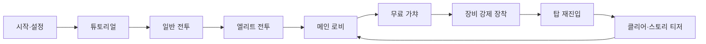

# ⌨️ typing-roguelike 초기 제품 스펙 v0.2

> [Notion에서 열기](https://app.notion.com/p/3c612168d52181828d2ce0c44d764708?pvs=204)
> 이 문서는 2026-08-26에 로컬로 추출한 원문 스냅샷입니다.

<callout icon="📚" color="blue_bg">
	개념 정의와 공통 용어는 <mention-page url="https://app.notion.com/p/3c612168d5218118ac6de6f23d757f5d"/>를 기준으로 관리합니다.
</callout>
<callout icon="📚" color="gray_bg">
	개념 정의의 단일 기준은  <mention-page url="https://app.notion.com/p/3c612168d5218118ac6de6f23d757f5d"/>에서 관리합니다. 이 문서는 구현 요구사항과 검증 기준에 집중합니다.
</callout>
<callout icon="📚" color="green_bg">
	상세 개념 정의는 <mention-page url="https://app.notion.com/p/3c612168d5218118ac6de6f23d757f5d"/>를 기준으로 합니다. 이 문서는 구현 요구사항과 초기 제품 범위에 집중합니다.
</callout>
<callout icon="📚" color="green_bg">
	개념 정의와 용어의 기준 문서는 <mention-page url="https://app.notion.com/p/3c612168d5218118ac6de6f23d757f5d"/>입니다. 이 문서는 구현 요구사항과 초기 제품 범위를 담당합니다.
</callout>
<callout icon="📚" color="purple_bg">
	세부 개념 정의는 <mention-page url="https://app.notion.com/p/3c612168d5218118ac6de6f23d757f5d"/>에서 관리합니다. 특히 용어집, 전투 시스템, 재화와 정산, 스킬과 커맨드 페이지를 기준 문서로 사용합니다.
</callout>
<callout icon="📚" color="purple_bg">
	개념 정의는 <mention-page url="https://app.notion.com/p/3c612168d5218118ac6de6f23d757f5d"/>를 기준으로 관리합니다. 이 스펙은 구현 범위와 요구사항을 중심으로 유지합니다.
</callout>
<callout icon="📚" color="gray_bg">
	개념 정의와 용어 기준:  <mention-page url="https://app.notion.com/p/3c612168d5218118ac6de6f23d757f5d"/>
</callout>
<callout icon="🛠️" color="yellow_bg">
	댓글 반영 보정: 아래 기존 항목 중 일부 표현이 남아 있어 개정 기준을 상단에 명시합니다.
	- REQ-010: 사망 시 보유 아이템은 소멸하지 않고, 사망 시점까지 획득한 아이템의 환전 가치만큼 재화 정산한다. 클리어 시에는 추가 스테이지 보상을 지급한다.
	- REQ-012: 첫 플레이 흐름 목표 시간은 20\~30분이다.
	- 전투 예고: 적 공격은 공격 게이지(선딜) → 준비 모션 → 시전 완료 → 후딜 → 타격 시점 순서로 표현한다. 다음 공격 게이지는 스킬 시전 직후 충전 시작 가능하다.
	- UX: 커맨드 성공 즉시 스킬 발동 피드백과 후딜 상태를 표시한다.
	- DES-004: 본문/일반 UI 기본 서체는 갈무리9(Galmuri9)를 우선 사용한다.
</callout>
<callout icon="📚" color="blue_bg">
	관련 개념 문서는  <mention-page url="https://app.notion.com/p/3c612168d5218118ac6de6f23d757f5d"/>에서 관리한다.
</callout>
<callout icon="📚" color="blue_bg">
	개념 정의와 운영 규칙은  <mention-page url="https://app.notion.com/p/3c612168d5218118ac6de6f23d757f5d"/>에서 관리합니다. 이 문서는 제품 요구사항과 구현 기준에 집중합니다.
</callout>
<callout icon="📚" color="blue_bg">
	개념 정의와 장기 관리 문서는  <mention-page url="https://app.notion.com/p/3c612168d5218118ac6de6f23d757f5d"/>를 기준으로 관리합니다.
</callout>
<callout icon="📚" color="purple_bg">
	개념 정의와 용어 기준은 <mention-page url="https://app.notion.com/p/3c612168d5218118ac6de6f23d757f5d"/>에서 관리합니다.
</callout>
<callout icon="📚" color="blue_bg">
	개념 정의는  <mention-page url="https://app.notion.com/p/3c612168d5218118ac6de6f23d757f5d"/>를 기준으로 관리합니다.
</callout>
<callout icon="📚" color="blue_bg">
	개념 정의와 용어 기준은  <mention-page url="https://app.notion.com/p/3c612168d5218118ac6de6f23d757f5d"/>에서 관리합니다.
</callout>
<callout icon="📚" color="green_bg">
	관련 개념 문서는 <mention-page url="https://app.notion.com/p/3c612168d5218118ac6de6f23d757f5d"/>에서 관리합니다.
</callout>
<callout icon="📚" color="green_bg">
	개념 정의와 세부 규칙은 <mention-page url="https://app.notion.com/p/3c612168d5218118ac6de6f23d757f5d"/>에서 관리합니다. 이 문서는 구현 요구사항과 검증 기준을 중심으로 유지합니다.
</callout>
<callout icon="📚" color="purple_bg">
	상세 개념 정의와 지속적으로 변경되는 게임 규칙은 <mention-page url="https://app.notion.com/p/3c612168d5218118ac6de6f23d757f5d"/>에서 관리한다. 아래의 **댓글 반영 정정사항**은 기존 본문의 동일 항목보다 우선한다.
</callout>
## 댓글 반영 정정사항
- **REQ-010 정정**: 런 도중 사망하더라도 사망 시점까지 획득한 아이템의 환전 가치만큼 재화를 정산한다. 스테이지를 클리어하면 아이템 환전 정산에 더해 스테이지 클리어 보상을 추가 지급한다.
- **REQ-012 정정**: 첫 플레이 흐름의 권장 소요 시간은 **20\~30분**으로 한다.
- **UX-003 정정**: 커맨드 성공 시 플레이어가 자신이 입력한 스킬이 실제로 동작했다고 즉시 인지할 수 있는 시각·음향 피드백을 제공한다. 스킬 생명주기는 `사용자 입력 → 스킬 시작 → 선딜 → 시전 완료 → 후딜 → 타격 시점`으로 정의한다.
- **UX-006 정정**: 적 공격은 공격 시작부터 스킬 완성까지의 **선딜**을 가로 진행 게이지로 표시하고, 게이지가 차는 동안 공격별 준비 모션을 보여준다. 게이지가 가득 차면 시전이 완료되고 **후딜**로 전환되며, 후딜 종료 시점에 실제 타격이 발생한다. 적의 다음 공격 게이지는 스킬 시전 직후부터 다시 충전될 수 있다.
- **DES-004 정정**: 본문과 일반 UI 텍스트는 **갈무리9(Galmuri9)**를 우선 사용한다. 제목은 각진 판타지 서체를 사용할 수 있고, 커맨드는 입력 판독성과 획 구분이 선명한 서체를 사용한다.
<callout icon="📚" color="purple_bg">
	개념 정의와 용어 기준은 <mention-page url="https://app.notion.com/p/3c612168d5218118ac6de6f23d757f5d"/>에서 관리합니다. 이 문서는 구현·검증 기준에 집중합니다.
</callout>
<callout icon="✅" color="green_bg">
	**댓글 반영 기준 — 2026-08-25**
	아래 항목은 기존 본문의 동일·충돌 항목보다 우선한다.
</callout>
## 댓글 반영 변경사항
- **정산 규칙**: 사망 시에도 사망 시점까지 획득한 아이템의 환전 가치만큼 재화를 정산한다. 스테이지 클리어 시에는 아이템 환전 정산에 **스테이지 클리어 보상**을 추가한다.
- **첫 플레이 시간**: 권장 소요 시간을 **20\~30분**으로 변경한다.
- **전투 시간 용어**: **선딜**은 스킬 시작부터 스킬 완성까지, **후딜**은 스킬 완성부터 상대에게 도착할 때까지, **타격 시점**은 후딜 종료 시점으로 정의한다.
- **적 공격 예고**: 적의 선딜을 가로 진행 게이지로 표시하고, 게이지 충전 중 공격 준비 모션을 보여 공격 종류를 판별할 수 있게 한다. 게이지가 가득 차면 스킬이 시전되고 후딜로 전환한다. 다음 공격 게이지는 이전 스킬 시전 직후부터 다시 충전될 수 있다.
- **플레이어 스킬 피드백**: 커맨드 입력 성공 직후 '내가 친 스킬이 실제로 동작했다'고 즉시 인지할 수 있는 시각·음향 피드백을 제공하고, 이어지는 후딜 상태를 명확히 표시한다.
- **폰트**: 본문과 일반 UI 텍스트는 **갈무리9(Galmuri9)**를 우선 사용한다.
## 관련 Wiki
 <mention-page url="https://app.notion.com/p/3c612168d5218118ac6de6f23d757f5d"/>
---
<callout icon="📝" color="yellow_bg">
	**2026-08-25 댓글 반영 메모**
	- 정산: 사망해도 사망 시점까지 획득한 아이템의 환전 가치만큼 정산. 클리어 시 스테이지 클리어 보상 추가.
	- 첫 플레이 권장 시간: **20\~30분**.
	- 전투 타이밍: **선딜 = 스킬 완성까지**, **후딜 = 완성 후 상대에게 도착까지**, **타격 시점 = 후딜 종료 시점**.
	- 적 공격 예고: 선딜 동안 가로 게이지와 준비 모션을 함께 표시하며, 스킬 시전 직후 다음 공격 게이지가 다시 충전될 수 있음.
	- 입력 UX: 커맨드 성공 시 스킬이 실제 발동했다는 즉시 피드백과 후딜 상태를 명확히 표시.
	- 본문/일반 UI 폰트: **갈무리9(Galmuri9)** 우선.
	- 상세 개념 정의는 하위 **CEX Wiki**를 기준으로 관리.
</callout>
<callout icon="📚" color="green_bg">
	반복 참조되는 게임 개념은  <mention-page url="https://app.notion.com/p/3c612168d5218118ac6de6f23d757f5d"/>에서 관리합니다. 이 문서는 구현 요구사항과 검증 기준을 중심으로 유지합니다.
</callout>
<callout icon="📚" color="purple_bg">
	상세 개념 정의와 지속적으로 변경되는 게임 규칙은 <mention-page url="https://app.notion.com/p/3c612168d5218118ac6de6f23d757f5d"/>에서 관리한다. 이 문서는 구현 범위와 제품 요구사항을 중심으로 유지한다.
</callout>
<callout icon="📝" color="yellow_bg">
	**2026-08-25 댓글 반영 사항 — 아래 내용이 기존 본문의 충돌하는 표현보다 우선합니다.**
	- 사망 시: 사망 시점까지 획득한 아이템의 **환전 가치만큼 재화 정산**.
	- 스테이지 클리어 시: 아이템 환전 정산 + **스테이지 클리어 보상 추가 지급**.
	- 첫 플레이 권장 시간: **20\~30분**.
	- 선딜: 스킬이 완성되기까지의 시간. 적 공격은 가로 게이지와 준비 모션으로 선딜을 표현.
	- 후딜: 스킬 완성 후 상대에게 도착하기까지의 시간. 후딜 종료 시점이 타격 시점.
	- 적의 다음 공격 게이지는 **스킬 시전 직후부터** 다시 충전 가능.
	- 커맨드 성공 시 플레이어가 스킬 동작을 즉시 인지할 수 있는 피드백과 후딜 상태를 명확히 표시.
	- 본문·일반 UI 텍스트 기본 추천 서체: **갈무리9(Galmuri9)**.
</callout>
<callout icon="🛠️" color="yellow_bg">
	**댓글 반영 개정사항 (2026-08-25)**
	- REQ-010: 사망 시에도 사망 시점까지 획득한 아이템의 환전 가치만큼 재화를 정산한다. 스테이지 클리어 시 아이템 환전 정산에 더해 클리어 보상을 추가 지급한다.
	- REQ-012: 첫 플레이 권장 소요 시간을 **20\~30분**으로 조정한다.
	- 전투 텔레그래프: 적 공격은 **선딜 게이지 + 준비 모션 → 스킬 시전 완료 → 후딜 → 타격 시점**으로 표현한다. 다음 공격 게이지는 스킬 시전 직후부터 다시 충전될 수 있다.
	- UX-003: 커맨드 입력 성공 직후 '내가 친 스킬이 동작했다'는 것을 즉시 인지할 수 있는 시각/음향 피드백을 제공하고 후딜 상태를 명확히 표시한다.
	- 용어 정의: **선딜**은 스킬이 완성되기까지의 시간, **후딜**은 스킬 완성 후 상대에게 도착하기까지의 시간, **타격 시점**은 후딜 종료 시점이다.
	- DES-004: 본문 및 일반 UI 텍스트의 우선 서체는 **갈무리9(Galmuri9)**로 한다.
</callout>
<callout icon="📌" color="blue_bg">
	이 문서는 원문 기획을 실행 가능한 초기 제품 스펙으로 정리한 문서입니다. 확정·제안·미정 항목을 구분했습니다.
</callout>
# Introduction
이 문서는 Notion의 「힘내봅시다 CEX」 기획 메모를 기반으로 작성한 초기 제품 스펙이다. 제품을 설계하고 구현할 수 있도록 핵심 게임 루프, 기능, 사용자 인터페이스(UI), 시각 디자인, 이미지 에셋, 데이터 계약, 검증 기준을 한 문서에 정의한다.
## 1. Purpose & Scope
### 1.1 목적
- 타자 입력과 실시간 전투를 결합한 게임의 재미를 첫 플레이 구간에서 검증한다.
- 로비, 가챠, 장비 장착, 일반 전투, 엘리트 전투, 탑 클리어 안내로 이어지는 사용자 흐름을 구현한다.
- 기획, 디자인, 개발, 이미지 생성 작업에 공통 기준을 제공한다.
### 1.2 범위
- **포함**: 첫 실행 안내, 기본 타자 전투, 적 공격 예고, 행동력, 장비 획득·장착, 온보딩 가챠, 일반·엘리트 전투, 클리어 결과, 후속 스토리 안내.
- **후속 범위**: 협동 레이드, 1:1 결투, 캐릭터·장비 유료 가챠, 스킨 판매, 월정액 편의 기능, 영구 성장, 다층 탑, 복잡한 인벤토리 관리.
- **플랫폼**: 미정. 제품 배포 환경을 결정한 뒤 입력 방식과 화면 비율을 확정한다.
- **대상 사용자**: 로그라이크, 장비 빌딩, 액션 전투, 타자 게임을 선호하는 사용자.
### 1.3 상태 표기
- **확정**: 원문 기획에서 직접 확인된 내용.
- **제안**: 초기 출시 범위를 구체화하기 위해 이 문서에서 추가한 내용.
- **미정**: 팀 의사결정이 필요한 내용.
## 2. Definitions
<table fit-page-width="true" header-row="true">
<colgroup>
<col width="166">
<col width="639">
</colgroup>
<tr>
<td>용어</td>
<td>정의</td>
</tr>
<tr>
<td>Typing Roguelike</td>
<td>프로젝트 임시 명칭. 정식 타이틀은 미정이다.</td>
</tr>
<tr>
<td>PvE</td>
<td>플레이어가 시스템이 제어하는 적과 전투하는 모드다.</td>
</tr>
<tr>
<td>PvP</td>
<td>플레이어끼리 전투하는 모드다.</td>
</tr>
<tr>
<td>BM</td>
<td>수익 모델을 의미한다. 초기 출시 범위에는 실제 결제를 포함하지 않는다.</td>
</tr>
<tr>
<td>런</td>
<td>탑 입장부터 클리어, 탈출 또는 사망까지 이어지는 한 번의 플레이 세션이다.</td>
</tr>
<tr>
<td>행동력(AP)</td>
<td>짧은 시간에 기술을 과도하게 사용하지 못하도록 제한하는 자원이다.</td>
</tr>
<tr>
<td>커맨드</td>
<td>기술 발동을 위해 사용자가 정확히 입력해야 하는 문자열이다.</td>
</tr>
<tr>
<td>텔레그래프</td>
<td>적 공격이 시전되기 전, 선딜 게이지와 준비 모션을 통해 공격 종류와 시전 진행 상태를 보여주는 예고 정보다.</td>
</tr>
<tr>
<td>시그니처 기술</td>
<td>장비의 정체성을 나타내는 고유 기술이다.</td>
</tr>
<tr>
<td>추출</td>
<td>런에서 획득한 아이템의 환전 가치를 재화로 정산하는 과정이다. 사망 시에도 사망 시점까지의 획득 아이템 가치가 정산되며, 스테이지 클리어 시 추가 보상이 붙는다.</td>
</tr>
<tr>
<td></td>
<td></td>
</tr>
</table>
## 3. Requirements, Constraints & Guidelines
### 3.1 제품 및 게임플레이 요구사항
- **REQ-001 \[확정\]**: 게임 장르는 로그라이크 장비 빌딩 타자 게임이어야 한다.
- **REQ-002 \[확정\]**: 기본 전투 행동은 사용자가 화면에 표시된 커맨드를 입력하는 방식이어야 한다.
- **REQ-003 \[확정\]**: 전투는 실시간으로 진행되어야 하며 적의 기술에는 도착 시간이 있어야 한다.
- **REQ-004 \[확정\]**: 시스템은 기술 사용을 제한하는 행동력 자원을 제공해야 한다.
- **REQ-005 \[확정\]**: 사용자는 공격 도착 전 대응 커맨드를 입력해 방어할 수 있어야 한다. 예시는 `매직실드`와 `방패들기`다.
- **REQ-006 \[확정\]**: 장비 등급에 따라 기본 기술 1개와 시그니처 기술 1\~2개를 제공할 수 있어야 한다.
- **REQ-007 \[확정\]**: 장비 구성은 무기, 세컨더리 2개, 반지 1개, 주문서 1개를 지원해야 한다.
- **REQ-008 \[확정\]**: 일반 적, 엘리트 적, 보스는 서로 다른 보상 등급을 제공해야 한다.
- **REQ-009 \[확정\]**: 엘리트 적의 기술은 해당 구간 보스 기믹을 학습할 수 있는 힌트 역할을 해야 한다.
- **<span discussion-urls="discussion://3c612168-d521-8182-8d2c-e0c44d764708/264b8667-3d59-4bb8-b536-aff9c2543ab7/3c612168-d521-8066-b914-001c9f07b4f0">REQ-010 \[확정\]</span>**<span discussion-urls="discussion://3c612168-d521-8182-8d2c-e0c44d764708/264b8667-3d59-4bb8-b536-aff9c2543ab7/3c612168-d521-8066-b914-001c9f07b4f0">: 런 도중 사망하더라도 사망 시점까지 획득한 아이템의 환전 가치만큼 재화를 정산한다. 스테이지를 클리어하면 아이템 환전 정산에 더해 스테이지 클리어 보상을 추가로 지급한다.</span>
- **REQ-011 \[확정\]**: 초기 출시 범위는 게임 방법 안내, 일반 전투 1회, 엘리트 전투 1회, 메인 화면 복귀, 가챠 안내, 획득 장비 장착, 탑 재진입, 클리어 후 후속 스토리 안내를 포함해야 한다.
- **<span discussion-urls="discussion://3c612168-d521-8182-8d2c-e0c44d764708/9d3dc1e8-f9c8-41af-8276-3d398367772e/3c612168-d521-806b-b25d-001c05e35d70">REQ-012 \[제안\]</span>**<span discussion-urls="discussion://3c612168-d521-8182-8d2c-e0c44d764708/9d3dc1e8-f9c8-41af-8276-3d398367772e/3c612168-d521-806b-b25d-001c05e35d70">: 첫 플레이 흐름의 권장 소요 시간은 20\~30분으로 한다.</span>
- **REQ-013 \[제안\]**: 온보딩 가챠는 무료이며 결과를 고정해 장비 학습 경험을 보장한다.
- **REQ-014 \[제안\]**: 전투 결과 화면은 생존 여부, 명중률, 최고 연속 입력 수, 받은 피해, 획득 보상을 표시해야 한다.
- **REQ-015 \[미정\]**: 커맨드 언어는 한국어, 영어 또는 사용자 선택 방식 중 하나로 확정해야 한다.
- **REQ-016 \[미정\]**: 첫 번째 탑 진행의 최종 전투에 독립된 보스전을 포함할지 결정해야 한다.
### 3.2 필수 UI
<table fit-page-width="true" header-row="true">
<colgroup>
<col width="79">
<col>
<col width="443.296875">
<col width="161.2578125">
</colgroup>
<tr>
<td>UI ID</td>
<td>화면/컴포넌트</td>
<td>필수 요소</td>
<td>주요 행동</td>
</tr>
<tr>
<td>UI-001</td>
<td>시작·접근성 설정</td>
<td>시작 버튼, 커맨드 언어, 글자 크기, 음량, 화면 흔들림 설정</td>
<td>게임 시작</td>
</tr>
<tr>
<td>UI-002</td>
<td>튜토리얼 오버레이</td>
<td>입력 예시, 성공·실패 피드백, 행동력 설명, 적 공격 예고 설명</td>
<td>연습 커맨드 입력</td>
</tr>
<tr>
<td>UI-003</td>
<td>메인 로비</td>
<td>탑 입장, 장비, 가챠, 보유 재화, 현재 전투력</td>
<td>기능 진입</td>
</tr>
<tr>
<td>UI-004</td>
<td>가챠</td>
<td>1회 뽑기, 결과 카드, 등급, 신규 장비 정보</td>
<td>무료 뽑기, 결과 확인</td>
</tr>
<tr>
<td>UI-005</td>
<td>장비 장착</td>
<td>슬롯 5개, 보유 장비, 기술 목록, 장착 전후 비교</td>
<td>가챠 장비 강제 장착</td>
</tr>
<tr>
<td>UI-006</td>
<td>탑 경로</td>
<td>현재 단계, 일반·엘리트·보스 구분, 진행 상태</td>
<td>다음 전투 진입</td>
</tr>
<tr>
<td>UI-007</td>
<td>전투 HUD</td>
<td>적·플레이어 체력, 행동력, 입력창, 커맨드 후보, 공격 도착 타이머, 장비 기술</td>
<td>입력, 기술 발동, 방어</td>
</tr>
<tr>
<td>UI-008</td>
<td>일시정지</td>
<td>계속하기, 재시작, 설정, 로비로 나가기 경고</td>
<td>플레이 제어</td>
</tr>
<tr>
<td>UI-009</td>
<td>전투 결과</td>
<td>승패, 입력 지표, 보상, 다음 단계</td>
<td>계속 진행</td>
</tr>
<tr>
<td>UI-010</td>
<td>런 종료·스토리 티저</td>
<td>클리어 상태, 정산 결과, 후속 콘텐츠 안내</td>
<td>메인 화면 복귀</td>
</tr>
</table>
### 3.3 전투 UX 규칙
- **UX-001 \[제안\]**: 입력창은 전투 화면 하단 중앙에 고정하고 현재 입력, 오타 지점, 완성된 문자열을 색으로 구분한다.
- **UX-002 \[제안\]**: 방어가 필요한 공격은 색, 아이콘, 모션을 함께 사용해 표현한다. 색상만으로 의미를 전달하지 않는다.
- **<span discussion-urls="discussion://3c612168-d521-8182-8d2c-e0c44d764708/0dac2027-ef08-4402-a86b-0f66f7c90481/3c612168-d521-80a8-8c71-001cd358ba84">UX-003 \[제안\]</span>**<span discussion-urls="discussion://3c612168-d521-8182-8d2c-e0c44d764708/0dac2027-ef08-4402-a86b-0f66f7c90481/3c612168-d521-80a8-8c71-001cd358ba84">: 커맨드 성공 시 플레이어가 '내가 입력한 스킬이 실제로 동작했다'고 즉시 인지할 수 있는 시각·음향 피드백을 제공하고, 스킬의 후딜 상태를 이어서 명확히 표시한다.</span> 
	- LifeCycle : 사용자 입력 → 스킬 시작 → 선딜 → 시전 완료 → 후딜 → 타격 시점
- **UX-004 \[제안\]**: 사용자가 타이핑하는 동안 키보드 포커스가 입력창 밖으로 이동하지 않아야 한다.
- **UX-005 \[제안\]**: 오타가 발생해도 기존 입력 전체를 초기화하지 않고 잘못된 글자부터 수정할 수 있어야 한다.
- **<span discussion-urls="discussion://3c612168-d521-8182-8d2c-e0c44d764708/f8a32abf-1141-4481-91ee-3b3c22b692c5/3c612168-d521-80df-969b-001c2e7afb61">UX-006 \[제안\]</span>**<span discussion-urls="discussion://3c612168-d521-8182-8d2c-e0c44d764708/f8a32abf-1141-4481-91ee-3b3c22b692c5/3c612168-d521-80df-969b-001c2e7afb61">: 적은 공격 시작 시점부터 스킬이 완성될 때까지의 선딜을 가로 진행 게이지로 표시하고, 게이지가 차는 동안 해당 공격의 준비 모션을 보여 플레이어가 공격 종류를 판별할 수 있게 한다. 게이지가 가득 차면 스킬 시전이 완료되며 후딜 구간으로 전환한다. 적의 다음 공격 게이지는 스킬 시전 직후부터 다시 충전될 수 있다.</span>
- **UX-007 \[제안\]**: 행동력이 부족한 기술은 비활성 상태와 부족 수치를 명확히 표시한다.
### 3.4 시각 디자인 가이드
- **DES-001 \[제안\]**: 아트 방향은 어두운 판타지, 마법 문서, 탑 탐험을 중심으로 구성한다.
- **DES-002 \[제안\]**: 배경은 저채도 남색·회색, 상호작용 요소는 청록·금색, 위험 신호는 주황·적색을 사용한다.
- **DES-003 \[제안\]**: 전투 중 텍스트 가독성을 최우선으로 하며 배경 대비 비율은 일반 텍스트 4.5:1 이상을 목표로 한다.
- **<span discussion-urls="discussion://3c612168-d521-8182-8d2c-e0c44d764708/006d5598-b8b1-456a-838a-4899cc7bb81b/3c612168-d521-80b2-bb6d-001c7b24542f">DES-004 \[제안\]</span>**<span discussion-urls="discussion://3c612168-d521-8182-8d2c-e0c44d764708/006d5598-b8b1-456a-838a-4899cc7bb81b/3c612168-d521-80b2-bb6d-001c7b24542f">: 제목에는 각진 판타지 서체를 사용할 수 있다. 본문과 일반 UI 텍스트는 갈무리9(Galmuri9)를 우선 사용하고, 커맨드는 입력 판독성과 획 구분이 선명한 서체를 사용한다. </span>
- **DES-005 \[제안\]**: UI 장식은 마법진, 룬, 금속 프레임을 사용하되 입력 문자열 주변의 장식 밀도를 낮게 유지한다.
- **DES-006 \[제안\]**: 일반, 희귀, 영웅, 전설 등급은 색상과 테두리 패턴을 함께 사용한다.
- **DES-007 \[제안\]**: 기본 화면은 16:9 비율을 우선 설계하고 최소 지원 해상도는 플랫폼 결정 후 확정한다.
### 3.5 이미지 및 시각 에셋 요구사항
<table fit-page-width="true" header-row="true">
<tr>
<td>AST ID</td>
<td>에셋</td>
<td>최소 수량</td>
<td>형식·비율</td>
<td>사용 위치</td>
<td>우선순위</td>
</tr>
<tr>
<td>AST-001</td>
<td>대표 키아트</td>
<td>1</td>
<td>16:9, 원본 레이어 보존</td>
<td>시작 화면, 소개 자료</td>
<td>P1</td>
</tr>
<tr>
<td>AST-002</td>
<td>로비 배경</td>
<td>1</td>
<td>16:9</td>
<td>메인 로비</td>
<td>P0</td>
</tr>
<tr>
<td>AST-003</td>
<td>탑 전투 배경</td>
<td>2</td>
<td>16:9, 일반·엘리트 변형</td>
<td>전투 화면</td>
<td>P0</td>
</tr>
<tr>
<td>AST-004</td>
<td>플레이어 캐릭터</td>
<td>1세트</td>
<td>투명 PNG/WebP, 대기·피격·공격 상태</td>
<td>전투, 장비 화면</td>
<td>P0</td>
</tr>
<tr>
<td>AST-005</td>
<td>일반 적</td>
<td>1세트</td>
<td>투명 PNG/WebP, 대기·피격·공격 상태</td>
<td>일반 전투</td>
<td>P0</td>
</tr>
<tr>
<td>AST-006</td>
<td>엘리트 적</td>
<td>1세트</td>
<td>투명 PNG/WebP, 고유 기술 상태 포함</td>
<td>엘리트 전투</td>
<td>P0</td>
</tr>
<tr>
<td>AST-007</td>
<td>보스</td>
<td>1세트</td>
<td>보스전 확정 시 제작</td>
<td>최종 전투</td>
<td>P1</td>
</tr>
<tr>
<td>AST-008</td>
<td>장비 아이콘</td>
<td>최소 8</td>
<td>정사각형, 투명 배경</td>
<td>가챠, 인벤토리, HUD</td>
<td>P0</td>
</tr>
<tr>
<td>AST-009</td>
<td>기술·상태 아이콘</td>
<td>최소 10</td>
<td>정사각형, 단색에서도 식별 가능</td>
<td>HUD, 툴팁</td>
<td>P0</td>
</tr>
<tr>
<td>AST-010</td>
<td>공격 텔레그래프</td>
<td>최소 4</td>
<td>투명 시퀀스 또는 파티클</td>
<td>적 공격 예고</td>
<td>P0</td>
</tr>
<tr>
<td>AST-011</td>
<td>타격·방어 VFX</td>
<td>최소 6</td>
<td>투명 시퀀스 또는 엔진 파티클</td>
<td>전투 피드백</td>
<td>P0</td>
</tr>
<tr>
<td>AST-012</td>
<td>UI 프레임·패널</td>
<td>1세트</td>
<td>9-slice 가능 원본</td>
<td>전체 UI</td>
<td>P0</td>
</tr>
<tr>
<td>AST-013</td>
<td>등급 테두리</td>
<td>4</td>
<td>정사각형, 색·패턴 병행</td>
<td>아이템 카드</td>
<td>P0</td>
</tr>
<tr>
<td>AST-014</td>
<td>스토리 티저 일러스트</td>
<td>1</td>
<td>16:9 또는 3:2</td>
<td>첫 번째 탑 클리어 이후</td>
<td>P1</td>
</tr>
</table>
- **AST-015 \[제안\]**: 모든 생성형 이미지 에셋은 생성 도구, 프롬프트, 생성일, 편집 이력을 기록한다.
- **AST-016 \[제안\]**: 외부 에셋은 상업적 사용 가능 여부와 출처를 기록한다.
- **AST-017 \[제안\]**: 이미지 원본과 게임용 최적화 파일을 분리하며 파일명은 `{category}_{subject}_{state}_{variant}` 형식을 사용한다.
- **AST-018 \[제안\]**: P0 에셋이 준비되지 않은 단계에서는 명확히 표시된 플레이스홀더를 사용한다.
### 3.6 제약 및 보안
- **CON-001**: 실제 결제와 유료 확률형 아이템 구매는 초기 출시 범위에서 제외한다.
- **CON-002**: 화면 흔들림, 섬광, 파티클은 사용자가 줄이거나 끌 수 있어야 한다.
- **CON-003**: 미성년자 대상 가능성이 있으므로 확률형 아이템과 결제 기능 도입 시 별도 법률·플랫폼 검토가 필요하다.
- **SEC-001**: 온라인 기록을 도입할 경우 사용자 입력을 명령어나 HTML로 실행하지 않아야 한다.
- **SEC-002**: 저장 데이터는 게임 상태 스키마에 정의된 값만 허용해야 한다.
## 4. Interfaces & Data Contracts
### 4.1 입력 인터페이스
<table fit-page-width="true" header-row="true">
<tr>
<td>입력</td>
<td>동작</td>
</tr>
<tr>
<td>문자 키</td>
<td>현재 커맨드 문자열에 추가</td>
</tr>
<tr>
<td>Backspace</td>
<td>마지막 입력 문자 삭제</td>
</tr>
<tr>
<td>Enter 또는 커맨드 자동 완성</td>
<td>완성된 커맨드 제출</td>
</tr>
<tr>
<td>Escape</td>
<td>일시정지 메뉴 열기</td>
</tr>
<tr>
<td>마우스·포인터</td>
<td>로비, 장비, 가챠 UI 조작</td>
</tr>
</table>
### 4.2 핵심 데이터 계약 예시
```json
{
  "command": {
    "id": "cmd_magic_shield",
    "displayText": "매직실드",
    "normalizedText": "매직실드",
    "costAP": 30,
    "type": "defense",
    "effectId": "fx_magic_shield",
    "cooldownMs": 2000
  },
  "incomingAttack": {
    "id": "attack_fireball_01",
    "counterCommandIds": ["cmd_magic_shield"],
    "impactAtMs": 4500,
    "damage": 20,
    "telegraphType": "magic"
  }
}
```
```json
{
  "item": {
    "id": "weapon_apprentice_sword",
    "slot": "weapon",
    "rarity": "rare",
    "baseCommandIds": ["cmd_swing"],
    "signatureCommandIds": ["cmd_spin_slash"],
    "iconAssetId": "item_weapon_apprentice_sword"
  },
  "runResult": {
    "status": "cleared",
    "accuracy": 0.94,
    "maxCombo": 17,
    "damageTaken": 28,
    "acquiredItemIds": ["weapon_apprentice_sword"],
    "settledCurrency": 120
  }
}
```
### 4.3 상태 전이

## 5. Acceptance Criteria
- **AC-001**: 첫 실행 사용자가 안내를 완료하면 일반 전투에 진입해야 한다.
- **AC-002**: 적의 파이어볼 공격이 예고된 상태에서 사용자가 제한 시간 내 `매직실드`를 정확히 입력하면 피해가 방어 규칙에 따라 감소하거나 무효화되어야 한다.
- **AC-003**: 행동력이 기술 비용보다 낮으면 해당 기술이 발동되지 않고 부족한 행동력 수치가 표시되어야 한다.
- **AC-004**: 사용자가 커맨드를 잘못 입력하면 오타 위치가 표시되고 수정 입력을 받을 수 있어야 한다.
- **AC-005**: 일반 전투를 완료하면 하급 보상, 엘리트 전투를 완료하면 중급 이상 보상이 지급되어야 한다.
- **AC-006**: 가챠 안내 단계에서 무료 뽑기를 완료하면 온보딩 장비가 지급되고 장비 화면으로 이동해야 한다.
- **AC-007**: 필수 장비를 장착하기 전에는 탑 재입장 버튼이 활성화되지 않아야 한다.
- **AC-008**: 런에서 사망하면 해당 런에서 획득한 임시 아이템이 정산되지 않아야 한다.
- **AC-009**: 런을 생존 상태로 완료하면 획득 아이템이 재화로 정산되고 결과 화면에 합계가 표시되어야 한다.
- **AC-010**: 첫 플레이 흐름을 완료하면 후속 스토리 안내와 메인 화면 복귀 동작이 제공되어야 한다.
- **AC-011**: 모든 위험 신호와 아이템 등급은 색상 외 아이콘 또는 패턴으로 구분할 수 있어야 한다.
- **AC-012**: 16:9 기준 화면에서 전투 입력창, 현재 커맨드, 적 공격 타이머가 서로 겹치지 않아야 한다.
## 6. Test Automation Strategy
- **단위 테스트**: 커맨드 정규화, 오타 판정, 행동력 소비·회복, 피해 계산, 보상 등급, 사망 시 아이템 삭제, 생존 시 정산을 검증한다.
- **통합 테스트**: 입력 이벤트에서 기술 발동, 공격 예고에서 방어 판정, 가챠 보상에서 장비 장착, 전투 종료에서 결과 저장까지의 연결을 검증한다.
- **종단 간 테스트**: 첫 실행부터 스토리 티저까지 핵심 사용자 흐름과 사망 흐름을 각각 자동화한다.
- **시각 회귀 테스트**: 주요 10개 화면을 기준 해상도에서 캡처하고 입력창·타이머·팝업의 겹침을 비교한다.
- **성능 테스트**: 전투 중 입력 피드백 지연, 프레임 유지, 에셋 로딩 중 끊김을 측정한다.
- **테스트 데이터**: 고정 시드 가챠 결과, 일반·엘리트 적 프리셋, 성공·오타·시간 초과 커맨드를 제공한다.
- **도구**: 구현 플랫폼 확정 후 프레임워크를 선택한다. CI에서는 단위·통합·핵심 사용자 흐름을 자동 실행한다.
- **품질 목표**: 전투 판정과 정산 로직의 분기 커버리지 90% 이상을 목표로 한다.
## 7. Rationale & Context
타자 입력은 전투의 핵심 조작이며 적 공격 예고와 대응 커맨드는 실시간 긴장감을 만든다. 행동력은 빠른 타자 속도가 모든 난이도를 무력화하는 상황을 줄인다. 엘리트 적이 보스 기믹을 미리 보여주면 실패 원인을 학습할 수 있다. 온보딩 가챠 결과를 고정하면 장비 빌딩 경험을 첫 플레이 구간에서 안정적으로 전달할 수 있다.
## 8. Dependencies & External Integrations
### External Systems
- **EXT-001**: 입력 시스템 - 한글 조합 중 입력과 영문 입력을 안정적으로 처리해야 한다.
- **EXT-002**: 로컬 저장소 - 설정, 게임 진행 상태, 장비 상태를 저장해야 한다.
### Third-Party Services
- **SVC-001**: 필수 외부 서비스 없음. 분석 또는 오류 수집 도입 여부는 별도 결정한다.
### Infrastructure Dependencies
- **INF-001**: 제품 배포 환경 - 정적 웹, 데스크톱 빌드 또는 게임 플랫폼 중 하나를 선택해야 한다.
### Data Dependencies
- **DAT-001**: 커맨드 사전 - 언어, 난이도, 기술 유형, 금칙어 여부가 정의된 데이터가 필요하다.
- **DAT-002**: 밸런스 테이블 - 적 체력, 공격 주기, 행동력 비용, 보상 확률을 외부 설정으로 관리해야 한다.
### Technology Platform Dependencies
- **PLT-001**: 플랫폼은 안정적인 키보드 입력, 2D 애니메이션, 오디오, 로컬 저장을 지원해야 한다.
### Compliance Dependencies
- **COM-001**: 유료 가챠 도입 전 확률 공개, 연령 등급, 결제 정책을 검토해야 한다.
- **COM-002**: 외부 또는 생성형 에셋의 라이선스와 제작 이력을 관리해야 한다.
## 9. Examples & Edge Cases
### 9.1 정상 대응
```plain text
상황: 파이어볼이 4.5초 뒤 도착한다.
표시 커맨드: 매직실드
사용자 입력: 매직실드
결과: 행동력 30을 소비하고 방어 효과를 적용한다.
```
### 9.2 경계 사례
- 한글 조합 중 Enter 입력: 조합 중인 마지막 글자를 확정한 뒤 커맨드를 제출한다.
- 대소문자 차이: 영문 커맨드의 대소문자 구분 여부를 설정으로 정의하고 일관되게 적용한다.
- 불필요한 공백: 앞뒤 공백은 제거한다. 단어 사이 공백은 커맨드 데이터와 동일해야 한다.
- 동시 공격: 가장 빨리 도착하는 공격을 기본 선택하고 모든 타이머를 계속 표시한다.
- 행동력 부족: 입력 성공 피드백과 기술 미발동 피드백을 구분한다.
- 일시정지: 적 공격 타이머와 행동력 회복을 함께 정지한다.
- 창 포커스 상실: 자동 일시정지하고 복귀 안내를 표시한다.
- 사망 직전 방어 입력: 서버 또는 게임 루프의 판정 시각을 기준으로 결과를 한 번만 확정한다.
- 에셋 로드 실패: 플레이스홀더와 대체 아이콘을 표시하며 플레이를 계속할 수 있어야 한다.
## 10. Validation Criteria
- [ ] REQ-001\~REQ-014가 동작 가능한 제품 빌드에서 확인된다.
- [ ] UI-001\~UI-010의 화면 또는 상태가 구현되어 있다.
- [ ] P0 이미지 에셋이 최종본 또는 명시된 플레이스홀더로 연결되어 있다.
- [ ] 일반 전투와 엘리트 전투의 적 기술과 보상 차이가 확인된다.
- [ ] 성공, 오타, 시간 초과, 행동력 부족 입력이 각각 구분된다.
- [ ] 사망과 생존 종료의 보상 처리 차이가 자동 테스트로 검증된다.
- [ ] 커맨드 언어와 보스전 포함 여부가 구현 시작 전에 결정된다.
- [ ] 키보드만으로 핵심 사용자 흐름을 진행할 수 있다.
- [ ] 외부 및 생성형 이미지 에셋의 출처와 사용 조건이 기록되어 있다.
## 11. Related Specifications / Further Reading
- 원문 기획: [typing-roguelike](https://app.notion.com/p/3c612168d521804f9ed4c8c7f9471df0)
- 후속 문서 권장: 전투 밸런스 스펙, 콘텐츠 데이터 스키마, UI 와이어프레임, 이미지 생성 프롬프트 가이드
<empty-block/>
---
## Wiki
세부 개념 정의와 확장 설계는  <mention-page url="https://app.notion.com/p/3c612168d5218118ac6de6f23d757f5d"/>에서 관리한다.
---
## Wiki
게임 개념의 상세 정의와 변경 이력은 <mention-page url="https://app.notion.com/p/3c612168d5218118ac6de6f23d757f5d"/>에서 관리합니다.
## 관련 Wiki
<callout icon="📚" color="green_bg">
	용어·전투 규칙·장비·유물·적·런·정산·UI/UX의 기준 정의는 <mention-page url="https://app.notion.com/p/3c612168d5218118ac6de6f23d757f5d"/>에서 관리합니다.
</callout>
<empty-block/>

